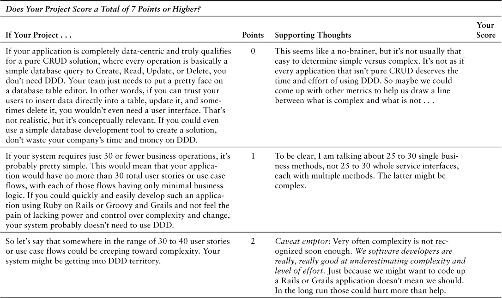
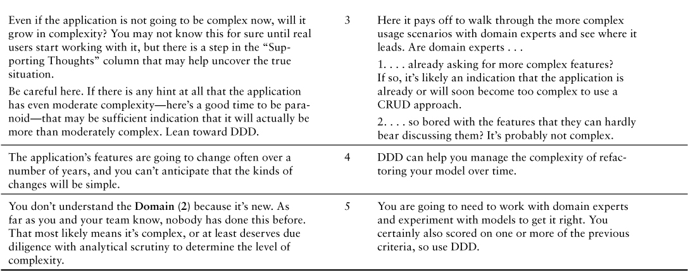
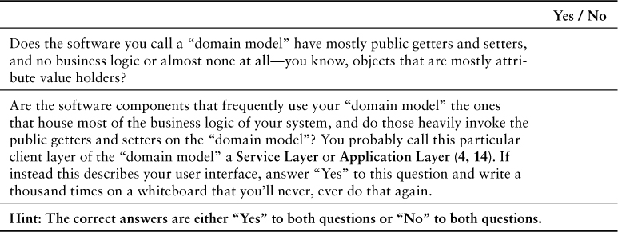
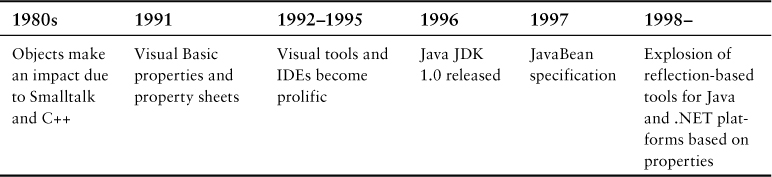
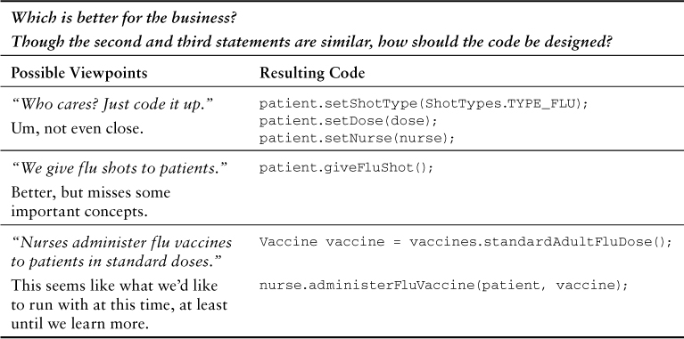

# 第 1 章 DDD 入门

Design is not just what it looks like and feels like. Design is how it works.

—Steve Jobs

We strive to produce quality in the software we develop. We achieve some quality by using tests to help us avoid delivering software with a fatal number of bugs. Yet, even if we could produce completely bug-free software, that in itself does not necessarily mean that a quality software model is designed. The software model—the way the software expresses the solution to the business goal being sought—could still suffer greatly. Delivering software with few defects is obviously good. Still, we can reach higher for a well-designed software model that explicitly reflects the intended business objective, and our work may even reach the level of great.

The software development approach called Domain-Driven Design, or DDD, exists to help us more readily succeed at achieving high-quality software model designs. When implemented correctly, DDD helps us reach the point where our design is exactly how the software works. This book is about helping you correctly implement DDD.

You may be completely new to DDD, you may have tried it and struggled, or you may have already succeeded with it before. Regardless, you no doubt are reading this book because you want to improve your ability to implement DDD, and you can. The chapter road map helps you target your specific needs.

Road Map to This Chapter

- Discover what DDD can do for your projects and your teams as you grapple with complexity.
- Find out how to score your project to see if it deserves the DDD investment.
- Consider the common alternatives to DDD and why they often lead to problems.
- Grasp the foundations of DDD as you learn how to take the first steps on your project.
- Learn how to sell DDD to your management, domain experts, and technical team members.
- Face the challenges of using DDD armed with knowledge of how to succeed.
- Look in on a team that is learning how to implement DDD.

What should you expect from DDD? Not a heavy, dense, ceremonial process that blocks your way to progress. Rather, expect to use the agile development techniques you probably already have come to trust. Beyond agile, anticipate the acquisition of methods that help you gain deep insight into your business domain, with the prospect of producing testable, malleable, organized, carefully crafted, high-quality software models.

DDD gives you both the strategic and tactical modeling tools necessary to design high-quality software that meets core business objectives.

## CAN I DDD?

You can implement DDD if you have

- A passion for creating excellent software every day, and the tenacity to achieve that goal
- The eagerness to learn and improve, and the fortitude to admit you need to
- The aptitude to understand software patterns and how to properly apply them
- The skill and patience to explore design alternatives using proven agile methods
- The courage to challenge the status quo
- The desire and ability to pay attention to details, to experiment and discover
- A drive to seek ways to code smarter and better

I’m not going to tell you that there isn’t a learning curve. To put it bluntly, the learning curve can be steep. Yet, this book has been put together to help flatten the curve as much as possible. My goal is to help you and your team implement DDD with the greatest potential for success.

DDD isn’t first and foremost about technology. In its most central principles, DDD is about discussion, listening, understanding, discovery, and business value, all in an effort to centralize knowledge. If you are capable of understanding the business in which your company works, you can at a minimum participate in the software model discovery process to produce a Ubiquitous Language. Sure, you’re going to have to learn more about the business, lots more. Still, you are on your way to succeeding with DDD already because you can comprehend the concepts of your business, you revel in developing great software, and that gives you the proper footing to take DDD all the way.

Won’t having years, even a decade or two, of software development experience help? It might. Nevertheless, software development experience doesn’t give you the ability to listen and learn from domain experts, the people who know the most about some high-priority area of the business. You are at a greater advantage if you can engage with those who seldom, if ever, express themselves using technical lingo. You’re going to have to listen and listen carefully. You’re going to have to respect their viewpoint and trust that they know a lot more than you do.

There Are Big Advantages to Engaging with Domain Experts

You are at a greater advantage if you can engage with those who seldom, if ever, express themselves using technical lingo. Just as you are going to learn from them, there is a high probability that they are also going to learn from you.

What you may like best about DDD is that the domain experts are also going to have to listen to you. You are on the team just as they are. As strange as it may seem, the domain experts don’t know everything about their business, and they are also going to learn more about it. Just as you are going to learn from them, there is a high probability that they are also going to learn from you. Your questions about what they know will most likely also uncover what they don’t know. You’ll be directly involved in helping everyone on the team discover a deeper understanding of the business, even shaping the business.

It’s great when a team learns and grows together. If you give it a chance, DDD makes that possible.

But We Don’t Have Domain Experts

A domain expert is not one by job title. These are the people who know the line of business you are working in really well. They probably have a lot of background in the business domain, and they might be product designers or even your salespeople.

Look past the job title. The people you are looking for know more about what you are working on than anyone else, and for sure way more than you know. Find them. Listen. Learn. Design in code.

So far we’re off to a pretty reassuring start. Still, I am also not going to tell you that technical ability isn’t important, that somehow you can get by without it. You will have to grasp some advanced software domain modeling concepts. Even so, it doesn’t necessarily mean you are going to be in over your head. If you have abilities somewhere between grasping Head First Design Patterns [Freeman et al.] and grokking the original Design Patterns [Gamma et al.] text, or even more advanced patterns, you stand a really good chance of succeeding with DDD. You can bank on this: I’m going to do everything I can to make that happen by lowering the bar, no matter what your level of experience.

What’s a Domain Model?

It’s a software model of the very specific business domain you are working in. Often it’s implemented as an object model, where those objects have both data and behavior with literal and accurate business meaning.

Creating a unique, carefully crafted domain model at the heart of a core, strategic application or subsystem is essential to practicing DDD. With DDD your domain models will tend to be smallish, very focused. Using DDD, you never try to model the whole business enterprise with a single, large domain model. Phew, that’s good!

Consider the following perspectives of the people who can benefit from DDD. I know you fit in here somewhere:

- Newbie, junior developer: “I’m young, with fresh ideas, I’ve got pent-up energy to code, and I’m going to have an impact. What’s got me miffed is one of the projects I sprint on. I didn’t expect that my first gig off campus would mean shoveling data back and forth using lots of almost identical yet redundant ‘objects.’ Why is this architecture so complex if that’s all that’s happening? What’s up with that? The code breaks a lot when I try to change it. Does anyone actually understand what it’s supposed to do? Now there are some complex new features I have to add. I regularly slap an adapter around legacy classes to shield me from the goo. No joy. I’m sure there’s something I can do besides code and debug all day and night just to finish iterations. Whatever that is, I’m going to track it down and own it. I heard some of the others talking about DDD. It sounds like Gang of Four, but tuned for the domain model. Nice.”

Gotcha covered.

- Midlevel developer: “Over the past few months I’ve been included on the new system. It’s my turn to make a difference. I get it, but what I’m missing are profound insights when I’m meeting with the senior developers. Sometimes things seem whacked, but I’m not sure why. I’m going to help change the way things are done around here. I know that throwing technology at a problem only takes you so far, and that’s basically not far enough. What I need is a sound software development technique that’s going to help me become a wise and experienced software practitioner. One of the senior architects, the new guy, made a pitch for something called DDD. I’m listening.”

You’re sounding senior already. Read on. Your forward-thinking attitude will be rewarded.

- Senior developer, architect: “I’ve used DDD on a few projects, but not since landing this new position. I like the power of the tactical patterns, but there’s a lot more I could apply, with strategic design being one. What I found most insightful when reading [Evans] was the Ubiquitous Language. That’s powerful stuff. I’ve had discussions with a number of my teammates and management, trying to influence DDD’s adoption here. One of the new kids and a few of the midlevel and senior members are jazzed about the prospects. Management isn’t so excited. I recently joined this company, and although I was brought in to lead, it seems that the organization is less interested in disruptive advancements than I thought. Whatever. I’m not giving up. With other developers psyched about it, I know we can make it happen. The payoffs are going to be much greater than anticipated. We’ll draw the pure business people—the domain experts—closer to our technical teams, and we’ll actually invest in our solutions, not just grunt them out iteration after iteration.”

Now that’s what a leader does. This book has lots of guidance that shows how to succeed with strategic design.

- Domain expert: “I’ve been involved in specifying the IT solutions to our business challenges for a long time now. Maybe it’s too much to expect, but I wish the developers understood better what we do here. They’re always talking down to us like we’re stupid. What they don’t understand is, if it wasn’t for us there wouldn’t be jobs here for them to mess around with computers. The developers always have some strange way of talking about what our software does. If we talk about A, they say it’s really called B. It’s like we have to have some sort of dictionary and road map on hand every time we try to communicate what we need. If we don’t let them have their way by calling B what we know is A, they don’t cooperate. We waste so much time in this mode. Why can’t the software just work the way the real experts think about the business?”

You’ve got that right. One of the biggest problems is the false need for translation between business people and techies. This chapter is for you. As you’re going to see, DDD puts you and developers on level ground.

And, surprise! You’ve got some developers already leaning your way. Help them here.

- Manager: “We are shipping software. It’s not always with the greatest result, and changes seem to take longer than they should. The developers keep talking about some domain something-or-another. I’m not sure we need to get high centered on yet another technique or methodology, like it’s some kind of silver bullet. I’ve heard all that a thousand times before. We try, the fad dies, and we are right back to the same-old same-old. I keep saying that we need to stay the course and stop dreaming, but the team keeps hounding me. They’ve worked hard, so I owe them a listen. They are smart people and they all deserve a chance to improve things before they get torqued and move on. I could allow them some time to learn and adjust if I can get backing from upper management. I think I could get that approval if I can convince my boss of the team’s claims of achieving critical software investment and a centralization of business knowledge. Truth is, it will make my job easier if I can do something to inspire trust and cooperation between my teams and business experts. Anyway, that’s what I am hearing I can do.”

Good manager!

Whoever you are, here’s an important heads-up. To succeed with DDD you are going to have to learn something, and actually a lot of somethings. That shouldn’t be a big deal, though. You are smart and you have to learn all the time. Yet we all face this challenge:

Personally I’m always ready to learn, although I do not always like being taught.

—Sir Winston Churchill

That’s where this book comes in. I’ve tried to make the teaching as pleasant as possible while delivering the vital understanding you need to implement DDD with success.

Your question, though, is: “Why should I do DDD?” That’s fair.

## WHY YOU SHOULD DO DDD

Actually, I’ve already given you some pretty good reasons why DDD makes so much practical sense. At the risk of breaking the DRY principle (“Don’t repeat yourself”), I reiterate them here and also add to the earlier reasons. Does anyone hear an echo?

- Put domain experts and developers on a level playing field, which produces software that makes perfect sense to the business, not just the coders. This doesn’t mean merely tolerating the opposite group. It means becoming one cohesive, tight-knit team.
- That “makes sense to the business” thing means investing in the business by making software that is as close as possible to what the business leaders and experts would create if they were the coders.
- You can actually teach the business more about itself. No domain expert, no C-level manager, no one, ever knows every single thing about the business. It’s a constant discovery process that becomes more insightful over time. With DDD, everybody learns because everybody contributes to discovery discussions.
- Centralizing knowledge is key, because with that the business is capable of ensuring that understanding the software is not locked in “tribal knowledge,” available only to a select few, who are usually only the developers.
- There are zero translations between the domain experts, the software developers, and the software. That doesn’t mean maybe some few translations. It means zero translations because your team develops a common, shared language that everyone on the team speaks.
- The design is the code, and the code is the design. The design is how it works. Knowing the best code design comes through quick experimental models using an agile discovery process.
- DDD provides sound software development techniques that address both strategic and tactical design. Strategic design helps us understand what are the most important software investments to make, what existing software assets to leverage in order to get there fastest and safest, and who must be involved. Tactical design helps us craft the single elegant model of a solution using time-tested, proven software building blocks.

Like any good, high-yielding investment, DDD has some up-front cost of time and effort for the team. Considering the typical challenges encountered by every software development effort will reinforce the need to invest in a sound software development approach.

## Delivering Business Value Can Be Elusive

Developing software that delivers true business value is not the same thing as developing ordinary business software. Software that delivers true business value aligns with the business strategic initiatives and bears solutions with clearly identifiable competitive advantage—software that is not about technology, but about the business.

Business knowledge is never centralized. Development teams have to balance and prioritize among the needs and requests of multiple stakeholders and engage with many people having diverse skill sets, all with the goal of uncovering software functional and nonfunctional requirements. After gathering all that information, how can teams be certain that any given requirement delivers true business value? In fact, what are the business values being sought, and how do you uncover them, prioritize them, and realize them?

One of the worst disconnects of a business software development effort is seen in the gap between domain experts and software developers. Generally speaking, true domain experts are focused on delivering business value. On the other hand, software developers are typically drawn to technology and technical solutions to business problems. It’s not that software developers have wrong motivations; it’s just what tends to grab their attention. Even when software developers engage with domain experts, the collaboration is largely at a surface level, and the software that gets developed often results in a translation/mapping between how the business thinks and operates and how the software developer interprets that. The resulting software generally does not reflect a recognizable realization of the mental model of the domain experts, or perhaps it does so only partially. Over time this disconnect becomes costly. The translation of domain knowledge into software is lost as developers transition to other projects or leave the company.

A different, yet related problem is when one or more domain experts do not agree with each other. This tends to happen because each expert has more or less experience in the specific domain being modeled, or they are simply experts in related but different areas. It’s also common for multiple “domain experts” to have no expertise in a given domain, where they are more of a business analyst, yet they are expected to bring insightful direction to discussions. When this situation goes unchecked, it results in blurred rather than crisp mental models, which lead to conflicting software models.

Worse still is when the technical approach to software development actually wrongly changes the way the business functions. While a different scenario, it is well known that enterprise resource planning (ERP) software will often change the overall business operations of an organization to fit the way the ERP functions. The total cost of owning the ERP cannot be fully calculated in terms of license and maintenance fees. The reorganization and disruption to the business can be far more costly than either of those two tangible factors. A similar dynamic is at play as your software development teams interpret what the business needs into what the newly developed software actually does. This can be both costly and disruptive to the business, its customers, and its partners. Furthermore, this technical interpretation is both unnecessary and avoidable with the use of proven software development techniques. The solution is a key investment.

## How DDD Helps

DDD is an approach to developing software that focuses on these three primary aspects:

1. DDD brings domain experts and software developers together in order to develop software that reflects the mental model of the business experts. This does not mean that effort is spent on modeling the “real world.” Rather, DDD delivers a model that is the most useful to the business. Sometimes useful and realistic models happen to intersect, but to the degree that they diverge, DDD chooses useful.

With this aspect the efforts of domain experts and software developers are devoted to jointly developing a Ubiquitous Language of the areas of the business that they are focused on modeling. The Ubiquitous Language is developed with full team agreement, is spoken, and is directly captured in the model of the software. It is worth reiterating that the team is composed of both domain experts and software developers. It’s never “us and them.” It’s always us. This is a key business value that allows business know-how to outlive the relatively short initial development efforts that deliver the first few versions of the software, and the teams that produce it. It’s the point where the cost of developing software is a justifiable business investment, not just a cost center.

This entire effort unifies domain experts who initially disagree with each other, or who simply lack core knowledge of the domain. Further, it strengthens the close-knit team by spreading deep domain insight among all team members, including software developers. Consider this the hands-on training that every company should invest in its knowledge workers.

2. DDD addresses the strategic initiatives of the business. While this strategic design approach naturally includes technical analysis, it is more concerned with the strategic direction of the business. It helps define the best inter-team organizational relationships and provides early-warning systems for recognizing when a given relationship could cause software and even project failure. The technical aspects of strategic design have the goal of cleanly bounding systems and business concerns, which protects each business-level service. This provides meaningful motivations for how an overall service-oriented architecture or business-driven architecture is achieved.

3. DDD meets the real technical demands of the software by using tactical design modeling tools to analyze and develop the executable software deliverables. These tactical design tools allow developers to produce software that is a correct codification of the domain experts’ mental model, is highly testable, is less error prone (a provable statement), performs to service-level agreements (SLAs), is scalable, and allows for distributed computing. DDD best practices generally address a dozen or more higher-level architectural and lower-level software design concerns, with a focus on recognizing true business rules and data invariants, and protecting the rules from error situations.

Using this approach to software development, you and your team can succeed in delivering true business value.

## Grappling with the Complexity of Your Domain

We primarily want to use DDD in the areas that are most important to the business. You don’t invest in what can be easily replaced. You invest in the nontrivial, the more complex stuff, the most valuable and important stuff that promises to return the greatest dividends. That’s why we call such a model a Core Domain (2). It is these, and in second priority the significant Supporting Subdomains (2), that deserve and get the biggest investment. Rightly, then, we need to grasp what complex means.

Use DDD to Simplify, Not to Complicate

Use DDD to model a complex domain in the simplest possible way. Never use DDD to make your solution more complex.

What qualifies as complex will differ from business to business. Different companies have different challenges, different levels of maturity, and different software development capabilities. So rather than determining what is complex, it may be easier to determine what is nontrivial. Thus, your team and management will have to determine if a system you are planning to work on deserves the cost of making a DDD investment.

DDD Scorecard: Use Table 1.1 to determine whether your project qualifies for an investment in DDD. If a row on the scorecard describes your project, place the corresponding number of points in the right-hand column. Tally all the points for your project. If it’s 7 or higher, seriously consider using DDD.

Table 1.1. The DDD Scorecard





This scoring exercise may have led your team to these conclusions:

It’s too bad that we can’t shift gears quickly and easily when we discover we are on the wrong side of complexity, no matter if the wrong side is more or less complex than we thought.

Sure, but that just means that we need to become much better at determining simplicity versus complexity early on in our project planning. That would save us a lot of time, expense, and trouble.

Once we make a major architectural decision and get several use cases deep in development, we are usually stuck with it. We had better choose wisely.

If any of these observations resonates with your team, you are making good use of critical thought.

## Anemia and Memory Loss

Anemia can be a serious health ailment with dangerous side effects. When the name Anemic Domain Model [Fowler, Anemic] was first coined, it wasn’t meant to be a complimentary term, as if to say that a domain model that is weak, without the power of inherent behavioral qualities, could possibly be a good thing. Strangely enough, Anemic Domain Models have popped up left and right in our industry. The trouble is that most developers seem to think this is quite normal and would not even acknowledge that a serious condition exists when employed in their systems. It’s a real problem.

Are you wondering if your model is feeling tired, listless, forgetful, clumsy, needing a good shot in the arm? If you’re suddenly experiencing technical hypochondria, here’s a good way to perform a self-examination. You’ll either put yourself at ease or confirm your worst fears. Use the steps in Table 1.2 to perform your checkup.

Table 1.2. Determine Your Domain Model Health History



How did you do?

If you answered “No” to both questions, your domain is doing well.

If you answered “Yes” to both questions, your “domain model” is very, very ill. It’s anemic. The good news is that you can get help for it by reading on.

If you answered “Yes” to one question and “No” to the other question, you are either in denial or suffering from delusions or another neurological issue that could be caused by anemia. What should you do if you have conflicting answers? Go straight back to the first question and run the self-examination once again. Take your time, but remember that your answer to both questions must be an emphatic “Yes!”

As [Fowler, Anemic] says, an Anemic Domain Model is a bad thing because you pay most of the high cost of developing a domain model, but you get little or none of the benefit. For example, because of the object-relational impedance mismatch, developers of such a “domain model” spend a lot of time and effort mapping objects to and from the persistence store. That’s a high price to pay while getting little or no benefit in return. I’ll add that what you have is not a domain model at all, but just a data model projected from a relational model (or other database) into objects. It’s an impostor that may actually be closer to the definition of Active Record [Fowler, P of EAA]. You can probably simplify your architecture by not being pretentious and just admit that you are really using a form of Transaction Script [Fowler, P of EAA].

Reasons Why Anemia Happens

So if an Anemic Domain Model is the sickly outcome of a poorly executed design effort, why do so many use it while thinking that their model is experiencing fine health? Certainly it does reflect a procedural programming mentality, but I don’t think that’s the primary reason. A good portion of our industry is made up of sample code followers, which isn’t bad as long as the samples are quality ones. Often, however, sample code is purposely focused on demonstrating some concept or application programming interface (API) feature in the simplest possible way, without concern for good design principles. Yet oversimplified sample code, which usually demonstrates with a lot of getters and setters, is copied every day without a second thought about design.

There is another, older influence. The ancient history of Microsoft’s Visual Basic had much to do with where we are today. I’m not saying that Visual Basic was a bad language and integrated development environment (IDE), because it’s always been a highly productive environment and in some ways influenced the industry for the good. Of course, some may have avoided its direct influence altogether, but Visual Basic indirectly caught up with just about every software developer eventually. Just note the timeline shown in Table 1.3.

Table 1.3. The Timeline from Behavior Rich to Infamous Anemia



What I am talking about is the influence of properties and property sheets, both backed by property getters and setters that were made so popular by the original Visual Basic forms designer. All you had to do was place a few custom control instances on a form, fill out their property sheets, and voilà! You had a fully functioning Windows application. It took just a few minutes to do that compared to the few days required to program a similar application directly against the Windows API using C.

So what does all that have to do with Anemic Domain Models? The Java Bean standard was originally specified to assist in the creation of visual programming tools for Java. Its motivation was to bring the Microsoft ActiveX capabilities to the Java platform. It offered the hope of creating a market full of third-party custom controls of various kinds, just like Visual Basic’s. Soon almost every framework and library jumped on the JavaBean bandwagon. This included much of the Java SDK/JDK as well as libraries such as the popular Hibernate. Specific to our DDD concerns, Hibernate was introduced to persist domain models. The trend continued as the .NET platform reached us.

Interestingly, any domain model that was persisted using Hibernate in the early days had to expose public getters and setters for every persistent simple attribute and complex association in every domain object. This meant that even if you wanted to design your POJO (Plain Old Java Object) with a behavior-rich interface, you had to expose your internals publicly so that Hibernate could persist and reconstitute your domain objects. Sure, you could do things to hide the public JavaBean interface, but by and large most developers didn’t bother or even understand why they should have.

Should I Be Concerned about Using Object-Relational Mappers with DDD?

The preceding critique of Hibernate is from a historical perspective. For quite a while now Hibernate has supported the use of hidden getters and setters, and even direct field access. I demonstrate in later chapters how to avoid anemia in your models when using Hibernate and other persistence mechanisms. So, don’t sweat it.

Most, if not all, of the Web frameworks also function solely on the JavaBean standard. If you want your Java objects to be able to populate your Web pages, the Java objects had better support the JavaBean specification. If you want your HTML forms to populate a Java object when submitted to the server side, your Java form object had better support the JavaBean specification.

Just about every framework on the market today requires, and therefore promotes, the use of public properties on simple objects. Most developers can’t help but be influenced by all the anemic classes all over their enterprises. Admit it. You’ve been bitten by it, haven’t you? As a result, we have a situation that might be best labeled anemia everywhere.

Look at What Anemia Does to Your Model

All right, so let’s say we can agree that this is both true and vexing to us. What does anemia everywhere have to do with memory loss? When you are reading through the client code of an Anemic Domain Model (for example, the impostor Application Service (4, 14), à la Transaction Script), what do we usually see? Here’s a rudimentary example:

Click here to view code image

```java
@Transactional
public void saveCustomer(
    String customerId,
    String customerFirstName, String customerLastName,
    String streetAddress1, String streetAddress2,
    String city, String stateOrProvince,
    String postalCode, String country,
    String homePhone, String mobilePhone,
    String primaryEmailAddress, String secondaryEmailAddress) {
    Customer customer = customerDao.readCustomer(customerId);
    if (customer == null) {
        customer = new Customer();
        customer.setCustomerId(customerId);
    }
    customer.setCustomerFirstName(customerFirstName);
    customer.setCustomerLastName(customerLastName);
    customer.setStreetAddress1(streetAddress1);
    customer.setStreetAddress2(streetAddress2);
    customer.setCity(city);
    customer.setStateOrProvince(stateOrProvince);
    customer.setPostalCode(postalCode);
    customer.setCountry(country);
    customer.setHomePhone(homePhone);
    customer.setMobilePhone(mobilePhone);
    customer.setPrimaryEmailAddress(primaryEmailAddress);
    customer.setSecondaryEmailAddress (secondaryEmailAddress);
    customerDao.saveCustomer(customer);
}
```

Example Purposely Kept Simple

Admittedly, this example is not from a very interesting domain, but it does help us examine a less-than-ideal design and determine how we can refactor it to a much better one. Let’s be clear that this exercise is not leading us to a cooler way to save data. It’s about crafting a software model that adds value to your business, even though this example may not seem valuable.

What did this code just do? Actually it’s pretty versatile code. It saves a Customer no matter whether it is new or preexisting. It saves a Customer no matter whether the last name changed or the person moved to a new home. It saves a Customer no matter whether the person got a new home phone number or discontinued home phone service, or whether he or she got a mobile phone for the first time, or both. It even saves a Customer who switched from using Juno to using Gmail instead, or who changed jobs and now has a new work e-mail address. Wow, this is an awesome method!

Or is it? Actually, we have no idea under what business situations this saveCustomer() method is used—not exactly, anyway. Why was this method created in the first place? Does anyone remember its original intent, and all the motivations for changing it to support a wide variety of business goals? Those memories were quite likely lost only a few weeks or months after the method was created and then modified. And it gets even worse. You don’t believe me? Look at the next version of this same method:

Click here to view code image

```java
@Transactional

public void saveCustomer(
    String customerId,
    String customerFirstName, String customerLastName,
    String streetAddress1, String streetAddress2,
    String city, String stateOrProvince,
    String postalCode, String country,
    String homePhone, String mobilePhone,
    String primaryEmailAddress, String secondaryEmailAddress) {
    Customer customer = customerDao.readCustomer(customerId);
    if (customer == null) {
        customer = new Customer();
        customer.setCustomerId(customerId);
    }
    if (customerFirstName != null) {
        customer.setCustomerFirstName(customerFirstName);
    }
    if (customerLastName != null) {
        customer.setCustomerLastName(customerLastName);
    }
    if (streetAddress1 != null) {
        customer.setStreetAddress1(streetAddress1);
    }
    if (streetAddress2 != null) {
        customer.setStreetAddress2(streetAddress2);
    }
    if (city != null) {
        customer.setCity(city);
    }
    if (stateOrProvince != null) {
        customer.setStateOrProvince(stateOrProvince);
    }
    if (postalCode != null) {
        customer.setPostalCode(postalCode);
    }
    if (country != null) {
        customer.setCountry(country);
    }
    if (homePhone != null) {
        customer.setHomePhone(homePhone);
    }
    if (mobilePhone != null) {
        customer.setMobilePhone(mobilePhone);
    }
    if (primaryEmailAddress != null) {
        customer.setPrimaryEmailAddress(primaryEmailAddress);
    }
    if (secondaryEmailAddress != null) {
        customer.setSecondaryEmailAddress (secondaryEmailAddress);
    }
    customerDao.saveCustomer(customer);
}
```

I have to note here that this example isn’t as bad as it gets. Many times the data-mapping code becomes quite complex, and a lot of business logic gets tucked away in it. I’m sparing you the worst in this example, but you’ve probably seen it for yourself.

Now each of the parameters other than the customerId is optional. We can now use this method to save a Customer under at least a dozen business situations, and more! But is that really a good thing? How could we actually test this method to ensure that it doesn’t save a Customer under the wrong situations?

Without going into extensive detail, this method could function incorrectly in more ways than it could correctly. Perhaps there are database constraints that prevent a completely invalid state from being persisted, but now you have to look at the database to be sure. Almost certainly it will take you some time to mentally map between Java attributes and column names. Once you’ve figured out that part, you find that the database constraints are missing or incomplete.

You could look at the possibly many clients (not counting those added after the user interface was completed to manage automatic remote clients) and compare source revisions to gain some insight into why it is implemented the way it is right now. As you search for answers, you learn that nobody can explain why this one method works the way it does, or how many correct uses there are. It could take several hours or days to understand it on your own.

Cowboy Logic

AJ: “That fella’s so confused, he doesn’t know if he’s sackin’ potatoes or rollerskatin’ in a buffalo herd.”


Domain experts can’t help here because they would have to be programmers to understand the code. Even if a domain expert or two knew enough about programming or could at least read the code, they would probably be at least equally at a loss as a developer regarding all that code is meant to support. With all these concerns in mind, do we dare change this code in any way, and if so, how?

There are at least three big problems here:

1. There is little intention revealed by the saveCustomer() interface.
2. The implementation of saveCustomer() itself adds hidden complexity.
3. The Customer “domain object” isn’t really an object at all. It’s really just a dumb data holder.

Let’s call this unenviable situation anemia-induced memory loss. It happens all the time on projects that produce this kind of implicit, completely subjective code “design.”

Hold On a Minute!

At this point some of you may be thinking, “Our designs never really leave the whiteboard. We just draw some structure, and once agreement on that is reached, we are set free to implement. Scary.”

If so, try not to distinguish design from implementation. Remember that when practicing DDD, the design is the code and the code is the design. In other words, whiteboard diagrams aren’t the design, just a way to discuss the challenges of the model.

Stay tuned, as you’ll learn how to take ideas off the whiteboard and make them work for you.

By now you should be worried about this kind of code and how you can create a better design. The good news is that you can succeed in producing an explicit, carefully crafted design in your code.

## HOW TO DO DDD

Let’s back away from heavy implementation discussions for a moment to consider one of the most empowering features of DDD, the Ubiquitous Language. It’s one of the two primary pillars of DDD’s strengths, the second being the Bounded Context (2), and one cannot properly stand without the other.

Terms in a Context

For now think of a Bounded Context as a conceptual boundary around a whole application or finite system. The reason for this boundary is to highlight that every use of a given domain term, phrase, or sentence—the Ubiquitous Language—inside the boundary has a specific contextual meaning. Any use of the term outside that boundary could, and probably does, mean something different. Chapter 2 explains Bounded Context in depth.

## Ubiquitous Language

The Ubiquitous Language is a shared team language. It’s shared by domain experts and developers alike. In fact, it’s shared by everyone on the project team. No matter your role on the team, since you are on the team you use the Ubiquitous Language of the project.

So, You Think You Know What a Ubiquitous Language Is

Obviously it’s the language of the business.

Well, no.

Surely it must be adopting industry standard terminology.

No, not really.

Clearly it’s the lingo used by the domain experts.

Sorry, but no.

The Ubiquitous Language is a shared language developed by the team—a team composed of both domain experts and software developers.

That’s it. Now you’ve got it!

Naturally, the domain experts have a heavy influence on the Language because they know that part of the business best and may be influenced by industry standards. However, the Language is more centered on how the business itself thinks and operates. Also, many times two or more domain experts disagree on concepts and terms, and they are actually wrong about some because they haven’t thought of every case before. So, as the experts and developers work together to craft a model of the domain, they use discussion with both consensus and compromise to achieve the very best Language for the project. The team never compromises on the quality of the Language, just on the best concepts, terms, and meanings. Initial consensus is not the end, however. The Language grows and changes over time as tiny and large breakthroughs are achieved, much like any other living language.

This is no gimmick to get developers to be on the same page as domain experts. It’s not just a bunch of business jargon being forced on developers. It’s a real language that is created by the whole team—domain experts, developers, business analysts, everyone involved in producing the system. The Language may start out with terms that are the natural lingo of the domain experts, but it isn’t limited to that because the Language must grow over time. Suffice it to say that when multiple domain experts are involved in creating the Language, they often disagree ever so slightly on the terms and meanings of what they thought were already ubiquitous.

In Table 1.4, we not only model the administration of flu vaccines in code, but the team must also speak the Language openly. When the team discusses this aspect of the model, they literally speak phrases such as “Nurses administer flu vaccines to patients in standard doses.”

Table 1.4. Analyzing the Best Model for the Business



There will be some haggling and wrangling over the Language that exists in the minds of experts and what evolves from there. It’s all part of the natural progression of developing the best Language that will matter a lot for a long time. This happens through open discussion, looking at existing documents, business tribal knowledge that finally surfaces, as well as referencing standards, dictionaries, and thesauruses. There’s also a point reached where we come to terms with the fact that some words and phrases just don’t aptly fit the business context as well as we once thought, and we realize that others fit it much better.

So how do you capture this all-important Ubiquitous Language? Here are some ways that work as experimentation leads to advancement:

- Draw pictures of the physical and conceptual domain and label them with names and actions. These drawings are mostly informal but may contain some aspects of formal software modeling. Even if your team does some formal modeling with Unified Modeling Language (UML), you want to avoid any kind of ceremony that will bog down discussions and stifle the creativity of the ultimate Language being sought.
- Create a glossary of terms with simple definitions. List alternative terms, including the ones that show promise and the ones that didn’t work, and why. As you include definitions, you cannot help but develop reusable phrases for the Language because you are forced to write in the Language of the domain.
- If you don’t like the idea of a glossary, still capture some kind of documentation that includes the informal drawings of important software concepts. Again, the goal here is to force additional Language terms and phrases to surface.
- Since only one or a few team members may capture the glossary or other written documents, circle back with the rest of the team to review the resulting phrases. You won’t always, if ever, agree on all the captured linguistics, so be agile and ready to edit heavily.

Those are some ideal first steps to coining a Ubiquitous Language that fits your specific domain. However, this is absolutely not the model that you are developing. It’s only the genesis of the Ubiquitous Language that will very soon be expressed in your system’s source code. We are talking Java, or C#, or Scala, or some other programming language of choice. These drawings and documents also don’t address that the Ubiquitous Language will continue to expand and morph over time. The artifacts that originally led us down an inspiring path to developing a useful Ubiquitous Language that was just right for our specialized domain will very likely be rendered obsolete over time. That’s why in the end it is team speech and the model in the code that are the most enduring and the only guaranteed current denotations of the Ubiquitous Language.

Since team speech and the code will be the lasting expression of the Ubiquitous Language, be prepared to abandon the drawings, glossary, and other documentation that will be difficult to keep up-to-date with the spoken Ubiquitous Language and source code as they are rapidly enhanced. This is not a requirement of using DDD, but it is pragmatic because it becomes impractical to keep all the documentation in sync with the system.

With this knowledge we can redesign the saveCustomer() example. What if we chose to make Customer reflect each of the possible business goals that it must support?

Click here to view code image

```java
public interface Customer {
    public void changePersonalName(
        String firstName, String lastName);
    public void postalAddress(PostalAddress postalAddress);
    public void relocateTo(PostalAddress changedPostalAddress);
    public void changeHomeTelephone(Telephone telephone);
    public void disconnectHomeTelephone();
    public void changeMobileTelephone(Telephone telephone);
    public void disconnectMobileTelephone();
    public void primaryEmailAddress(EmailAddress emailAddress);
    public void secondaryEmailAddress(EmailAddress emailAddress);
}
```

We can argue that this is not the best model for a Customer, but when implementing DDD, questioning the design is expected. As a team we are free to haggle over what is the best model and settle only after we’ve discovered the Ubiquitous Language that is agreed upon. Still, the preceding interface does explicitly reflect the various business goals that a Customer must support, even if the Language could be improved by refinements again and again.

It’s important to understand too that the Application Service would also be refactored to reflect the explicit intentions of the business goals at hand. Each Application Service method would be modified to deal with a single use case flow or user story:

Click here to view code image

```java
@Transactional
public void changeCustomerPersonalName(
    String customerId,
    String customerFirstName,
    String customerLastName) {
    Customer customer = customerRepository.customerOfId(customerId);
    if (customer == null) {
        throw new IllegalStateException("Customer does not exist.");
    }
    customer.changePersonalName(customerFirstName, customerLastName);
}
```

This is different from the original example because in that code a single method was used to deal with many different use case flows or user stories. In the new example we have limited a single Application Service method to deal with changing the personal name of the Customer, and nothing more. Thus, when using DDD, it is our job to refine Application Services accordingly. This implies that the user interface likewise reflects a narrower user goal, which may have previously been true. Now, however, this specific Application Service method doesn’t require its client to pass ten nulls following the first- and last-name parameters.

Doesn’t this new design put your mind at ease? You can read the code and easily comprehend it. You can also test it and confirm that it does exactly what it is meant to do, and that it doesn’t do anything that it shouldn’t.

Thus, the Ubiquitous Language is a team pattern used to capture the concepts and terms of a specific core business domain in the software model itself. The software model incorporates the nouns, adjectives, verbs, and richer expressions formally formulated and spoken by the close-knit team. Both the software and the tests that verify the model’s adherence to the tenets of the domain capture and adhere to this Language, the same one spoken by the team.

Ubiquitous, but Not Universal
Some further clarification about the reach of a Ubiquitous Language is in order. There are a few basic concepts that we need to keep carefully in mind:

- Ubiquitous means “pervasive,” or “found everywhere,” as spoken among the team and expressed by the single domain model that the team develops.
- The use of the word ubiquitous is not an attempt to describe some kind of enterprise-wide, company-wide, or worldwide, universal domain language.
- There is one Ubiquitous Language per Bounded Context.
- Bounded Contexts are relatively small, smaller than we might at first imagine. A Bounded Context is large enough only to capture the complete Ubiquitous Language of the isolated business domain, and no larger.
- The Language is ubiquitous only within the team that is working on the project that develops in an isolated Bounded Context.
- On a single project that develops a single Bounded Context, there are always one or more additional isolated Bounded Contexts with which it integrates using Context Maps (3). Each of the multiple Bounded Contexts that integrate has its own Ubiquitous Language, even though some terms of each may overlap.
- If you try to apply a single Ubiquitous Language to an entire enterprise, or worse, universally among many enterprises, you will fail.

When you begin a new project in which you are properly using DDD, identify the isolated Bounded Context that is being developed. This places an explicit boundary around your domain model. Discuss, research, conceptualize, develop, and speak the Ubiquitous Language of the isolated domain model within the explicit Bounded Context. Reject all concepts that are not part of the agreed-upon Ubiquitous Language of your isolated Context.

## THE BUSINESS VALUE OF USING DDD

If your experience is anything like mine, you know that software developers can no longer pursue technologies and techniques just because they sound cool or intriguing. We must justify everything that we do. I think that has not always been true, but it is a good thing it is true now. I think the best justification for using any technology or technique is to provide value to the business. If we can establish real, tangible business value, why would the business ever refuse to use what we recommend?

The business case is strengthened especially if we can demonstrate that the business values are higher with our recommended approach than with other options.

Isn’t Business Value Most Important?

Sure, and perhaps I should have put this subheading “The Business Value of Using DDD” earlier in the book. But it’s done, now. This subheading could actually be “How You Can Sell DDD to Your Boss.” Until you are mostly convinced that there is a real chance that you can actually implement DDD in your company, this book is just hypothetical. And I don’t want you to read this book as just a theoretical exercise. Read it as a concrete reality for your company. Then you can become more excited about how your company can really benefit. So read on.

Let’s consider the very realistic business value of employing DDD. Be sure to share this openly with your management, domain experts, and technical team members. The value and benefits are summarized here, then I will elaborate. I start off with the less technical benefits.

1. The organization gains a useful model of its domain.
2. A refined, precise definition and understanding of the business is developed.
3. Domain experts contribute to software design.
4. A better user experience is gained.
5. Clean boundaries are placed around pure models.
6. Enterprise architecture is better organized.
7. Agile, iterative, continuous modeling is used.
8. New tools, both strategic and tactical, are employed.

## 1. The Organization Gains a Useful Model of Its Domain

The emphasis of DDD is to invest our efforts in what matters most to the business. We don’t over-model. We focus on the Core Domain. Other models exist to support the Core Domain and are important, too. Yet the supporting models may not be given the priority and effort of the Core Domain.

When our focus is on what distinguishes our business from all others, our mission is well understood and we have the parameters we need to keep on track. We will deliver exactly what is needed to achieve competitive advantage.

## 2. A Refined, Precise Definition and Understanding of the Business Is Developed

The business may actually come to understand itself and its mission better than before. I have heard others state that the Ubiquitous Language developed for the business’s Core Domain has found its way into marketing materials. Certainly it should be incorporated in vision documents and mission statements.

As the model is refined over time, the business develops a deep understanding that can serve as an analysis tool. Details surface out of the minds of your domain experts as you are challenged by one another and shaped by technical team partners. These details can help your business analyze the value of the current and future direction, both strategic and tactical.

## 3. Domain Experts Contribute to Software Design

There is business value when the organization grows a deeper understanding of the core business. Domain experts don’t always agree on concepts and terminology. Sometimes the differences are fostered by different experiences from outside before joining the organization. Sometimes it happens because of the divergent paths taken by each expert within the same organization. Yet when brought together to a DDD effort, the domain experts gain consensus among themselves. This fortifies the effort and the organization as a whole.

Developers now share a common Language as a unified team along with domain experts. They benefit further from the knowledge transfer from the domain experts they work with. As developers inevitably move on, either to a new Core Domain or out of the organization, training and handoffs are easier. The chances of developing “tribal knowledge,” where only a select few understand the model, are reduced. The experts, remaining developers, and new ones continue to share a common knowledge that is available to anyone in the organization who requires it. This advantage exists because there remains an express goal to adhere to the Language of the domain.

## 4. A Better User Experience Is Gained

Often the end user experience can be tuned to better reflect the model of the domain. Domain-Driven is formally “baked in,” influencing human use of the software.

When software leaves too much to the understanding of its users, users must be trained to make a great number of decisions. In essence the users are only transferring the understanding in their minds into data that they enter into forms. The data is then saved to a data store. If users don’t understand exactly what is needed, the results are incorrect. Often this leads to guesswork with related lowered productivity until users can figure out the software.

When the user experience is designed to follow the contours of the underlying expert model, users are led to correct conclusions. The software actually trains the users, which reduces the training overhead to the business. Quicker to productivity with less training—that’s business value.

We next move into more technically driven benefits to the business.

## 5. Clean Boundaries Are Placed around Pure Models

The technical team is discouraged from doing what might appeal more to their programming and algorithmic interests by aligning expectations with business advantage. Purity in direction allows for focus on the potency of the solution, with efforts directed to where they matter the most. Achieving this is very closely connected to understanding the Bounded Context of the project.

## 6. Enterprise Architecture Is Better Organized

When Bounded Contexts are well understood and carefully partitioned, all teams in the enterprise develop an acute understanding of where and why integrations are necessary. The boundaries are explicit, and the relationships between them are as well. The teams that have models that intersect by usage dependency employ Context Maps to establish formal relationships and ways to integrate. This can actually lead to a very thorough understanding of the entire enterprise architecture.

## 7. Agile, Iterative, Continuous Modeling Is Used

The word design can evoke negative thoughts in the minds of business management. However, DDD is not a heavyweight, high-ceremony design and development process. DDD is not about drawing diagrams. It is about carefully refining the mental model of domain experts into a useful model for the business. It is not about creating a real-world model, as in trying to mimic reality.

The team’s efforts follow an agile approach, which is iterative and incremental. Any agile process that the team feels comfortable with can be used successfully in a DDD project. The model that is produced is the working software. It is refined continuously until it is no longer needed by the business.

## 8. New Tools, Both Strategic and Tactical, Are Employed

A Bounded Context gives the team a modeling boundary in which to create a solution to a specific business problem domain. Inside a single Bounded Context is a Ubiquitous Language formulated by the team. It is spoken among the team and in the software model. Disparate teams, sometimes each responsible for a given Bounded Context, use Context Maps to strategically segregate Bounded Contexts and understand their integrations. Within a single modeling boundary the team may employ any number of useful tactical modeling tools: Aggregates (10), Entities (5), Value Objects (6), Services (7), Domain Events (8), and others.

## THE CHALLENGES OF APPLYING DDD

As you implement DDD, you will encounter challenges. So has everyone else who has succeeded at it. What are the common challenges and how do we justify using DDD as we face them? I will discuss the more common ones:

- Allowing for the time and effort required to create a Ubiquitous Language
- Involving domain experts at the outset and continuously with the project
- Changing the way developers think about solutions in their domain

One of the greatest challenges in using DDD can be the time and effort required to think about the business domain, research concepts and terminology, and converse with domain experts in order to discover, capture, and enhance the Ubiquitous Language rather than coding in techno-babble. If you want to apply DDD completely, with the greatest value to the business, it’s going to require more thought and effort, and it’s going to take more time. That’s the way it is, period.

It can also be a challenge to solicit the necessary involvement from domain experts. No matter how difficult it is, make sure you do. If you don’t get commitment from at least one real expert, you are not going to uncover deep knowledge of the domain. When you do get the domain experts’ involvement, the onus falls back on the developers. Developers must converse with and listen carefully to the true experts, molding their spoken language into software that reflects their mental model of the domain.

If the domain you are working in is truly distinguishing to your business, domain experts have the edge-knowledge locked up in their heads, and you need to draw it out. I’ve been on projects where the real domain experts are hardly around. Sometimes they travel a lot and it can be weeks between one-hour meetings with them. In a small business it can be the CEO or one of the vice presidents, and they have lots of other things to do that may seem more important.

Cowboy Logic

AJ: “If you can’t rope the big steer, you’re gonna go hungry.”


Getting domain expert involvement may require creativity . . .

How to Involve Domain Experts in Your Project


Coffee. Use that Ubiquitous Language:

“Hi, Sally, I got you a tall half-skinny half-one-percent extra-hot split-quad-shot latte with whip. Do you have a few minutes to talk about . . . ?”

Learn to use the Ubiquitous Language of C-Level management: “. . . profits . . . revenues . . . competitive edge . . . market domination.” Seriously.

Hockey tickets.

Most developers have had to change the way they think in order to properly apply DDD. We developers are technical thinkers. Technical solutions come easy for us. It’s not that thinking technically is bad. It’s just that there are times when thinking less technically is better. If it’s been our habit to practice software development only in technical ways for years, perhaps now would be a good time to consider a new way of thinking. Developing the Ubiquitous Language of your domain is the best place to start.

Cowboy Logic

LB: “That fella’s boots are too small. If he don’t find himself another pair, his toes are gonna hurt.”

AJ: “Yep. If you don’t listen, you’re gonna have to feel.”


There’s another level of thought that is required with DDD that goes beyond concept naming. When we model a domain through software, we are required to give careful thought to which model objects do what. It’s about designing the behaviors of objects. Yes, we want the behaviors to be named properly to convey the essence of the Ubiquitous Language. But what an object does by means of a specific behavior must be considered. This is a level of effort that goes beyond creating attributes on a class and exposing getters and setters publicly to clients of the model.

Let’s now look at a more interesting domain, one that is more challenging than the rudimentary one previously considered. I purposely repeat my previous guidance here to reinforce the ideas.

Again, what happens if we simply provide data accessors to our model? To reemphasize, if we only expose the data accessors for our model objects, the results will look much like a data model. Consider the following two examples and decide for yourself which of the two requires more thorough design thought, and which produces the greater benefit to its clients. The requirement is in a Scrum model, where we need to commit a backlog item to a sprint. You probably do this all the time, so it’s most likely a familiar domain.

The first example, as is commonly done today, uses attribute accessors:

Click here to view code image

```java
public class BacklogItem extends Entity {
    private SprintId sprintId;
    private BacklogItemStatusType status;
    ...
    public void setSprintId(SprintId sprintId) {
        this.sprintId = sprintId;
    }

    public void setStatus(BacklogItemStatusType status) {
        this.status = status;
    }
    ...
}
```

As for the client of this model:

Click here to view code image

```java
// client commits the backlog item to a sprint
// by setting its sprintId and status

backlogItem.setSprintId(sprintId);
backlogItem.setStatus(BacklogItemStatusType.COMMITTED);
```

The second example uses a domain object behavior that expresses the Ubiquitous Language of the domain:

Click here to view code image

```java
public class BacklogItem extends Entity {
    private SprintId sprintId;
    private BacklogItemStatusType status;
    ...
    public void commitTo(Sprint aSprint) {
        if (!this.isScheduledForRelease()) {
            throw new IllegalStateException(
                "Must be scheduled for release to commit to sprint.");
        }
        if (this.isCommittedToSprint()) {
            if (!aSprint.sprintId().equals(this.sprintId())) {
                this.uncommitFromSprint();
            }
        }
        this.elevateStatusWith(BacklogItemStatus.COMMITTED);
        this.setSprintId(aSprint.sprintId());
        DomainEventPublisher
            .instance()
            .publish(new BacklogItemCommitted(
                    this.tenant(),
                    this.backlogItemId(),
                    this.sprintId()));
    }
    ...
}
```

The client of this explicit model seems to operate on safer ground:

Click here to view code image

```java
// client commits the backlog item to a sprint
// by using a domain-specific behavior

backlogItem.commitTo(sprint);
```

The first example uses a very data-centric approach. The onus is entirely on the client to know how to correctly commit the backlog item to a sprint. The model, which is not really a domain model, doesn’t help at all. What if the client mistakenly changes only the sprintId but not the status, or the opposite? Or what if in the future another attribute must be set? The client code must be analyzed for correct mapping of data values to the proper attributes on the BacklogItem.

This approach also exposes the shape of the BacklogItem object and clearly focuses attention on its data attributes and not on its behaviors. Even if you argue that setSprintId() and setStatus() are behaviors, the case in point is that these “behaviors” have no real business domain value. These “behaviors” do not explicitly indicate the intentions of the scenarios that the domain software is supposed to model, that of committing a backlog item to a sprint. They do cause cognitive overload when the client developer tries to mentally select from among the BacklogItem attributes needed to commit a backlog item to a sprint. There could be many because it’s a data-centric model.

Now consider the second example. Instead of exposing the data attributes to clients, it exposes a behavior that explicitly and clearly indicates that a client may commit a backlog item to a sprint. Experts in this particular domain discuss the following requirement of the model:

Allow each backlog item to be committed to a sprint. It may be committed only if it is already scheduled for release. If it is already committed to a different sprint, it must be uncommitted first. When the commit completes, notify interested parties.

Thus, the method in the second example captures the Ubiquitous Language of the model in context, that is, the Bounded Context in which the BacklogItem type is isolated. And as we analyze this scenario, we discover that the first solution is incomplete and contains bugs.

With the second implementation clients don’t need to know what is required to perform the commit, whether simple or complex. The implementation of this method has as much or as little logic as necessary. We easily added a guard to protect against committing a backlog item that is not yet scheduled for release. True, you can also place guards inside the setters of the first implementation, but the setter now becomes responsible for understanding the full context of the object’s state rather than just the requirements for sprintId and status.

There’s another subtle difference here, too. Note that if the backlog item is already committed to another sprint, it will first be uncommitted from the current sprint. This is an important detail, because when a backlog item is uncommitted from a sprint, a Domain Event is to be published to clients:

Allow each backlog item to be uncommitted from a sprint. When the backlog item is uncommitted, notify interested parties.

The publication of the uncommitted notification is obtained for free just by using the domain behavior uncommitFrom(). Method commitTo() doesn’t even need to know that it notifies. All it needs to know is that it must uncommit from any current sprint before committing to a new sprint. Additionally, the commitTo() domain behavior also notifies interested parties with an Event as its final step. Without placing this rich behavior in BacklogItem we would have to publish Events from the client. That would certainly leak domain logic from the model. Bad.

Clearly, more thought is needed to create the BacklogItem of the second example than that of the first. Yet the thought needed is not so much greater, and the benefits are so much higher. The more we learn to design in this way, the easier it becomes. In the end, there is certainly more required thought, more effort, more collaboration and orchestration of team efforts, but not so much that DDD becomes heavy. New thought is well worth the effort.

Whiteboard Time

- Using the specific domain you currently work in, think of the common terms and actions of the model.
- Write the terms on the board.
- Next, write phrases that should be used by your team when you talk about the project.
- Discuss them with a real domain expert to see how they could be refined (remember to bring the coffee).

## Justification for Domain Modeling

Tactical modeling is generally more complex than strategic modeling. Thus, if you intend to develop a domain model using the DDD tactical patterns (Aggregates, Services, Value Objects, Events, and so forth), doing so will require more careful thought and greater investment. Since this is so, how does an organization justify tactical domain modeling? What criteria can be used to qualify a given project for the extra investment needed to properly apply DDD from top to bottom?

Picture yourself leading an expedition through unfamiliar territory. You would want to understand the surrounding landmasses and borders. Your team would study maps, maybe even draw their own, and determine their strategic approach. You would consider aspects of the terrain and how it could be used to your advantage. No matter how much planning is done, some facets of such an endeavor are going to be really difficult.

If your strategy indicated that you’d have to scale a vertical rock face, you’d need some fitting tactical tools and maneuvers for that ascent. Standing at the bottom and looking up, you might see some indication of specific challenges and perilous areas. Yet, you wouldn’t see every detail until you were on the rock face. You might need to drive pitons into slick rock, but you could use various-size cams to wedge into natural cracks. To latch on to these climbing protections, you’d bring along your carabiners. You would try to take as straight a path as possible but would have to make specific determinations point by point. Sometimes you might even have to backtrack and reroute depending on what the rock dictated. Many people think of climbing as a dangerous thrill sport, but those who actually climb will tell you it’s safer than driving a car or flying an airplane. Clearly, for that to be true, climbers need to understand the tools and techniques and how to judge the rock.

If developing a given Subdomain (2) requires such a difficult, even precarious, ascent, we’d bring the DDD tactical patterns along for the climb. A business initiative that matches the criteria of the Core Domain should not quickly dismiss the use of the tactical patterns. The Core Domain is an unknown and complex area. The team is best protected against a disastrous mid-asset fall if using the right tactics.

Here’s some practical guidance. I begin with the high-level ones and progress to more details:

- If a Bounded Context is being developed as the Core Domain, it is strategically vital to the success of the business. The core model is not well understood and will require lots of experimentation and refactoring. It likely deserves commitment to longevity with continuous enhancement. It may not always be your Core Domain. Nonetheless, if the Bounded Context is complex, innovative, and needs to endure for a long time as it undergoes change, strongly consider the use of the tactical patterns as an investment in the future of your business. This assumes that your Core Domain deserves the best developer resources with a high skill level.
- A domain that may become a Generic Subdomain (2) or Supporting Subdomain to its consumers may actually be a Core Domain to your business. You don’t always judge a domain from the viewpoint of its ultimate consumers. If you are developing a Bounded Context as your chief business initiative, it is your Core Domain regardless of how it is viewed by customers outside your business. Strongly consider the use of the tactical patterns.
- If you are developing a Supporting Subdomain that, for various reasons, cannot be acquired as a third-party Generic Subdomain, it is possible that the tactical patterns would benefit your efforts. In this case consider the skill level of the team and whether or not the model is new and innovative. It is innovative if it adds specific business value, captures special knowledge, and is not just technically intriguing. If the team is capable of properly applying tactical design, and the Supporting Subdomain is innovative and must endure for years in the future, this is a good opportunity to invest in your software using tactical design. However, this does not make this model the Core Domain since in the eyes of the business it is merely Supporting.

These guidelines may be somewhat confining if your business employs a good number of developers with vast experience in and a very high comfort level with domain modeling. Where experience is very high, and the engineers themselves believe the tactical patterns would be the best choice, it makes sense to trust their opinion. Honest developers, no matter how experienced, will indicate in a specific case that developing a domain model is, or is not, the best choice.

The type of business domain itself is not automatically the determining factor for choosing a development approach. Your team should consider important questions to help you make the final determination. Consider the following short list of more detailed decision parameters, which is more or less aligned with and expands on the preceding higher-level guidelines:

- Are domain experts available and are you committed to forming a team around them?
- Although the specific business domain is somewhat simple now, will it grow in complexity over time? There is risk in using Transaction Script1 for complex applications. If you use Transaction Script now, will the potential for refactoring to a behavioral domain model later on be practical if/when the Context becomes complex?

1. Here I am generalizing terms. In this list I use Transaction Script to represent several non-domain-model approaches.

- Will the use of the DDD tactical patterns make it easier and more practical to integrate with other Bounded Contexts, whether third-party or custom developed?
- Will development really be simpler and require less code if you use Transaction Script? (Experience with both approaches proves that many times Transaction Script requires as much or more code. This is probably because the complexity of the domain and the innovation of the model were not well understood during project planning. Underestimating domain complexity and the innovation involved happens often.)
- Do the critical path and timeline allow for any overhead required for tactical investment?
- Will the tactical investment in a Core Domain protect the system from changing architectural influences? Transaction Script may leave it exposed. (Domain models are often enduring while architectural influences tend to be more disruptive to other layers.)
- Will clients/customers benefit from a cleaner, enduring design and development approach, or could their application be replaced by an off-the-shelf solution tomorrow? In other words, why would we ever develop this as a custom application/service in the first place?
- Will developing an application/service using tactical DDD be more difficult than using other approaches such as Transaction Script? (Skill level and availability of domain experts is vital to answering this question.)
- If the team’s toolkit was complete with DDD enablers, would we conscientiously choose to use another approach instead? (Some enablers make model persistence practical, such as using object-relational mapping, full Aggregate serialization and persistence, an Event Store, or a framework that supports tactical DDD. There may be other enablers, too.)

This list is not prioritized for your domain, and you can probably assemble additional criteria. You understand the compelling reasons for using the best and most empowering methods possible to your advantage. You also know your business and technology landscape. In the end it is the business customer, not the object practitioners and technologists, who must be pleased. Choose wisely.

## DDD Is Not Heavy

In no way do I want to imply that properly practicing DDD leads to a heavyweight process with lots of ceremony and all the crufty documentation artifacts that must be supported. That’s not what DDD is about. It is meant to fit well into any agile project framework, such as Scrum, that the team desires to use. Its design tenets lean toward rather rapid test-first refinements of a real software model. If you were in need of developing a new domain object, such as an Entity or a Value Object, the test-first approach works like this:

1. Write a test that demonstrates how the new domain object should be used by a client of the domain model.
2. Create the new domain object with enough code to make the test compile.
3. Refactor both until the test properly represents the way a client would use the domain object, and the domain object has proper behavioral method signatures.
4. Implement each domain object behavior until the test passes, refactoring the domain object until no inappropriate code duplications exist.
5. Demonstrate the code to team members, including domain experts, to ensure that the test is using the domain object according to the current meaning of the Ubiquitous Language.

You may conclude that this is not any different from the test-first approach you already practice. Well, it might be a little different, but the point is that it’s basically the same. This test stage is not attempting to prove with absolute certainty that the model is bulletproof. Later we will add tests to do that. First we want to focus on how the model will be used by clients, and these tests drive the model’s design. The good news is that it really is an agile approach. DDD promotes lightweight development, not ceremonious, heavy, up-front design. From that standpoint it really isn’t different from common agile development. So, while the preceding steps may not enlighten you about agile, I think they clarify the position of DDD, that it is meant to be used in an agile way.

Later you also add tests that verify the correctness of the new domain object from every possible (and practical) angle. At this point you are interested in the correctness of the expression of a domain concept that is embodied in the new domain object. Reading the demonstrative clientlike test code must reveal the proper expressiveness using the Ubiquitous Language. Domain experts who are nontechnical should be able, with the help of a developer, to read the code well enough to get a clear impression that the model has achieved the goal of the team. This implies that test data must be realistic and support and enhance the desired expressiveness. Otherwise, domain experts cannot make a complete judgment about the implementation.

This test-first agile methodology repeats until you have a model that is working according to the tasks outlined for the current iteration. The steps outlined previously are agile and represent what Extreme Programming originally promoted. Using agile does not eliminate any essential DDD patterns and practices. They go together quite well. Of course, you can choose to use full DDD without doing test-first development. You can always develop tests against existing model objects. However, designing from the model client’s perspective adds a very desirable dimension.

## FICTION, WITH BUCKETFULS OF REALITY

As I contemplated how to best present implementation guidance for contemporary use of DDD, I wanted to provide justification for everything I say should be done. That meant supplying not just the how, but the why. It occurred to me that looking at a few projects as case studies would appropriately illustrate why I made a certain suggestion and demonstrate how proper use of DDD will solve the challenges commonly faced.

Sometimes it’s easier to look at the problems faced by other project teams and learn from their misuse of DDD than it is to look inward. Certainly, once you recognize the flaws of others’ work, you’ll be able to judge whether or not you are leaning in the same precarious direction, or even standing in the thick of the same morass. Then, knowing where you are headed or where you already are, you can make the precise adjustments to correct problems and avoid the same in the future.

Rather than present a series of actual projects that I have worked on—ones that I could not discuss openly anyway—I decided to use a bit of fiction based on real-world situations that I and others have experienced. That way I could create the perfect state of affairs to demonstrate the reasons a specific implementation approach works best, or at least better, when dealing with challenges in DDD.

So it is not just fiction on which I am interested in building case studies. It is a fictitious company with a real-world business charter, fictitious teams within the company with real-world software to build and deploy, and real-world DDD challenges and resulting problems with real-world solutions to them. It’s what I call “fiction with bucketfuls of reality.” I have found it quite effective to write in this style. I hope you benefit from it.

When presenting any set of examples, we must limit the scope to make it practical. Otherwise, the volume will drown efforts to teach and learn. Examples cannot be overly simplistic either, or vital lessons would be lost. To balance this effort, the business situation I have chosen is largely based on greenfield development.

As we peer into the projects at various points in time, we’ll see different problems and successes that the teams experience. The Core Domain that is the focus of the examples is sufficiently complex to examine DDD from various perspectives. Our Bounded Contexts use one or more others, which enables us to investigate integration with DDD. Still, the three sample models cannot possibly demonstrate every aspect of strategic design, such as occurs in a “brownfield” environment common where many legacy systems exist. I don’t completely dodge those less attractive regions, as if they are irrelevant. Whenever advisable we will diverge from the main samples and study areas where DDD guidance can be used in additional advantageous ways.

Now allow me to introduce you to the company and tell you a little bit about its teams and the projects they are working on.

SaaSOvation, Its Products, and Its Use of DDD


The company is SaaSOvation. As its name implies, SaaSOvation’s charter is to develop a series of software as a service, or SaaS, products. The SaaS products are hosted by SaaSOvation and accessed and used by subscribing organizations. The company’s business plan includes two planned products, one to precede the other.

The flagship product is named CollabOvation. It is a corporate collaboration suite, which sports the features of leading social networks. These include forums, shared calendars, blogs, instant messaging, wiki, message boards, document management, announcements and alerts, activity tracking, and RSS feeds. All of the collaboration tools are focused on the needs of corporate businesses, helping them spike productivity in smaller projects, in larger programs, and across business units. Business collaboration is important for creating and facilitating a synergistic atmosphere in today’s changing and sometimes uncertain, yet fast-paced economy. Anything that can help propel productivity forward, transfer knowledge, promote idea sharing, and associatively manage the creative process so results will not be misplaced will be a boon to the corporate success equation. CollabOvation provides a high-value proposition to customers, and the challenge will also please its developers.

The second product, named ProjectOvation, is the Core Domain of primary focus. The tool focuses on the management of agile projects, using Scrum as the iterative and incremental project management framework. ProjectOvation follows the traditional Scrum project management model, complete with product, product owner, team, backlog items, planned releases, and sprints. Backlog item estimation is provided through business value calculators that use cost-benefit analysis. If you think of Scrum at its richest, that’s where ProjectOvation is headed. But SaaSOvation plans to get more bang for its buck.

CollabOvation and ProjectOvation would not go down entirely separate paths. SaaSOvation and its board of advisers envisioned innovation around weaving collaboration tools in with agile software development. Thus, CollabOvation features will be offered as an optional add-on to ProjectOvation. Without a doubt, supplying collaboration tools for project planning, feature and story discussions, team and inter-team group discussion, and support will be a popular option. SaaSOvation forecasts that more than 60 percent of ProjectOvation subscribers will add on CollabOvation features. And this kind of add-on sales often ends up leading to new full sales of the add-on product itself. Once a sales channel is established and software development teams see the power of collaboration in their project management suite, their enthusiasm will influence full corporate adoption of the complete collaboration suite. Due to this viral sales approach, SaaSOvation further forecasts that at a minimum 35 percent of all ProjectOvation sales will lead to full corporate adoption of CollabOvation. They consider this a conservative estimate, but one that will make it extremely successful.

The CollabOvation product development team is staffed first. There are a few seasoned veterans on the team, but a greater number of midlevel developers. Early meetings pointed to Domain-Driven Design as the favored design and development approach. One of the two senior developers had used a minimal set of DDD patterns on a previous project at his former employer. As he described his experience to the team, it would have been clear to a more experienced DDD practitioner that this was not full use of DDD. What he had done is sometimes referred to as DDD-Lite.

DDD-Lite is a means of picking and choosing a subset of the DDD tactical patterns, but without giving full attention to discovering, capturing, and enhancing the Ubiquitous Language. As well, this technique generally bypasses the use of Bounded Contexts and Context Mapping. Its focus is much more technical, with a desire to solve technical problems. It can have benefits, but generally not with as high a reward as including strategic modeling along with it. SaaSOvation bought into this. In its case doing so soon led to problems because the team didn’t understand Subdomains and the power and safety of explicit Bounded Contexts.

Things could have been worse. SaaSOvation actually avoided some major pitfalls of using DDD-Lite, just because its two core products formed a natural set of Bounded Contexts. This tended to keep the CollabOvation model and the ProjectOvation model formally segregated. But that was just by chance. It didn’t mean the team understood Bounded Context, which is why the problems they did experience happened in the first place. Well, you either learn or you fail.

It’s good that we can benefit from examining SaaSOvation’s incomplete use of DDD. The team eventually learned from their mistakes by acquiring a better grasp of strategic design. You will also learn from the adjustments the CollabOvation team made, as the eventual ProjectOvation team benefited from retrospectives of the early conditions of its sister and partner project. See Subdomains (2) and Bounded Contexts (2), as well as Context Maps (3), for the full story.


## WRAP-UP

Well, that’s a pretty encouraging start with DDD. I think by now you probably have gotten a good feeling that you and your team can actually succeed with an advanced software development technique. I agree.

Of course, we aren’t going to oversimplify things. Implementing DDD takes real concerted effort. If it were easy, everybody would be writing great code, and we know that just doesn’t happen. So get ready. It will be worth it, because your design will be exactly how your software works.

Here’s what you’ve learned so far:

- You’ve discovered what DDD can do for your projects and your teams to help you grapple with domain complexity.
- You found out how to score your project to see if it deserves the DDD investment.
- You considered the common alternatives to DDD and why using those approaches often leads to problems.
- You’ve grasped the foundations of DDD and are prepared to take the first steps on your project.
- You’ve found out how to sell DDD to your management, domain experts, and technical team members.
- You are now armed with knowledge of how to succeed while facing the challenges of DDD.

Here’s where we’re going next. The next two chapters are on the all-important strategic design, followed by a chapter on software architectures with DDD. This is really important stuff to get a handle on before you move to the subsequent chapters on tactical modeling.
