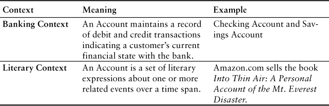
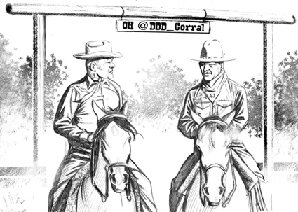

# 第 2 章 领域、子域和限界上下文

There are just as many notes as I required, neither more nor less.

—Mozart in the film Amadeus (Orion Pictures, Warner Brothers, 1984)

There are three things you are going to have to understand very clearly:

- What your Domain is
- What your Subdomains are
- What your Bounded Contexts are

Just because all these concepts were discussed in detail in the second half of [Evans] does not mean that they are of secondary importance. To succeed in implementing DDD, you have to get these right.

Road Map to This Chapter

- Grasp the big picture of DDD by understanding Domains, Subdomains, and Bounded Contexts.
- Learn why strategic design is so essential, and why designing without it hurts.
- Consider a practical real-world Domain with multiple Subdomains.
- Make sense of Bounded Contexts, both conceptually and technically.
- See SaaSOvation’s “aha!” moments as they discover strategic design.

## BIG PICTURE

A Domain, in the broad sense, is what an organization does and the world it does it in. Businesses identify a market and sell products and services. Each kind of organization has its own unique realm of know-how and way of doing things. That realm of understanding and its methods for carrying out its operations is its Domain. When you develop software for an organization, you are working in its Domain. It should be pretty obvious to you what your Domain is. You work in it.

One thing to be aware of is that the term Domain may be a bit overloaded. Domain can refer to both the entire domain of the business, as well as just one core or supporting area of it. I will do my best to distinguish each use of the term. When referring to just one area of the business, I will generally qualify it with the use of Core Domain, Subdomain, and the like.

Because the term domain model includes the word domain, we might get the idea that we should create a single, cohesive, all-inclusive model of an organization’s entire business domain—you know, like an enterprise model. However, when using DDD, that is not our goal. DDD places emphasis on just the opposite. The whole Domain of the organization is composed of Subdomains. Using DDD, models are developed in Bounded Contexts. In fact, developing a Domain Model is actually one way that we focus on only one specific area of the whole business domain. Any attempt to define the business of even a moderately complex organization in a single, all-encompassing model will be at best extremely difficult and will usually fail. As is made clear in this chapter, vigorously separating distinct areas of the whole business domain will help us succeed.

So, if a domain model shouldn’t be all-inclusive of what the organization does and how it does it, what should it be, exactly?

Almost every software Domain has multiple Subdomains. It really doesn’t matter whether the organization is huge and extremely complex or consists of just a few people and the software they use. There are different functions that make any business successful, so it’s advantageous to think about each of those business functions separately.

## Subdomains and Bounded Contexts at Work

Here’s a fairly simple example to introduce how Subdomains can be used. Think of a retail company that sells products online. The products it sells could be just about anything, so we won’t think too carefully about them. To do business in this Domain, the company must present a catalog of products to shoppers, it must allow orders to be placed, it must collect payment for the products sold, and it must ship the products to buyers. This online retailer’s Domain seems to be composed of these four primary Subdomains: Product Catalog, Orders, Invoicing, and Shipping. The upper part of Figure 2.1 shows the e-Commerce System.

<Figures figure="2-1">A Domain with Subdomains and Bounded Contexts</Figures>

This all seems quite straightforward, and to some degree it is. However, if we introduce just one additional detail, we will make our example more complex. Consider for a moment how difficult it can be to deal with Inventory, an additional system and Subdomain seen in Figure 2.1. We’ll get back to the increased complexity in a moment. First let’s peer into the physical subsystems and logical Subdomains in the diagram.

Notice that at this time just three physical systems exist to realize this retailer’s Domain, only two of which are hosted internally. Those two internal systems represent what we might think of as two Bounded Contexts. Since, unfortunately, most systems today are not created by employing a DDD approach, this ends up being a fairly typical situation, with fewer subsystems responsible for many business functions.

Inside the e-Commerce Bounded Context there are really multiple implicit domain models at play, even though they are not cleanly separated as such. These otherwise separate domain models are actually fused into one software model, and that’s very unfortunate. It might be less of a problem for the retailer if it had purchased this Bounded Context from a third party rather than building it, but whoever maintains this system has experienced the negative consequences of the increasing complexity that results from blending the Product Catalog, the Orders, the Invoicing, and the Shipping models into one large e-commerce model. As the various logical models need to grow to facilitate new features, each of the conflicting concerns will impede the progress of each of the others. This would be especially so if another logical model—a major new feature set—must be added. It’s just what happens when software concerns are not cleanly separated.

This is particularly unfortunate because a lot of software developers think it’s clever to bake everything possible into one system. It’s your basic all-knowing, all-doing e-commerce system, and thus it will certainly satisfy everyone’s needs. This is deceiving, however, because no matter how many concerns can be piled into one subsystem, it will never address the needs of every potential consumer. Never. Add to this the fact that not separating otherwise distinct software domain models by Subdomain will make ongoing changes much more burdensome, since everything will tend to be connected to and depend on everything else.

Yet, using one of the DDD strategic design tools, we can to some degree cut through the complexity by externally dissecting these intertwined models into logically separated Subdomains according to their actual functionality. The logical Subdomain separations are indicated by the dashed lines in Figure 2.1. It’s not that we have somehow refactored the third-party models into cleanly separated ones. We’ve just indicated what separate models should exist, at least as they apply to our specific retailer’s business operations. We’ve also drawn some connections between logical Subdomains and even physical Bounded Contexts to show integrations.

Now let’s shift from technical complexities and focus on the business complexities faced by our small company. It has limited funds and it has limited warehouse space. There’s a constant juggling act going on. The company must not overspend on products that aren’t selling well, and some products sell better at certain times than they do at other times. Obviously, if some products don’t sell according to plans, the company’s funds are tied up with products that its customers don’t want, not right now anyway. The money is frozen. As a result, the company has limited room to stock products that are selling well at any given time.

That’s not all. There ends up being another problem. If some products sell more quickly than anticipated, the company will not be able to inventory enough of them to fulfill customer demand. This insufficient inventory challenge could cause customers to obtain the same urgently needed products elsewhere. Sure, some product wholesalers are willing to drop-ship on behalf of the retailer, but that option costs more and introduces other undesirable consequences. There are also cost-saving strategies to stock some products nearby for local consumption and drop-ship others that sell well in distant regions. Thus, drop-shipping should be leveraged to the retailer’s advantage, not as a last-minute tactic employed to rescue a sale gone bad. After all, it’s not that the products that are selling the best are scarce. It’s just that they are not readily available from the small retail company because it didn’t optimally inventory them. If customers experience delays on a continuing basis, it will likely cost the online sales company at least a significant part of any competitive advantage it had previously earned. This example is inspired by customer problems commonly solved by Lokad.1

1. www.lokad.com/.

To be clear, we haven’t investigated the limits of the challenges faced with inventories, and these undesirable situations are not limited to small retailers. Retailers everywhere desire to purchase and inventory precisely according to their exact needs, minimizing cost and optimizing sales fulfillment according to demand. Yet the small retailer tends to suffer the penalties of suboptimal performance more quickly than large retailers.

What would help any online retailer tremendously is a way to base future inventory and sales demands on past trends. If the retailer could use a forecasting engine, providing it with data about inventory and sales history, it could obtain demand forecasts with specific numbers for optimizing its inventory—when to reorder and how much of each product to obtain.

For the small retailer to add such forecasting capabilities would probably constitute a new Core Domain, because it is a nontrivial problem to solve, and succeeding would help the company establish a new competitive advantage. In fact, the third physical Bounded Context in Figure 2.1 is an External Forecasting System. The Orders Subdomain and the Inventory Bounded Context integrate with Forecasting to supply historical product sales and returns information. Additionally, we should also have the Catalog Subdomain provide globally recognized product bar codes, which would allow Forecasting to compare the small retailer’s product lines to related and similar sales trends worldwide, resulting in a broader perspective. This leads to the Forecasting engine possessing the means to calculate the most accurate numbers needed by the small retailer to correctly stock products.

If this new solution were actually a Core Domain, and it most likely is, the team developing it would benefit greatly from understanding the surrounding business terrain composed of logical Subdomains and the integrations needed. Thus, highlighting the preexisting integrations indicated on the diagram in Figure 2.1 is key to grasping the project situation at the time the project begins.

It’s not always the case that Subdomains feature such distinct models of significant size and functionality. Sometimes a Subdomain can be as simple as a set of algorithms that, while essential to the business solution, are not part of the distinguished Core Domain. Applying good DDD techniques, such simple Subdomains can be separated from the Core using Modules (9) and need not be housed in a heavy, architecturally significant subsystem component.

When we employ DDD, we strive for each Bounded Context to mark off where the meaning of every term used by the domain model is well understood, or at least should be if we’ve done a good job of modeling the software. It’s chiefly a linguistic boundary. These contextual boundaries are a key to implementing DDD.

Cowboy Logic

LB: “We get along just fine with the neighbors, until their fences break down.”

AJ: “That’s right. Keep your fences horse-high.”


Note that a single Bounded Context does not necessarily fall within only a single Subdomain, but it may. In Figure 2.1, only one Bounded Context, Inventory, falls within just one Subdomain.2 That makes it rather apparent that proper DDD was not in use when the e-Commerce System was developed. In that system we’ve identified four Subdomains, and there are probably more. On the other hand, the Inventory System does seem to be aligned as one Subdomain per Bounded Context by limiting its domain model to inventorying products. The Inventory System’s apparently clean model may be due to employing DDD, or it may be merely coincidental. We’d have to look under the hood to know for sure. Regardless, we can still make practical use of Inventory to develop the new Core Domain.

2. True, the Shipping Subdomain uses Inventory, but that doesn’t make Inventory part of the e-Commerce System where Shipping has context.

Linguistically, which of the Bounded Contexts in Figure 2.1 has a better design? In other words, which has an unambiguous set of domain-specific terms? When we consider that there are at least four Subdomains in the e-Commerce System, it’s almost certain that terms and meanings collide there. For example, the term Customer must have multiple meanings. When a user is browsing the Catalog, Customer means one thing, but when a user is placing an Order, it means something else. Here’s why. When browsing the Catalog, Customer is being used in the context of previous purchases, loyalty, available products, discounts, and shipping options. On the Order itself, however, Customer has a limited meaning. Among the few details there is a name with a ship-to address, a bill-to address, a total due, and payment terms. Just by this basic reasoning we see that in the e-Commerce System there is no one clean meaning for Customer. Given this situation, as we look around that system we would expect to find several other terms that have multiple meanings. It’s not a clean Bounded Context with an explicit meaning for each term naming a domain concept.

Yet, there’s also no guarantee that the Inventory System has a completely clean model, possessing wholly unambiguous domain linguistics. Even in this apparently focused Context we could face differences in meanings among the things that are being controlled in inventory. This is because there are different ways that inventoried Items are used. Is there a clean distinction between an Item being ordered, one being received, one in stock, and one moving out of stock? An Item on order that is not yet available for sale is called Back-Ordered Item. An Item being received is often called Goods Received. An item in stock may be called a Stock Item. An Item being consumed is often referred to as an Item Leaving Inventory. An inventoried Item that becomes spoiled or broken is often called a Wasted Inventory Item.

By looking at Figure 2.1, we don’t know how well the range of inventory concepts and their accompanying linguistics are modeled. When using DDD, we’d leave none of it to guesswork. We would be certain that each of those concepts is well understood, spoken of explicitly, and modeled as such. The way domain experts describe each of these concepts could lead to separating some in different Bounded Contexts.

From outward appearances we would conclude that the Inventory System has better DDD health than the e-Commerce System. Perhaps the team that worked out its model didn’t attempt to make one Item represent all inventoried item situations. Although uncertain, it’s possible that the model of the Inventory System will be easier to integrate with than that of the e-Commerce System.

Speaking of integration, Figure 2.1 further shows that Bounded Contexts in an enterprise rarely if ever completely stand alone. Even when the third-party e-Commerce System attempts to provide a large, all-encompassing model, it can’t do everything the retailer needs. The solid straight lines running between and connecting the various Subdomains in the e-Commerce System, the Inventory System, and the External Forecasting System show the necessary integration relationships, which proves that different models must work together. There are always specific kinds of relationships involved in integration, and you’ll learn more about the possible integration options in Contexts Maps (3).

That’s the high-level summary of one view of a simple business domain. We’ve briefly encountered a Core Domain and gotten the notion that it is an important part of DDD. Now we need to understand it better.

## Focus on the Core Domain

With an understanding of Subdomains and Bounded Contexts, consider an abstract view of a different Domain found in Figure 2.2. This could represent any domain, perhaps even the one you work in. I’ve removed the explicit names so you can mentally fill in the blanks. Naturally, our business goals are on a path of continuous refinement and expansion reflected by ever-changing Subdomains and the models within. This diagram only captures the whole business Domain at a moment in time with a specific perspective, and one that could be somewhat short-lived.

<Figures figure="2-2">An abstract business Domain that includes Subdomains and Bounded Contexts</Figures>

Whiteboard Time

- In one column make a list of all the Subdomains that you are aware of in your daily work. In another column list the Bounded Contexts. Do Subdomains intersect with multiple Bounded Contexts? If so, it’s not necessarily a bad thing, just a fact of enterprise software.
- Now, using the template in Figure 2.2, write in some of the names of the software running in your enterprise with the Subdomains, Bounded Contexts, and the integration relationships between them.

Was that difficult? Probably, because the template in Figure 2.2 likely doesn’t closely reflect the existing boundaries in your Domain.

- Start over. This time you should draw a diagram that aligns with your Domain, Subdomains, and Bounded Contexts. Use the techniques displayed in Figure 2.2, but go ahead and fit them to your world.

Of course, you may not know about every Subdomain and Bounded Context in your entire enterprise, especially if your Domain is really large and complex. But you may be able to figure out the ones you deal with on a day-to-day basis. Anyway, give it a go. Don’t be afraid of being wrong. You’ll get some good practice at Context Mapping, which will be refined in the next chapter. If you want to jump to that chapter briefly for more advice, that’s fine. Still, don’t worry about being perfect just now. Grasp the basic ideas first.

Now look at the top of the Domain boundary in Figure 2.2 and you’ll see the Subdomain labeled Core Domain. Introduced earlier, this is another aspect of DDD of major importance. A Core Domain is a part of the business Domain that is of primary importance to the success of the organization. Strategically speaking, the business must excel with its Core Domain. It is of utmost importance to the ongoing success of the business. That project gets the highest priority, one or more domain experts with deep knowledge of that Subdomain, the best developers, and as much leeway and leverage as possible to give the close-knit team an unobstructed success path. Most of your DDD project efforts will be focused on the Core Domain.

Two other kinds of Subdomains are found in Figure 2.2, Supporting Subdomain and Generic Subdomain. Sometimes a Bounded Context is created or acquired to support the business. If it models some aspect of the business that is essential, yet not Core, it is a Supporting Subdomain. The business creates a Supporting Subdomain because it is somewhat specialized. Otherwise, if it captures nothing special to the business, yet is required for the overall business solution, it is a Generic Subdomain. Being Supporting or Generic doesn’t mean unimportant. These kinds of Subdomains are important to the success of the business, yet there is no need for the business to excel in these areas. It’s the Core Domain that requires excellence in implementation, since it will provide distinct advantages to the business.

Whiteboard Time

- To make sure you grasp the significance of the Core Domain concepts, what you should do next is go back to your fresh whiteboard drawing and see if you can identify where a Core Domain is being developed in your organization.
- Next, see if you can identify the Supporting Subdomains and Generic Subdomains in your Domain.

Remember: Ask the Domain Experts!

Even if you don’t get it just right the first time, this exercise will help you to think carefully about what software most distinguishes your business, what supports the distinguishing software, and what doesn’t distinguish your business’s success at all. Keep working at it so you become more comfortable with the thought processes and techniques.


Discuss each Subdomain and Bounded Context in your drawing with a few domain experts who specialize in the different areas.

Not only will you learn a lot from them, but you’ll gain valuable experience in listening to the experts. That’s a hallmark of implementing DDD well.

What you’ve just learned is the big-picture foundation of strategic design.

## WHY STRATEGIC DESIGN IS SO INCREDIBLY ESSENTIAL

OK, you’ve learned some DDD terminology and the meaning behind it, but not much has been said about why this is so important. I’ve really just asserted that it is very important and hoped that you’d believe me. But like most statements of “fact,” I’d better back my assertion now. Let’s jump in on our running example, that of the projects going on at SaaSOvation. They’ve managed to get themselves into a real jam.


Early on in their first effort with DDD, the collaboration project team began to veer off the path to developing a clean model. This happened because they didn’t understand strategic design, not even at its most basic level. As is true of most developers, their focus was on the details of Entities (5) and Value Objects (6), which obscured their vision of the bigger picture. They blended their core concepts with generic ones, causing the creation of two models in one. Before long they started to feel the pain of the design reflected in Figure 2.3. The bottom line? They had not fully achieved the goal of implementing DDD.

<Figures figure="2-3">The team didn’t understand basic strategic design, which led to mismatched concepts in the collaboration model. The dashes encircle the problem elements.</Figures>

A few on the SaaSOvation team asserted, “So what if collaboration concepts are tightly coupled to Users and Permissions? We must track who did what!” The senior developer pointed out that it’s actually not the coupling alone that the team should be concerned with. “In the end, a Forum, a Post, a Discussion, a Calendar, and a Calendar Entry will all be coupled to some kind of human collaborator objects. And that’s just it. The linguistics are wrong here.” As he elaborated, he showed that Forum, Post, Discussion, and the like were all coupled to the wrong linguistic concepts. Users and Permissions have nothing to do with collaboration and don’t harmonize in the true Ubiquitous Language of Collaboration. Users and Permissions are identity and access concepts—security concerns. Every concept modeled in the Collaboration Context—as in the Bounded Context surrounding the collaboration domain model—should have a linguistic association to collaboration, and right now they don’t. “What we should be focused on are collaboration concepts, such as Author and Moderator. Those are the correct concepts and linguistic terms in a collaboration setting.”

Naming a Bounded Context

Did you notice the name Collaboration Context used here? This is the way we name a Bounded Context, which is in the form Name-of-Model Context. In this case we use Collaboration Context because it is the Bounded Context that contains the domain model of the Collaboration project. We also have Identity and Access Context for the Bounded Context that contains the model of the Identity and Access project, and Agile Project Management (PM) Context for the Bounded Context that holds the model of the Agile Project Management project.

To reiterate, at a fundamental level, the SaaSOvation developers didn’t at first understand that Users and Permissions had nothing to do with collaboration tools. Well, sure, they did have users of their software, and those users had to be distinguished one from another to determine the tasks each could perform. But collaboration tools should be interested in the roles of users, rather than who they specifically are and each little action they are permitted to perform. However, the collaboration model now had user and permission details completely intertwined. If something changed about the way users and/or permissions worked, a lot or all of the model would suffer from the ripple. In fact, this problem was right at the threshold. The team wanted to switch from a permissions approach and use role-based access management instead. When they decided to make this switch, it made them more aware of the strategic modeling problem at hand.

They now realized that a Forum should not be concerned with who can post a subject, or under what conditions that is permitted. A Forum just needs to know that an Author is doing that right now, or had done that previously. The team was now grasping that determining who can do something is the concern of a completely separate model, and the core collaboration model only needed to know that any question regarding who can do what had already been answered. The Forum just needed to be given an Author who wants to Post to a Discussion. The Forum and Author are clearly concepts of the Ubiquitous Language of the collaboration model, a Bounded Context named Collaboration Context. User and Permission, or some similar concepts such as Role, belonged someplace completely different. Those needed to be isolated from the Collaboration Context.

It would be easy for the team to conclude that they only needed to factor out the tight coupling to User and Permission. After all, there would not be anything wrong with separating User and Permission/Role into a separate Module. That could help them place these concepts in a separate logical Security Subdomain within the same Bounded Context. However, what made the best modeling choice stand out even more boldly was the realization that the team’s next Core Domain project would have very similar role-based access needs and would lean on the use of domain-specific role characteristics. Clearly, Users and Roles were truly part of a Supporting or Generic Subdomain that had an enterprise-wide, and even customer-facing, part to play in the future.

Taking a more vigorous approach to clean modeling would help them avoid a more insidious problem. They were probably leaning toward working their way into a Big Ball of Mud (3). It wasn’t just that their User and Permission concepts were not properly modularized. While modularization is an essential DDD modeling tool, it doesn’t fix linguistic misalignment.

The senior developer was very concerned that, if left unchecked, this situation could easily lead to an undisciplined mindset that would allow more tangle to eventually creep in subtly. In time, as the team faced modeling another set of noncollaboration concepts, the Core Domain would become even less clear. They could end up with only an implicit model with source code that wouldn’t reflect an expressive Ubiquitous Language of Collaboration. What the team really needed to understand was their business Domain, its Subdomains, as well as the Bounded Contexts they were developing. Doing so would prevent the entry of the dastardly foe of strategic design, the muck of the Big Ball of Mud. Thus, the team needed to gain a strategic modeling mindset.

Oh, No! There’s That Word Design Again!

If you think that design is a dirty word when agile is in practice, it’s not with DDD. Using DDD with agile is completely natural. Always keep design in check with agile. Design need not be heavy.

Yeah, that was an important lesson to learn. They did manage to work their way through it with a lot of research and finally got a handle on their Domain and Subdomains. How they did that will be presented soon.

Alignment with the DDD Community

The running examples in this book are provided as three Bounded Contexts. These Bounded Contexts are likely different from those you work with. The examples present fairly typical modeling situations. However, not everyone would agree that Users and Permissions should be separated out of a given Core Domain. Perhaps in some cases it might make sense to intertwine them with your Core model. As always, that is the choice of a specific team. In my experience, however, this is one of the basic problems encountered by those new to DDD, and one that misleads their implementation efforts into an unnecessarily messy result. Another common misstep would be to meld the collaboration and agile project management models into one. These are only a few common problems. Other common modeling errors are discussed in each chapter.

At a minimum, the problems posed here, and those that follow, are representative of the kinds of modeling mistakes that are made when teams fail to understand the importance of linguistic drivers and Bounded Contexts. Thus, even if you disagree with the specific example problems, both the problems and solutions are still applicable in a general way to all DDD projects, because they all focus on the linguistics of a given Bounded Context.

My goal is to teach the principles of implementing DDD using the simplest, yet nontrivial, examples possible. I can’t afford to allow the examples to get in the way of my teaching and your learning. If I demonstrate that identity and access management, collaboration, and agile project management all have separate linguistics, readers are well served by what the examples emphasize. Since it is each team’s choice to discover the linguistic drivers that they find important, and that help them achieve the vision of their domain experts, assume that there is no mistake in the “ultimate correct” conclusions reached by the SaaSOvation developers and the modeling choices they made in their DDD implementation journey.

All of my guidance regarding Subdomains and Bounded Contexts is closely aligned with that of the broader DDD community, as it reflects my own experience. Other DDD leaders may have a slightly different focus. However, my explanations definitely provide a firm foundation for any team to move forward without ambiguity. Clearing the murky areas of DDD is the most important service to the community, and it is my primary goal. It should be your goal to put these guidelines to use in the most practical way to benefit your project.

## REAL-WORLD DOMAINS AND SUBDOMAINS

I have something more to tell you about domains. They have both a problem space and a solution space. The problem space enables us to think of a strategic business challenge to be solved, while the solution space focuses on how we will implement the software to solve the problem of the business challenge. Here’s how that fits into what you’ve already learned:

- The problem space is the parts of the Domain that need to be developed to deliver a new Core Domain. Assessing the problem space involves examining Subdomains that already exist and those that are needed. Thus, your problem space is the combination of the Core Domain and the Subdomains it must use. The Subdomains in the problem space are usually different from project to project since they are used to explore a current strategic business problem. This makes Subdomains a very useful tool in assessing the problem space. Subdomains allow us to rapidly view different parts of the Domain that are necessary to solve a specific problem.
- The solution space is one or more Bounded Contexts, a set of specific software models. That’s because the Bounded Context is a specific solution, a realization view, once developed. The Bounded Context is used to realize a solution as software.

It is a desirable goal to align Subdomains one-to-one with Bounded Contexts. Doing so expressly segregates domain models into well-defined areas of business by objective, melding the problem space with the solution space. In practice this is not always possible, but it can work in a greenfield effort. Considering a legacy system, and probably a Big Ball of Mud, however, Subdomains often intersect Bounded Contexts, similar to what we discussed regarding Figure 2.1. In a large and complex enterprise we can employ an assessment view to understand our problem space, which can save us from making costly mistakes. We can conceptually divide a single, large Bounded Context using two or more Subdomains, or multiple Bounded Contexts as part of a single Subdomain. Consider an example to help clarify the difference between the problem space and the solution space.

Imagine a large, monolithic system, classified as an ERP application. Strictly speaking, an ERP may be thought of as a single Bounded Context. However, since ERP systems provide many modular business services, there’s a benefit to thinking of distinct modules as different Subdomains. For example, we could divide the inventory module and purchasing module into separate, logical Subdomains. True, these modules aren’t available through completely different systems. Both are part of the same ERP. Still, each provides a very different set of services to the business domain. For analytical discussions let’s name these as separate Subdomains, the Inventory Subdomain and the Purchasing Subdomain. Continuing with the example, we’ll see why doing so is useful.

As a core business initiative, the organization whose Domain is represented in Figure 2.4 (a concrete example using the template from Figure 2.2) starts planning the design and development of a specialized domain model to reduce the cost of doing business. The model will provide decision-making tools to be used by purchasing agents. Algorithms discovered over years of manual, human process must now be automated by software to ensure that they are always used by all purchasing agents without error. This new Core Domain will make the organization more competitive by identifying better deals more quickly, and then ensuring that the needed inventories are met. To accurately stock inventory, use of the previously examined Forecasting System of Figure 2.1 would help here as well.

<Figures figure="2-4">The Core Domain and other Subdomains involved in purchasing and inventory. This view is limited to select Subdomains used for specific problem space analysis, not the entire Domain.</Figures>

Before we can execute a specific solution, we need to make an assessment of the problem space and the solution space. Here are some questions that should be answered in order to steer your project in the right direction:

- What is the name of and vision for the strategic Core Domain?
- What concepts should be considered part of the strategic Core Domain?
- What are the necessary Supporting Subdomains and the Generic Subdomains?
- Who should do the work in each area of the domain?
- Can the right teams be assembled?

If we don’t understand the vision and goals of the Core Domain and the areas of the Domain that are needed to support it, we won’t be able to strategically take advantage of them and avoid associated pitfalls. Keep problem space assessment high-level, but make it thorough. Be sure that all stakeholders are aligned with and committed to successfully delivering on the vision.

Whiteboard Time

Take a moment to look at your whiteboard work and consider: What is your problem space? Recall that it is the combination of the strategic Core Domain and the Subdomains supporting it.

When you have a good understanding of the problem space, you then turn to the solution space. The first assessment will contribute knowledge to the second. The solution space will be strongly influenced by the existing systems and technologies, and those that are to be newly created. Here we really need to think in terms of cleanly separated Bounded Contexts because we are looking at the Ubiquitous Language of each. Consider these crucial questions:

- What software assets already exist, and can they be reused?
- What assets need to be acquired or created?
- How are all of these connected to each other, or integrated?
- What additional integration will be needed?
- Given the existing assets and those that need to be created, what is the required effort?
- Do the strategic initiative and all supporting projects have a high probability of success, or will any one of them cause the overall program to be delayed or even fail?
- Where are the terms of the Ubiquitous Languages involved completely different?
- Where is there overlap and sharing of concepts and data between Bounded Contexts?
- How are shared terms and/or overlapping concepts mapped and translated between the Bounded Contexts?
- Which Bounded Context contains the concepts that address the Core Domain and which of the [Evans] tactical patterns will be used to model it?

Remember, the efforts in developing the solutions in the Core Domain are a key business investment!

The specialized purchasing model described previously and pictured in Figure 2.4—the one that captures decision-making tools and algorithms—represents the solution for the Core Domain. The domain model will be implemented in an explicit Bounded Context: the Optimal Acquisitions Context. This Bounded Context aligns one-to-one with the Subdomain, the Optimal Acquisitions Core Domain. Being aligned with just one Subdomain, and its carefully crafted domain model, will make it one of the best Bounded Contexts in this business domain.

Yet another Bounded Context, the Purchasing Context, will be developed in order to refine some technical aspects of the purchasing process as a helper to the Optimal Acquisitions Context. These refinements don’t reveal any special knowledge about an optimal approach to purchasing. They just make it easier for the Optimal Acquisitions Context to interact with the ERP at an arm’s length. It’s just a convenient model that operates against the ERP published interface. The new Purchasing Context and the preexisting ERP purchasing module fall within the Purchasing (Supporting) Subdomain.

The ERP purchasing module is as a whole a Generic Subdomain. That’s because you could replace this Subdomain with any off-the-shelf purchasing system as long as it fulfills your basic business needs. However, being used along with the new Purchasing Context in the Purchasing Subdomain makes it work in a Supporting fashion.

You Can’t Change the World of Bad Software Design

In a typical brownfield enterprise you are going to have undesirable situations like those illustrated in Figures 2.1 and 2.4. This means that Subdomains in poorly designed software will not align in an ideal way, one-to-one, with Bounded Contexts. You can’t change the world of bad software design. You can only hope to implement proper DDD in projects you work on. In the end you will have to integrate with and even work in brownfield domains, so be prepared to exercise the techniques taught in the first one-third of this chapter as you analyze the multiple implicit models found in a single, brown Bounded Context.

Sticking with Figure 2.4, the Optimal Acquisition Context must also interact with the Inventory Context. Inventory manages warehousing items. It uses the ERP inventory module, which falls within the Inventory (Supporting) Subdomain. As a convenience to delivery contractors, the Inventory Context can provide maps and directions to each of its warehouses from an origin location by using an external geographical mapping service. From the Inventory Context point of view, there is nothing special about mapping. There are several geographical mapping services to choose from, and there may be advantages to changing the chosen mapping system over time. The mapping service is itself a Generic Subdomain, but it is consumed by a Supporting Subdomain.

Note these key points as viewed from the perspective of the company developing the Optimal Acquisition Context. In the solution space the geographical mapping service is not part of the Inventory Context, although in the problem space it is considered part of the Inventory Subdomain. In the solution space, even if the mapping services are provided by a simple component-based API, it is in a different Bounded Context. The Ubiquitous Languages of Inventory and of Mapping are mutually exclusive, which means they are in different Bounded Contexts. When the Inventory Context uses something from the external Mapping Context, the data may go through at least some minimal translation to be properly consumed.

On the other hand, from the point of view of the external business organization that develops and offers the mapping service for subscription, mapping is a Core Domain. That external organization has its own domain, or realm of business operations. It must remain competitive, constantly refining its domain model in order to retain subscribers and attract new ones. If you were the CEO of the mapping organization, you’d make sure to give customers, including the one subscriber under discussion, every reason to stick with your services rather than move on to the competition. However, that doesn’t change the perspective of the subscriber that is developing its inventory system. To the inventory system it is still a Generic Subdomain. It could, if it was to its advantage, subscribe to a different mapping service.

Whiteboard Time

What are the Bounded Contexts in your solution space? At this point you should be able to refer back to your whiteboard diagram for a good idea. Still, you may be a bit surprised as we dig deeper into how to properly use Bounded Contexts. So be ready for possible refinements. We are doing agile development, after all.

So, for the balance of this chapter we are going to shift gears and consider the importance of Bounded Contexts as an essential solution space modeling tool for DDD. In Context Maps (3) the discussion primarily stresses how to deal with mapping different, but related, Ubiquitous Languages, by integrating their Bounded Contexts.

## MAKING SENSE OF BOUNDED CONTEXTS

Don’t forget, a Bounded Context is an explicit boundary within which a domain model exists. The domain model expresses a Ubiquitous Language as a software model. The boundary is created because each of the model’s concepts inside, with its properties and operations, has a special meaning. If you are a member of such a modeling team, you’d know exactly the meaning of each of the concepts in your Context.

Bounded Context Is Explicit and Linguistic

A Bounded Context is an explicit boundary within which a domain model exists. Inside the boundary all terms and phrases of the Ubiquitous Language have specific meaning, and the model reflects the Language with exactness.

It is often the case that in two explicitly different models, objects with the same or similar names have different meanings. When an explicit boundary is placed around each of the two models individually, the meaning of each concept in each Context is certain. Thus, a Bounded Context is principally a linguistic boundary. You should use these points of reasoning as a touchstone to determine if you are correctly using Bounded Contexts.

Some projects fall into the trap of attempting to create an all-inclusive model, one where the goal is to get the entire organization to agree on concepts with names that have only one global meaning. Approaching a modeling effort in this way is a pitfall. First, it will be nearly impossible to establish agreement among all stakeholders that all concepts have a single, pure, and distinct global meaning. Some organizations are so large and complex that you’d never be able to get all stakeholders together, let alone establish total meaningful agreement among them. Even if you are working in a smaller company with relatively few stakeholders, establishing an enduring definition of a single global concept is still unlikely. Thus, the best position to take is to embrace the fact that differences always exist and apply Bounded Context to separately delineate each domain model where differences are explicit and well understood.

A Bounded Context does not dictate the creation of a single kind of project artifact. It’s not an individual component, document, or diagram.3 So it’s not a JAR or DLL, but these can be used to deploy a Bounded Context as described later in the chapter.

3. You can draw a diagram of one or more Bounded Contexts as seen here and in Context Maps. However, the diagram is not the Bounded Context.

Consider this sharp contrast between an Account in a Banking Context and an Account in a Literary Context as presented in Table 2.1.

Table 2.1. The Diversity of Meanings That the Term Account Can Have



Looking at Figure 2.5, there is nothing characteristic of the Account types by name that distinguishes them. It is only by looking at the name of each conceptual container—its Bounded Context—that you understand the differences between the two.

<Figures figure="2-5">Account objects in two different Bounded Contexts have completely different meanings, but you know that only by considering the name of each Bounded Context.</Figures>

These two Bounded Contexts are probably not in the same Domain. The point is to demonstrate that context is king.

Context Is King

Context is king, especially when implementing DDD.

In the financial world the word security is often used. The Securities and Exchange Commission (SEC) restricts the term security to use with equities. Now consider this: Futures contracts are commodities and not under the jurisdiction of the SEC. However, some financial firms call Futures by the name security as a reference but mark them with the Standard Type (6) Futures.

Is that the best Language for a Future? It depends on the Domain it’s used in. Some would obviously say it is, while others would insist that it isn’t. Context is also cultural. Inside a given firm that trades Futures, it may align best with the culture to use the term Security in a specific Ubiquitous Language.

It is often the subtly different meanings that are most commonly faced in your enterprise. Here’s why. The name chosen by each team in each Context is always made with the Ubiquitous Language in mind. You never name a concept arbitrarily, such as to purposely distinguish it from a term in a different Context. Consider two banking Contexts, one for checking accounts and one for savings accounts.4 We don’t need to give the name Checking Account to the object in the Checking Context or the name Savings Account to the object in the Savings Context. Both concepts may safely be named Account because each Bounded Context distinguishes subtle meanings. Of course, there is no rule that says that more meaning cannot be added to these names. That’s the decision of your team.

4. This assumes a Domain where separate Bounded Contexts are used for checking and savings accounts.

When integrations are needed, mapping must be done between Bounded Contexts. This can be a complex aspect of DDD and calls for a corresponding amount of care. We don’t usually use an object instance outside its boundary, but related objects in multiple contexts may share some subset of common state.

Here’s another example with a common name used in multiple Bounded Contexts, but this time within the same Domain. Consider the modeling challenges of a publishing organization that must deal with the various stages of the life cycle of books. Roughly speaking, publishers deal with similar stages as a book progresses through these different Contexts:

- Conceptualizing and proposing a book
- Contracting with authors
- Managing the book’s authorship and editorial process
- Designing the book layout, including illustrations
- Translating the book into other languages
- Producing the physical print and/or electronic editions
- Marketing the book
- Selling the book to resellers and/or directly to consumers
- Shipping a physical book to resellers and consumers

Throughout each of these stages, is there one single way to properly model a Book? Absolutely not. At each of these stages the Book has different definitions. It is not until contract that the Book has a tentative title, which might change during editing. During the authorship and editorial phases, the Book has a collection of drafts with comments and corrections, along with a final draft. Graphic designers create page layouts. Production uses the layouts and to create press images, “blue lines,” and finally plates. Marketing doesn’t need most of the editorial or production artifacts, perhaps just cover art and high-level descriptions. For shipping, the Book might carry only an identity, inventory location, availability count, a size, and a weight.

What would happen if you tried to design a central model for Books that facilitated all the stages in its life cycle? There would be a high degree of confusion, disagreement, and contention, and little deliverable software. Even if a correct common model could be delivered from time to time, it would likely meet the needs of all clients only occasionally and far too briefly.

To counter that kind of undesirable churn and burn, such a publisher modeling with DDD would use separate Bounded Contexts for each of the life cycle stages. In every one of the multiple Bounded Contexts, there is a type of Book. The various Book objects would share an identity across all or most of the Contexts, perhaps first established at the conceptualization stage. However, the model of a Book in each Context would be different from all others. That’s fine, and in fact the way it should be. When the team of a given Bounded Context speaks about a Book, it means exactly what they require for their Context. The organization embraces the natural need for differences. This is not to say that such positive outcomes are trivial to achieve. Nonetheless, using explicit Bounded Contexts, software gets delivered regularly with incremental improvements that address the specific needs of the business.

At this point let’s take a quick look at the solution used by the SaaSOvation collaboration team to solve the modeling challenge as shown in Figure 2.3.

As indicated previously, in a Collaboration Context domain experts don’t describe the people who employ the collaboration facilities as Users with Permissions. Rather, they talk about these collaborators in terms of the roles they play in the Context, as Authors, Owners, Participants, and Moderators. Some contact information may exist there, but probably not all of it. On the other hand, it’s in an Identity and Access Context that we talk about Users. In that Context User objects have usernames and detailed information about the individual person, including detailed ways to contact the person.

Yet, we don’t create an Author object out of thin air. Every collaborator must be prequalified. We confirm the existence of a User playing the appropriate Role within the Identity and Access Context. The attributes of an authentication descriptor are passed with requests to the Identity and Access Context. To create a new collaborator object, such as a Moderator, we use a subset of User attributes and a Role name. The exact details of how we obtain object state from a separate Bounded Context is not important (although later on it’s explained extensively). What’s important now is that these two different concepts are similar and different at the same time, and that the differences are determined by the Bounded Context. Figure 2.6 exemplifies User and Role in their own Context being used to create a Moderator in a different Context.

<Figures figure="2-6">The Moderator object in its Context is based on User and Role in a different context.</Figures>

Whiteboard Time

- See if you can identify some subtly different concepts that exist in multiple Bounded Contexts in your Domain.
- Determine whether the concepts are properly separated, or if developers simply copied code into both.

Generally you can determine a proper separation because the similar objects have different properties and operations. In that case the boundary has separated the concepts appropriately. However, if you see the exact same objects in multiple contexts, it probably means there is some modeling error, unless the two Bounded Contexts are using a Shared Kernel (3).

## Room for More than the Model

A Bounded Context does not necessarily encompass only the domain model. True, the model is the primary occupant of the conceptual container. However, a Bounded Context is not limited to the model only. It often marks off a system, an application, or a business service.5 Sometimes a Bounded Context houses less than this if, for example, a Generic Subdomain can be produced without much more than a domain model. Consider portions of a system that are typically part of a Bounded Context.

5. Admittedly the meanings of system, application, and business service are not always agreed upon. However, in a general sense I intend these to mean a complex set of components that interact to realize a set of significant business use cases.

When the model drives the creation of a persistence database schema, the database schema will live inside the boundary. This is the case because the schema is designed, developed, and maintained by the modeling team. It means that the database table names and column names, for example, will directly reflect names used in the model, rather than names translated to another style. For example, say our model has a class named BacklogItem and that class has Value Object properties named backlogItemId and businessPriority:

Click here to view code image

```java
public class BacklogItem extends Entity  {
    ...
    private BacklogItemId backlogItemId;
    private BusinessPriority businessPriority;
    ...
}
```

We would expect to see those mapped to the database in like manner:

Click here to view code image

```sql
CREATE TABLE `tbl_backlog_item` (
     ...
    `backlog_item_id_id` varchar(36) NOT NULL,
    `business_priority_ratings_benefit` int NOT NULL,
    `business_priority_ratings_cost` int NOT NULL,
    `business_priority_ratings_penalty` int NOT NULL,
    `business_priority_ratings_risk` int NOT NULL,
    ...
) ENGINE=InnoDB;
```

On the other hand, if a database schema is preexisting or if a separate team of data modelers forces contradicting designs on the database schema, the schema does not live within the Bounded Context occupied by the domain model.

When there are User Interface (14) views that render the model and drive execution of its behavior, these are also inside the Bounded Context. However, this does not mean that we model the Domain in the user interface, causing domain model anemia. We want to reject the Smart UI Anti-Pattern [Evans] and any temptation to drag domain concepts that belong in the model into other areas of the system.

Users of the system/application are not always limited to humans and may include other computer systems. Components such as Web services may exist. We might use RESTful resources to provide interaction with the model as an Open Host Service (3, 13). Or perhaps we deploy Simple Object Access Protocol (SOAP) or messaging service endpoints instead. In all such cases, the service-oriented components are inside the boundary.

Both user interface components and service-oriented endpoints delegate to Application Services (14). These are different kinds of services, generally providing security and transaction management, and acting as Facade [Gamma et al.] to the model. They are task managers, transforming use case flow requests into the execution of domain logic. Application Services are also inside the boundary.

More on Architectural and Application Concerns

If you want to consider how DDD fits with various architectural styles, see Architecture (4). Also, Application Services are treated specially in Application (14). There are helpful diagrams and code snippets in both chapters.

The Bounded Context primarily encapsulates the Ubiquitous Language and its domain model, but it includes what exists to provide interaction with and support of the domain model. Pay attention to keeping the aspects of each Architectural concern in their proper place.

Whiteboard Time

- Look at each of the Bounded Contexts you identified in your whiteboard diagram. When you think of those, do you imagine components other than the domain model as being within the boundary?
- If there is a user interface and a set of Application Services, make sure they are inside the boundary. (You have flexibility in how you represent these. See Figures 2.8, 2.9, and 2.10 for some ideas for representing various components.)
- If your database schema or other persistence store was developed for your model, make sure it is also inside the boundary. (Figures 2.8, 2.9, and 2.10 provide one way to represent a database schema.)

## Size of Bounded Contexts

How many Modules (9), Aggregates (10), Events (8), and Services (7)—the primary building blocks of a domain model created using DDD—should a Bounded Context contain? That’s a bit like asking, “How long is a piece of string?” A Bounded Context should be as big as it needs to be in order to fully express its complete Ubiquitous Language.

Extraneous concepts that are not truly part of the Core Domain should be factored out. If a concept is not in your Ubiquitous Language, it should not be introduced in your model in the first place. Still, if one or more extraneous concepts creep in, get rid of them. They probably belong in a separate Supporting or Generic Subdomain, or in no model at all.

Be careful not to mistakenly factor out concepts that do truly belong in the Core Domain. Your model must completely exhibit the richness of the Ubiquitous Language in context, leaving out nothing essential. Clearly, good judgment is needed. Tools such as Context Maps (3) can help shape your team’s good judgment.

In the film Amadeus6 there is a scene where the Austrian emperor Joseph II communicates to Mozart that the musical work Mozart had just performed was a quality piece, but one that contained “simply too many notes.” Mozart aptly replies to the emperor, “There are just as many notes as I required, neither more nor less.” This reply well illustrates an essential mentality to take into stepping off contextual boundaries around our models. There is a very appropriate number of domain concepts to model in a given Bounded Context, neither more nor less.

6. Orion Pictures, Warner Brothers, 1984.

Of course this is rarely as easy for each of us to achieve as when Mozart would compose a symphony with the ease of writing a letter to a friend. At any given time we may have missed an opportunity to refine the domain model to some degree. During each iteration we challenge our assumptions about the model, which forces us to add or remove a concept or change the way concepts behave and collaborate. But the point is that we face that challenge time and again, and using DDD principles we give serious consideration to what belongs and what does not. We use Bounded Context and tools such as Context Maps to help analyze what is truly part of a Core Domain. We don’t resort to applying arbitrary segregation rules based on non-DDD principles.

The Beautiful Sound of Domain Models

If our models were music, they would have the unmistakable sound of completeness, purity, power, and possibly even elegance and beauty.

If we constrain a given Bounded Context too stringently, gaping holes result from vital but missing contextual concepts. And if we keep piling concepts onto the model that don’t express the core of the business problem being solved, we will muddy the waters so much that we will fail to observe and understand what is essential. Our goal? If our models were music, they would have the unmistakable sound of completeness, purity, power, and possibly even elegance and beauty. The number of notes—the Modules, Aggregates, Events, and Services inside—would be neither more nor less than what the correct design requires. Those “listening” in on the model would never have to ask what that strange “sound” is in the middle of an otherwise harmonious symphony. Nor would they be distracted by moments of complete silence caused by a missing page or two of musical notes.

What could lead us into creating a wrong-sized Bounded Context? We might mistakenly allow architectural influences, rather than the Ubiquitous Language, to guide us. Perhaps the way a platform, framework, or some infrastructure is typically used to package and deploy components could unduly influence the way we think about Bounded Contexts, treating them as technical rather than linguistic boundaries.

Another trap would be to divide Bounded Contexts in order to distribute tasks to available developer resources. Technical leads and project managers might think it is easier for developers to manage smaller tasks. While that might be the case, enforcing boundaries for the sake of task distribution plays false to the linguistic motivations of contextual modeling. In fact, there is no need to impose fake boundaries in order to manage technical resources.

The important question is, What does the Language of the domain experts indicate about the real contextual boundaries?

When a fake Context is formulated in order to address an architectural component or developer resources, the Language becomes fragmented and lacks expressiveness. Hence, focus on the Core Domain with the concepts that naturally fit together into a single Bounded Context, according to the Language spoken by domain experts. After you do so, you can identify the components that naturally fit in a single, cohesive model. Keep all such components in the Bounded Context.

Sometimes the problem of creating miniature Bounded Contexts can be avoided with careful application of Modules. Given an analysis of a set of services that are spread across multiple “Bounded Contexts,” you will find that judicious use of Modules could reduce the total number of actual Bounded Contexts to just one. Modules can also be used as a means to divide developer responsibilities, hence managing task distribution using a more appropriate tactical approach.

Whiteboard Time

- Draw a Bounded Context of your current model as a big, irregularly shaped ellipse.

Even if you don’t yet have an explicit model, still think of the Language within.

- Inside the ellipse, write the names of the primary concepts that you are sure your code implements. See if you can spot concepts that should be there but are missing, and those that are there but shouldn’t be. What should you do about each of those problems?

Be Careful to Practice DDD Using Linguistic Drivers

The bottom line: If you are not following the Language drivers, you are not working with and listening to domain experts to create the Bounded Context. Think carefully about the size of your Bounded Contexts. Don’t be too quick to miniaturize them.

## Aligning with Technical Components

It doesn’t hurt to think about a Bounded Context in terms of the technical components that house it. Just keep in mind that technical components don’t define the Context. Let’s consider some common ways that they are composed and deployed.

When using an IDE such as Eclipse or IntelliJ IDEA, a Bounded Context is often housed in a single project. When using Visual Studio and .NET, you may favor dividing your user interface, Application Services, and domain model into separate projects within the same solution, or you may decide on another division. The source tree of the project may be limited to the domain model itself, or it may contain surrounding Layers (4) or Hexagonal (4) areas. There is a lot of flexibility here. Using Java, the top-level package generally defines the highest-level Module name for the Bounded Context. Using one of the preceding examples, that could be done something like this:

```java
com.mycompany.optimalpurchasing
```

The source tree of this Bounded Context would be further divided according to Architectural responsibilities. Here’s a view of the project’s possible second-level package names:

Click here to view code image

```java
com.mycompany.optimalpurchasing.presentation

com.mycompany.optimalpurchasing.application

com.mycompany.optimalpurchasing.domain.model

com.mycompany.optimalpurchasing.infrastructure
```

Even with these modular divisions, only a single team should work in a single Bounded Context.

A Single Team for a Single Bounded Context

Assigning a single team to work on a single Bounded Context is not an attempt to limit flexibility to team organization. It’s not as if teams can’t be arranged as needed, or that individual members of one team cannot be used on one or more other projects. A company should use people in the way that best fits its needs. This is simply stating that it is best for one well-defined, cohesive team of domain experts and developers to focus on one Ubiquitous Language modeled in an explicit Bounded Context. If you assign two or more distinct teams to one Bounded Context, each team will contribute to a divergent and ill-defined Ubiquitous Language.

There is also the possibility that two teams will cooperate in the design of a Shared Kernel, which is actually not a typical Bounded Context. This Context Mapping pattern forms an intimate relationship between two teams, which requires ongoing consultation when model changes are deemed necessary. This modeling approach is less common and is generally avoided if possible.

When using Java, we may technically house a Bounded Context in one or more JAR files, including WAR or EAR files. The desire for modularization may have an influence here. Loosely coupled parts of the domain model could be housed in separate JAR files, enabling them to be deployed independently by version. This would be especially useful with large models. Creating multiple JAR files of a single model would provide the advantage of managing versions of its elements using OSGi bundles or using Java 8 Jigsaw modules. Thus, various high-level modules, their versions, and their dependencies could be managed as bundles/modules. There are at least four such bundles/modules represented by the preceding DDD-based, second-level Modules, and possibly more.

For a native Windows Bounded Context, such as for the .NET platform, deployment would be done using separate assemblies in DLL files. Think of a DLL as having similar deployment motivations to those of JAR described previously. The model could be partitioned for deployment in similar ways. All common language runtime (CLR) modularization is managed through assemblies. The specific version of an assembly and the versions of dependent assemblies are recorded in the assembly’s manifest. See [MSDN Assemblies].

## SAMPLE CONTEXTS

Because the samples represent a greenfield development environment, the three chosen Bounded Contexts eventually align in the most desirable way, one-to-one, with their respective Subdomains. The team wasn’t successful in aligning them one-to-one from the start, which teaches a crucial lesson. The ultimate outcome is shown in Figure 2.7.

<Figures figure="2-7">The assessment view of the sample Bounded Contexts in fully aligned Subdomains</Figures>

The following material demonstrates how the three models form a realistic, modern enterprise solution. There are always multiple Bounded Contexts in any project in the real world. Integration among them is an important scenario in today’s enterprise. In addition to Bounded Context and Subdomains, we must also grasp Context Mapping with Integration (13).

Let’s look at the three Bounded Contexts provided as sample DDD implementations.7 They are the Collaboration Context, the Identity and Access Context, and the Agile Project Management Context.

7. Note that Context Maps provides more detail about the actual three sample Bounded Contexts, how they are related to each other, and how they are integrated. Still, more depth is concentrated on the Core Domain.

## Collaboration Context

Business collaboration tools are one of the most important areas for creating and facilitating a synergistic workplace in the fast-paced economy. Anything that can help increase productivity, transfer knowledge, promote idea sharing, and associatively manage the creative process so results will not be misplaced is a boon to the corporate success equation. Whether the software tools offer features for broad communities or for narrow audiences targeted to daily activities and projects, corporations are flocking to the best-of-breed online tools, and SaaSOvation wants a share of that market.

The core team tasked to design and implement the Collaboration Context was given a first-release mandate to support the following minimum suite of tools: forums, shared calendars, blogs, instant messaging, wiki, message boards, document management, announcements and alerts, activity tracking, and RSS feeds. While supporting a broad array of features, each of the individual collaboration tools in the suite can also support targeted, narrow team environments, yet they remain in the same Bounded Context because they are all part of collaboration. Unfortunately this book cannot provide the entire collaboration suite. However, we do explore parts of the domain model for the tools represented in Figure 2.8, namely, Forums and Shared Calendars.

<Figures figure="2-8">The Collaboration Context. Its Ubiquitous Language determines what belongs inside the boundary. For readability, some model elements are not shown. The same goes for user interface (UI) and Application Service components.</Figures>

Now, to the team experience . . .

Tactical DDD was used from the inception of product development, but the team was still learning some of DDD’s finer points. In fact, they were really using what amounted to DDD-Lite, employing the tactical patterns mostly for a technical payoff. Sure, they were attempting to capture the Ubiquitous Language of collaboration, but they didn’t understand that the model had clear limits that couldn’t be stretched too far. As a result, they made a mistake by baking security and permissions into the collaboration model. The team realized well into the project that designing security and permissions as part of their model was not as desirable as they once thought.


Early on they were not overly concerned about or fully aware of the danger of constructing an application silo. Yet, without using a central security provider, that’s just what would happen. It constituted mixing two models in one. Soon enough they learned that the confusing entanglement that resulted from blending security concerns into their Core Domain had backfired. Right in the middle of core business logic, in behavioral methods, developers would check for client permissions to carry out the request:

Click here to view code image

```java
public class Forum extends Entity {
    ...
    public Discussion startDiscussion(
            String aUsername, String aSubject) {
        if (this.isClosed()) {
            throw new IllegalStateException("Forum is closed.");
        }
        User user = userRepository.userFor(this.tenantId(), aUsername);
        if (!user.hasPermissionTo(Permission.Forum.StartDiscussion)) {
            throw new IllegalStateException(
                    "User may not start forum discussion.");
        }
        String authorUser = user.username();
        String authorName = user.person().name().asFormattedName();
        String authorEmailAddress = user.person().emailAddress();
        Discussion discussion = new Discussion(
                this.tenant(), this.forumId(),
                DomainRegistry.discussionRepository().nextIdentity(),
                authorUser, authorName, authorEmailAddress,
                aSubject);
        return discussion;
    }
    ...
}
```

Did I Just See a Train Wreck?

Some developers consider the chaining of multiple expressions in a row, such as user.person().name().asFormattedName(), a “train wreck.” Others consider it expressiveness in code. I am not addressing either of those viewpoints. Rather, I am focused on the muddled model. The “train wreck” is another topic entirely.

This was really bad design. Developers should not have been able to reference User here, let alone query a Repository (12) for one. Even Permission should have been out of reach. It was possible because these were wrongly designed as part of the collaboration model. What is more, this distortion caused them to overlook a concept that they should have modeled, namely, Author. Instead of gathering three related attributes into an explicit Value Object, the developers seemed to be satisfied to deal with the data elements separately. Security was on their minds rather than collaboration.

This was not an isolated case. Every collaboration object had similar issues. As the risk of creating a Big Ball of Mud was becoming imminent, the team decided the code had to change. Besides, the team also wanted to switch from a permissions approach to security and use role-based access management instead. What would they do?

Being users of agile development methodologies and eventual builders of agile project management tools, they were not afraid to employ refactoring efforts just in time. So iteratively refactor they would. Still the question remained: What were the best DDD patterns to get them out of their bad situation, a deep bog of ill-placed code?

As a few on the team spent extra hours poring over the [Evans] tactical building block patterns, they realized that these were not the answer. They had followed the guidance in those patterns to create Aggregates by composing Entities and Value Objects in a technical way. They used Repositories and Domain Services (7) as well. Nonetheless, they were missing something important, and possibly this pointed to the need to pay closer attention to the second half of [Evans].

Finally doing so, they noted some empowering techniques. As they pored over “Part III: Refactoring toward Deeper Insight” [Evans], it was obvious that DDD offered far more than they once thought. With the techniques gleaned from that part of [Evans], they now knew how they could improve their current model by paying closer attention to the Ubiquitous Language. By spending more quality time with their domain experts, they could produce a model that more closely resembled their mental model. But that still didn’t address the security morass that distorted their vision of a pure collaboration domain model.

Further into the book there was “Part IV: Strategic Design” [Evans]. One of the team members found what proved to be crucial guidance that would eventually lead them to the realization of a Core Domain. One of the first new tools employed was Context Maps, which led to a better understanding of their current project situation. Although a simple exercise, drawing the first Context Map and formulating discussions about their predicament was a big step forward. It led to productive analysis toward a resolution, which eventually unblocked the team.

They now had a few options to make interim refinements, enabling them to stabilize their increasingly brittle model:

1. They could possibly refactor the model into Responsibility Layers [Evans], dividing the security and permissions features by pushing them down into a lower logical layer of the existing model. But that didn’t seem like the best approach. The use of Responsibility Layers is intended to address large-scale models, or to plan for those that will eventually grow to a large scale. Each layer is meant to remain in the model because it is part of the Core Domain, even though the layers should be carefully divided. On the other hand, what the team was dealing with were misappropriated concepts—ones that didn’t belong in the Core Domain.

2. Alternatively they could work toward a Segregated Core [Evans]. This could be accomplished by an exhaustive search for all security and permissions concerns in the Collaboration Context, followed by the refactoring of the identity and access components into completely separate packages in the same model. It would not produce the ultimate outcome of creating a completely separate Bounded Context, but it would move the team closer to it. This seemed to be precisely what was needed, for the pattern itself states: “The time to chop out a Segregated Core is when you have a large Bounded Context that is critical to the system, but where the essential part of the model is being obscured by a great deal of supporting capability.” The supporting capability was definitely security and permissions. The team eventually realized that a separate Identity and Access Context would emerge out of these efforts and serve as a Generic Subdomain to their Collaboration Context.

The initiative to create a Segregated Core would not be simple. It could require a few weeks of unplanned work. But if they didn’t take corrective action and refactor soon, they’d be paying for their lack of corrective action with bugs, coupled with a fragile code base that would not respond well to change. Business leadership helped confirm the wisdom of this direction when they determined that a successful separation into a new business service could someday lead to a new SaaS product.

Importantly, the team now understood the value of Bounded Contexts and of fighting hard to maintain a cohesive Core Domain. Using additional patterns of strategic design, they could segregate reusable models in separate Bounded Contexts and integrate as appropriate.

Likely the future Identity and Access Bounded Context would look different from the embedded security and permissions design. Designing for reuse would force the team to focus on a more general-purpose model, one that could be exploited by many applications as necessary. That dedicated team—different from our Collaboration Context team, but formed using a few members from it—could also introduce various implementation strategies. The strategies could include use of third-party products and customer-specific integrations, which had become far out of reach due to the embedded security tangle.

Since the development of the Segregated Core became an interim step, we don’t focus on those results here. Briefly, it amounted to moving all security and permissions classes to segregated Modules and requiring Application Services clients to check security and permissions using those objects prior to calling into the Core Domain. That freed the Core to implement only collaboration model object compositions and behaviors. The Application Service took care of security and object translation:

Click here to view code image

```java
public class ForumApplicationService ... {
    ...
    @Transactional
    public Discussion startDiscussion(
            String aTenantId, String aUsername,
            String aForumId, String aSubject) {
        Tenant tenant = new Tenant(aTenantId);
        ForumId forumId = new ForumId(aForumId);
        Forum forum = this.forum(tenant, forumId);
        if (forum == null) {
            throw new IllegalStateException("Forum does not exist.");
        }
        Author author =
                this.collaboratorService.authorFrom(
                        tenant,
                        anAuthorId);
        Discussion newDiscussion =
                forum.startDiscussion(
                        this.forumNavigationService(),
                        author,
                        aSubject);
        this.discussionRepository.add(newDiscussion);
        return newDiscussion;
    }
    ...
}
```

The result to the Forum looked like this:

Click here to view code image

```java
public class Forum extends Entity {
    ...
    public Discussion startDiscussionFor(
        ForumNavigationService aForumNavigationService,
        Author anAuthor,
        String aSubject) {
        if (this.isClosed()) {
            throw new IllegalStateException("Forum is closed.");
        }
        Discussion discussion = new Discussion(
                this.tenant(),
                this.forumId(),
                aForumNavigationService.nextDiscussionId(),
                anAuthor,
                aSubject);
        DomainEventPublisher
            .instance()
            .publish(new DiscussionStarted(
                    discussion.tenant(),
                    discussion.forumId(),
                    discussion.discussionId(),
                    discussion.subject()));
        return discussion;
    }
    ...
}
```

This removed the User and Permission tangle and focused the model strictly on collaboration. Again, it was not a picture-perfect outcome, but it prepared the team for the future refactorings to separate and integrate Bounded Contexts. The Collaboration Context team would finally remove all the security and permissions Modules and types from their Bounded Context and gladly employ the new Identity and Access Context. Their ultimate goal to make security central and reusable was now within reach.

Granted, the team could have started out going in the other direction. They could have miniaturized Bounded Contexts by creating a number of separate ones, ending up with ten or more total—one for each collaboration facility (for example, Forum and Calendar as separate models). What could have led them in that direction? Since most of the collaboration facilities were not coupled to the others, each could be deployed as an autonomous component. By placing each facility in a separate Bounded Context, the team could create ten or so natural deployment units. True, but producing ten different domain models was unnecessary to achieve those deployment objectives and would probably only serve to work against the modeling principles of the Ubiquitous Language.

Instead, the team kept the model as one but chose to create a separate JAR file for each collaboration facility. Using Jigsaw modularization, they created a version-based deployment unit for each. Besides JAR files for the natural collaboration divisions, they also needed one for shared model objects, such as Tenant, Moderator, Author, Participant, and others. Going this route supported the development of a unified Ubiquitous Language, while meeting the deployment objectives that had architectural and application management advantages.

With this understanding we can examine how the Identity and Access Context came about.

## Identity and Access Context

Most enterprise applications today need to have some form of security and permissions components in place to ensure that people who try to use the system are authentic users and are authorized to do what they attempt to do. As we just analyzed, a naive approach to application security builds users and permissions in with each discrete system, which creates a silo effect in every application.

Cowboy Logic

LB: “You have no locks on your barns and silos, but nobody steals your corn?”

AJ: “My dog Tumbleweed cares for access management. It’s my own silo effect.”

LB: “I don’t think you really understand the book.”



The users of one system cannot be easily associated with the users of any other systems, even though many of the people using them are the same. To prevent silos from popping up all over the business landscape, architects need to centralize security and permissions. This is done by purchasing or developing an identity and access management system. The route chosen will depend much on the level of sophistication needed, the time available, and the total cost of ownership.


Correcting the identity and access tangle in CollabOvation would be a multistep process. First the team refactored using Segregated Core [Evans]; see the “Collaboration Context” section. This step served the intended purpose at the time to ensure that CollabOvation was cleansed of security and permissions concerns. However, they figured that identity and access management should eventually occupy a context boundary of its own. That would require an even greater effort.

This constitutes a new Bounded Context—the Identity and Access Context—and will be used by other Bounded Contexts through standard DDD integration techniques. To the consuming contexts the Identity and Access Context is a Generic Subdomain. The product will be named IdOvation.

As Figure 2.9 shows, the Identity and Access Context provides support for multitenant subscribers. When developing an SaaS product, this goes without saying. Each tenant and every object asset owned by a given tenant would have a completely unique identity, logically isolating each tenant from all others. Users of the systems are registered via self-service by invitation only. Secured access is handled by means of an authentication service, and passwords are always highly encrypted. Groups of users and nested groups enable sophisticated identity management across the entire organization and down to the smallest of teams. Access to system resources is managed through simple, elegant, yet powerful role-based permissions.

<Figures figure="2-9">The Identity and Access Context. Everything inside the boundary is in context per the Ubiquitous Language. There are other components in this Bounded Context, some in the model and some in other layers, but they are not shown here for the sake of readability. The same goes for UI and Application Service components.</Figures>

As a more advanced step, throughout the model Domain Events (8) are published when model behaviors cause state transformations of special interest to observers of such occurrences. These Events are generally modeled as nouns combined with verbs in the past tense, such as TenantProvisioned, UserPasswordChanged, PersonNameChanged, and others as well.

The next chapter, “Context Maps,” shows how the Identity and Access Context is used by the other two sample Contexts using DDD integration patterns.

## Agile Project Management Context

The lightweight methods of agile development have propelled it to popularity, especially following the creation of the Agile Manifesto in 2001. In its vision statement, SaaSOvation has as its second primary and strategic initiative to develop an agile project management application. Here’s how things went . . .

After three quarters of successful CollabOvation subscription sales, planned upgrades with incremental improvements per customer feedback, and better-than-expected revenues, the company’s plans for ProjectOvation were launched. It’s their new Core Domain, and top developers from CollabOvation will be pulled in to leverage their SaaS multi-tenancy and newfound DDD experience.


The tool focuses on management of agile projects, using Scrum as the iterative and incremental project management framework. ProjectOvation follows the traditional Scrum project management model, complete with product, product owner, team, backlog items, planned releases, and sprints. Backlog item estimation is provided through business value calculators that use cost-benefit analysis.

The business plan began with a two-headed vision. CollabOvation and ProjectOvation would not go down entirely separate paths. SaaSOvation and its board of directors envisioned innovation around weaving collaboration tools in with agile software development. Thus, CollabOvation features will be offered as an optional add-on to ProjectOvation. Because it provides add-on features, CollabOvation is a Supporting Subdomain to ProjectOvation. Product owners and team members will interact in product discussions, release and sprint planning, and backlog item discussions, and they will share calendars, and more. There is a future plan to include corporate resource planning with ProjectOvation, but initial agile product goals must first be met.

The technical stakeholders originally planned to develop the ProjectOvation features as an extension of the CollabOvation model by using a revision control system source branch. That actually would have been a huge mistake, although typical of those not focusing proper attention on Subdomains in their problem space and Bounded Contexts in their solution space.

Fortunately the technical staff learned from early problems with the muddled Collaboration Context. The lesson they learned from that experience convinced them that even starting down the path of combining the agile project management model with the collaboration model would be a major mistake. Now the teams were starting to think with a strong leaning toward DDD strategic design.

Figure 2.10 shows that as a result of adopting a strategic design mentality, the ProjectOvation team now appropriately thinks of their consumers as Product Owners and Team Members. After all, those are the project member roles played by Scrum practitioners. The users and roles are managed inside the separate Identity and Access Context. By using that Bounded Context, self-service enables subscribers to manage their own personal identity. Administrative controls enable managers, such as product owners, to specify their product team members. With the roles properly managed, the Product Owners and Team Members can be created where they belong, inside the Agile Project Management Context. The remainder of the project’s design will benefit as the team focuses on capturing the Ubiquitous Language of agile project management into a carefully crafted domain model.

<Figures figure="2-10">The Agile Project Management Context. The Ubiquitous Language of this Bounded Context is concerned with Scrum-based agile products, iterations, and releases. For readability, some components, including those from the UI and Application Services, are not shown here.</Figures>

One requirement calls for ProjectOvation to operate as a set of autonomous application services. The team desires to limit the dependency of ProjectOvation on other Bounded Contexts to a reasonable periodicity, or at least as much as is practical. Generally speaking, ProjectOvation will be capable of operating on its own, and if IdOvation or CollabOvation were to go offline for any number of reasons, ProjectOvation would continue to function autonomously. Of course, in that case some things might get out of sync for a while, and probably a very short while at that, but the system would continue to function.

The Context Gives Each Term a Very Specific Meaning

A Scrum-based Product has any number of BacklogItem instances that describe the software being constructed. This is far different from the products on an e-commerce site that you put in a shopping cart to purchase. How do we know? Because of the Context. We understand what our Product means because it is in the Agile PM Context. In an Online Store Context, Product means something very different. The team didn’t need to name the product ScrumProduct in order to communicate the difference.

The Core Domain of Product, Backlog Items, Tasks, Sprints, and Releases is already off to a better start given the SaaSOvation experience gains. Still, we are interested in looking in on the big lessons they learned along the steep learning curve of carefully modeling Aggregates (10).


## WRAP-UP

That was a seriously intense discussion of the importance of DDD strategic design!

- You’ve looked into Domains, Subdomains, and Bounded Contexts.
- You’ve discovered how to strategically assess the current lay of the enterprise landscape using both problem space and solution space assessments.
- You peered extensively into the details of how to use Bounded Contexts to explicitly segregate models linguistically.
- You’ve learned what is included in Bounded Contexts, how to right-size them, and how they can be built for deployment.
- You felt the pain the SaaSOvation team experienced early on in the design of the Collaboration Context and how the team worked their way out of that bad situation.
- You saw the formation of the current Core Domain, the Agile Project Management Context, which is the focus of the design and implementation examples.

As promised, the next chapter takes a deep dive into Context Mapping. It is an essential strategic modeling tool to use in designs. You may have figured out that we’ve done a bit of Context Mapping already in this chapter. It was unavoidable as we assessed different domains. Still, we will go into much more detail next.
