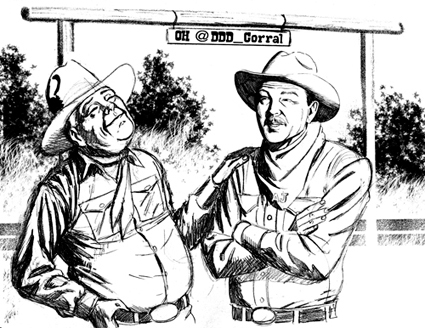
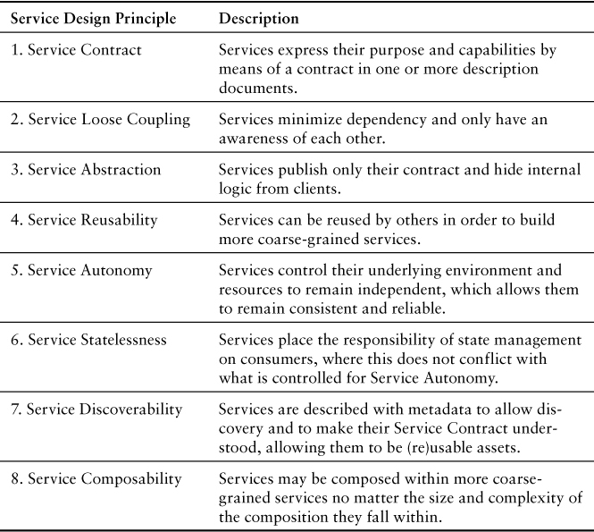
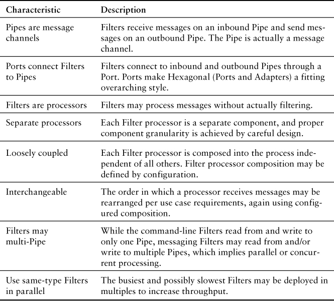
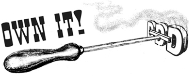

# 第 4 章 架构

> Chapter 4. Architecture

Architecture should speak of its time and place, but yearn for timelessness.

—Frank Gehry

One of the big advantages of DDD is that it doesn’t require the use of any specific architecture. Since our carefully crafted Core Domain (2) resides at the heart of a Bounded Context (2), it enables one or more architectural influences to play a role in the entire application or system.1 Some architectural influences surround the domain model and have a broad overall effect, while others address specific demands. The goal is to use just the right choices and combinations of architecture and architecture patterns.

1. This chapter is about architectural styles, application architectures, and architecture patterns. A style describes how to implement a specific architecture, while an architecture pattern explains how to address a specific concern within an architecture but is broader than a design pattern. I suggest you not get too hung up on the differences, but just understand that DDD can reside at the heart of a lot of surrounding architectural influences.

The real demands for specific software qualities should drive the use of architectural styles and patterns. The ones chosen must be proven to meet or exceed required qualities. Avoiding architectural style and pattern overuse is just as important as using the right ones. Allowing real, genuine quality demands to drive what we do with architecture is a beneficial risk-driven approach [Fairbanks]. That way we use architecture only to mitigate the risk of failure, not to increase our risk of failure by using an architectural style or pattern that cannot be justified. Thus, we must be able to justify every architectural influence in use, or we eliminate it from our system.

Our ability to justify the selection of any architectural styles and patterns is limited to the available functional requirements, such as use cases or user stories, and even scenarios specific to the domain model. In other words, you cannot determine the necessary software qualities without functional requirements. Lacking these kinds of inputs, we actually cannot make sound architectural choices, which implies that employing a use-case-driven architecture approach to software development is still applicable today.

Road Map to This Chapter

- Listen in on a retrospective interview with SaaSOvation’s CIO.
- Learn how the trusty Layers Architecture has been improved on by DIP and Hexagonal.
- See how Hexagonal can support Service-Oriented and REST.
- Gain perspective on Data Fabric or Grid-Based Distributed Cache and Event-Driven styles.
- Consider how a newer architecture pattern called CQRS helps with DDD.
- Learn from the architectures employed by the SaaSOvation teams.

Architecture Isn’t a Coolness Factor

The following architectural styles and patterns are not a grab bag of cool tools we should apply everywhere possible. Instead, use them only where applicable, where they mitigate a specific risk that would otherwise increase the potential for project or system failure.


[Evans] focused on the Layers Architecture. That being so, SaaSOvation first concluded that DDD could only be effective using that well-known pattern. It took the teams some time to understand that DDD is considerably more adaptable than that, even though Layers was most popular at the time [Evans] was written.

The principles of a Layers Architecture can still be used to govern good decision making. We don’t need to stop there, however, as we’ll consider some of the more modern architectures and patterns that can be leveraged where needed. This will prove the versatility and broad applicability of DDD.

For sure, SaaSOvation did not need every architectural influence all at once, but its teams needed to choose wisely from the options available to them.

## INTERVIEWING THE SUCCESSFUL CIO

To give a bit of a perspective on why each of the architectural influences discussed in the chapter might be used, we’re going to leap a decade into the future and talk to SaaSOvation’s CIO. While the company’s beginnings were humble, architectural decision helped it succeed each step of the way. Let’s tune in to the program TechMoney, with Anchor Maria Finance-Ilmundo . . .

Maria: Tonight, my exclusive interview is with Mitchell Williams, CIO of the enormously successful SaaSOvation. We’re continuing our “Know Your Architectural \$tyles” series. Tonight’s focus is on how selecting the right architecture can bring enduring success. Welcome to the show, Mitchell, and thanks for joining us.

Mitchell: I’m glad to be here again, Maria. It’s always a pleasure.

Maria: Can you take us through some of the early architectural decisions you went with, and why?

Mitchell: Of course. Believe it or not, we actually started off planning our projects around desktop deployment. Our team designed for the desktop application to persist to a central database. They chose the Layers Architecture for this approach.

Maria: Did that make sense?

Mitchell: Well, we believe it did, especially since we were only dealing with a single application tier plus the central database. It would have served us well for a simple client-server style.

Maria: But the tables soon turned, didn’t they?

Mitchell: They certainly did. We actually joined forces with a business partner and decided to move forward with an SaaS subscription model. We sought some significant funding to support our efforts and landed it. We determined that our agile project management application would go on the back burner for a while until we first developed a suite of collaboration tools. This had a twofold benefit. First, we’d enter the accelerating collaboration market, but then we’d also have a natural feature add-on for the project management application. You know, collaborating on software development project deliverables.

Maria: Interesting. It all sounds quite grassroots. Where did these decisions lead you?

Mitchell: As the software complexity increased, we needed to manage quality by introducing unit and feature testing tools. To do that, we kind of turned Layers on its ear by introducing the Dependency Inversion Principle, or DIP. It was important since the team could easily test by stubbing out the UI and Infrastructure Layers and concentrate on testing the Application and Domain. In fact, we could develop the UI in isolation and delay decisions on persistence technology for some time. And it actually wasn’t a big leap away from Layers. The team had a high comfort level.

Maria: Wow, swapping out the UI and persistence! That seems risky. How tough was it?

Mitchell: Well, actually not so much. As it turns out, the fact that we were using the Domain-Driven Design tactical patterns didn’t hurt us at all. Since we used the Aggregate pattern and Repositories, we could develop against in-memory persistence behind the Repository interfaces and swap in a persistence mechanism after we had time to consider our options.

Maria: Dude.

Mitchell: Totally.

Maria: And?

Mitchell: Bang. Things were off and running. We delivered CollabOvation and ProjectOvation, with successive profitable quarters.

Maria: Ka-ching.

Mitchell: Got that right. We then decided that we wanted to support mobile devices in addition to desktop browsers since mobile exploded and it got all over us. For that we’d use REST. Subscribers started asking for things like federated identity and security, as well as sophisticated project and time resource management tools. And then new investors wanted to see reports on their preferred business intelligence dash.

Maria: Amazing. So mobile wasn’t the only thing exploding. Let me get your take on dealing with all that.

Mitchell: The team decided that migrating to a Hexagonal Architecture was an appropriate choice to handle all these additions. They found that the Ports and Adapters approach gave them the ability to add new kinds of clients almost ad hoc. The same went for new output Port types, like innovative new persistence mechanisms, such as NoSQL, and messaging capabilities. And that all spelled c-l-o-u-d.

Maria: So you had confidence in those modifications?

Mitchell: Absolutely.

Maria: Huge. If you don’t buckle under all that, it probably means you made great choices that leveraged your ability to go even further.

Mitchell: Exactly. By now we were adding new tenants by many hundreds every month. We actually added a service to migrate existing data from legacy corporate collaboration tools into our cloud. The team decided that an SOA focus allowed them to aggregate this data nicely using Mule’s Collection Aggregator. It could sit on the service boundary while still using the Hexagonal Architecture.

Maria: Ah, so you didn’t introduce SOA because it sounded cool. You used it when it made sense. Perfect. We haven’t seen good decision making like that throughout the industry.

Mitchell: Yes, Maria, and that’s really the approach we took all along. It was our blueprint for success. For example, in time we added TrackOvation, our defect tracking software, which integrated with ProjectOvation. And as ProjectOvation features grew, the UI became more and more sophisticated. The Product Owner’s dashboard of all Scrum products and defects in their systems updated with each application command and corresponding event. Since Product Owners across subscribing tenants had different preferred views, it made the dashboards even more complex. And, naturally, we also had to support the mobile devices. The team considered the merits of including a CQRS architecture pattern.

Maria: CQRS? Come on, Mitch, that’s pretty heady. Was that one of those uncertainties that we don’t know how it plays out? What about walking off the plank there?

Mitchell: No, not really. Once the team had a valid reason to use CQRS to ease the friction between the command and query universes, it was full steam ahead, and they never looked back.

Maria: Exactly. Wasn’t that about the time that your subscribers starting asking for features that required distributed processing?

Mitchell: Yes; if we didn’t get this one right we’d soon be drowning in complexity. Some features required running through a series of distributed processes before delivering an answer. The ProjectOvation team would not make the user wait for these potentially long-running tasks and risk time-outs. They introduced a fully Event-Driven Architecture, employing a classic Pipes and Filters pattern to manage these.

Maria: But that wasn’t the end of your journey down Complexity Lane, was it? How tough was that?

Mitchell: LOL. No, no. Never would that happen, it seemed. However, when you have a smart team, it makes Complexity Lane like a stroll in the park. In actuality, the Event-Driven Architecture simplified many areas of the expanding suite of systems.

Maria: True, that. Go on. That was an obvious opportunity. We’re getting to my favorite part of the story. You know . . . [eyes twinkle $$$]

Mitchell: Our architecture allowed us to scale so rapidly and manage change so well that RoaringCloud acquired SaaSOvation for, well . . . that’s all a matter of public record.

Maria: I’d say, and very public. At $50 per common share that was around $3 billion worth of public record.

Mitchell: Good memory for financial facts! And that was serious incentive to get the integration right. They brought a vast number of new subscribers, and the user base actually started to stress the ProjectOvation infrastructure. It was now time to distribute and parallelize the Pipes and Filters. That called for adding in long-running processes, sometimes called Sagas.

Maria: Nice. Can you categorically say that that was fun?

Mitchell: Fun indeed, but necessary even more so.

Maria: And it seems that the fun would never end. Probably one of the least expected and even shocking chapters in your long success story came next.

Mitchell: You know it. Now that RoaringCloud had a monopoly in the marketplace due to the plethora of subscription applications and millions of users, the government took notice and began regulating the industry. A new law was passed to require RoaringCloud to track every change to a project. Actually, the best way to handle this compliance situation as a natural part of the domain model was to use Event Sourcing.

Maria: Man, you were poised. That’s crazy. I mean, really, really crazy.

Mitchell: That’s a crazy good problem to have, really.

Maria: What’s so amazing to me is that through all these years, the core of your applications was based on DDD software models. Yet, obviously DDD didn’t hurt you. You seemed to not experience hardships because of it.

Mitchell: In fact it was quite the opposite. We firmly believe that it was because we chose DDD early, and took the time to understand it thoroughly, that the business situations we could not escape—and didn’t want to—were handled in stride.

Maria: Well, as I like to say, “Ka-ching!” Thanks again, Mitchell. We’ve learned how selecting the right architecture can bring enduring success, right here on “Know Your Architectural \$tyles.”

Mitchell: My pleasure, Maria. Thanks for inviting me.

That was a bit quirky, but helpful. It demonstrates how the architectural influences discussed in the following sections can be used with DDD, and how to introduce each at just the right time.

## LAYERS

The Layers Architecture [Buschmann et al.] pattern is considered by many to be the granddaddy of all. It supports N-tier systems and is, thus, commonly used in Web, enterprise, and desktop applications. Here we rigorously separate the various concerns of our application or system into well-defined layers.

Isolate the expression of the domain model and the business logic, and eliminate any dependency on infrastructure, user interface, or even application logic that is not business logic. Partition a complex program into layers. Develop a design within each layer that is cohesive and that depends only on the layers below. [Evans, Ref, p. 16]

Figure 4.1 shows the layers common to a DDD application that uses a traditional Layers Architecture. Here the isolated Core Domain resides in one layer in the architecture. Above it are the User Interface and Application Layers. Below it is the Infrastructure Layer.

<Figures figure="4-1">The traditional Layers Architecture in which DDD is applied</Figures>

An essential rule of this architecture is that each layer may couple only to itself and below. There are distinctions within the style. A Strict Layers Architecture is one that allows coupling only to the layer directly below. A Relaxed Layers Architecture, however, allows any higher-level layer to couple to any layer below it. Since both the User Interface and the Application Services often need to employ infrastructure, many, if not most, systems are based on Relaxed Layers.

Lower layers may actually loosely couple to higher layers, but this is only by means of a mechanism such as Observer or Mediator [Gamma et al.]; there is never a direct reference from lower to higher. Using Mediator, for example, the higher layer would implement an interface defined by the lower layer, then pass the implementing object as an argument to the lower layer. The lower layer uses the implementing object with no knowledge of where it resides architecturally.

The User Interface is to contain only code that addresses user view and request concerns. It must not contain domain/business logic. Some may conclude that since validation is required by the User Interface, it must contain business logic. The kinds of validation found in the User Interface are not the kinds that belong in the domain model (only). As discussed in Entities (5), we still want to limit coarse-grained validations that express deep business knowledge only to the model.

If the User Interface components use objects from the domain model, it is generally limited to rendering its data on the glass. If using this approach, a Presentation Model (14) can be used to prevent the view itself from knowing about domain objects.

Since a user may be either a human or other systems, sometimes this layer will provide the means to remotely invoke the services of an API in the form of an Open Host Service (13).

Components in the User Interface are direct clients of the Application Layer.

Application Services (14) reside in the Application Layer. These are different from Domain Services (7) and are thus devoid of domain logic. They may control persistence transactions and security. They may also be in charge of sending Event-based notifications to other systems and/or for composing e-mail messages to be sent to users. The Application Services in this layer are the direct clients of the domain model, though themselves possessing no business logic. They remain very lightweight, coordinating operations performed against domain objects, such as Aggregates (10). They are the primary means of expressing use cases or user stories on the model. Hence, a common function of an Application Service is to accept parameters from the User Interface, use a Repository (12) to obtain an Aggregate instance, and then execute some command operation on it:

Click here to view code image

```java
@Transactional
public void commitBacklogItemToSprint(
    String aTenantId, String aBacklogItemId, String aSprintId) {
    TenantId tenantId = new TenantId(aTenantId);
    BacklogItem backlogItem =
        backlogItemRepository.backlogItemOfId(
                tenantId, new BacklogItemId(aBacklogItemId));
    Sprint sprint = sprintRepository.sprintOfId(
                tenantId, new SprintId(aSprintId));
    backlogItem.commitTo(sprint);
}
```

If our Application Services become much more complex than this, it is probably an indication that domain logic is leaking into the Application Services, and that the model is becoming anemic. So it’s a best practice to keep these model clients very thin. When a new Aggregate must be created, an Application Service would use a Factory (11) or the Aggregate’s constructor to instantiate it and then use the corresponding Repository to persist it. An Application Service may also use a Domain Service to fulfill some domain-specific task designed as a stateless operation.

When the domain model is designed to publish Domain Events (8), the Application Layer may register subscribers to any number of Events. Doing so enables the Events to be stored, forwarded, and otherwise dealt with as one of the application’s duties. This frees the domain model to be aware of only its own core concerns and enables the Domain Event Publisher (8) to remain lightweight and liberated from messaging infrastructure dependencies.

Since the domain model possessing all business logic is discussed at great length in the other chapters, it is not repeated here. Nonetheless, there are some challenges associated with the domain and the use of traditional Layers. Using Layers may require the Domain Layer to make some limited use of Infrastructure. I’m not saying that core domain objects would do this, as we should absolutely avoid that altogether. However, adhering to the definition of Layers may require implementations of some interfaces in the Domain Layer that depend on technologies provided by Infrastructure.

For example, Repository interfaces require implementations that use components, such as persistence mechanisms, housed in Infrastructure. What if we just implemented the Repository interfaces in Infrastructure? Since the Infrastructure Layer is below the Domain Layer, the references from Infrastructure upward to Domain would violate the rules of Layers Architecture. Still, avoiding that does not mean that the primary domain objects would couple to Infrastructure. To avoid that we might use implementation Modules (9) to hide technical classes:

```java
com.saasovation.agilepm.domain.model.product.impl
```

As indicated in Modules (9), MongoProductRepository could be housed in that package. This is not the only way to address this challenge, however. We might decide instead to implement such interfaces in the Application Layer, which would uphold the rules of Layers. Figure 4.2 provides a glimpse of this approach. But doing that may seem a bit distasteful.

<Figures figure="4-2">The Application Layer could house some technical implementations of interfaces defined by the Domain Layer.</Figures>

There is a better way, as discussed in the section entitled “Dependency Inversion Principle.”

In a traditional Layers Architecture the Infrastructure is at the bottom. Things like persistence and messaging mechanisms reside there. Messages may include those sent by enterprise messaging middleware systems or more basic e-mails (SMTP) or text messages (SMS). Think of all the technical components and frameworks that provide low-level services for the application. Those are usually considered to be part of Infrastructure. The higher-level Layers couple to the lower-level components to reuse the technical facilities provided. That being the case, again we want to reject any notion of coupling core domain model objects to Infrastructure.


The SaaSOvation teams noted that having the Infrastructure Layer at the bottom posed some disadvantages. For one it made implementing technical aspects required by the Domain Layer kind of bitter-tasting since the rules of Layers had to be violated. And actually their code was difficult to test. How could they overcome this disadvantage?

Could we whip up something a bit sweeter if we adjusted the order of Layers?

## Dependency Inversion Principle

There is a way to improve on the traditional Layers Architecture by adjusting the way dependencies work. The Dependency Inversion Principle (DIP) was postulated by Robert C. Martin and described in [Martin, DIP]. The formal definition states:

High-level modules should not depend on low-level modules. Both should depend on abstractions.

Abstractions should not depend upon details. Details should depend upon abstractions.

The essence of this definition is communicating that a component that provides low-level services (Infrastructure, for this discussion) should depend on interfaces defined by high-level components (for this discussion, User Interface, Application, and Domain). While there are several ways to express an architecture that uses DIP, we could boil it down to the structure shown in Figure 4.3.

<Figures figure="4-3">The possible Layers when the Dependency Inversion Principle is used. We move the Infrastructure Layer above all others, enabling it to implement interfaces for all Layers below.</Figures>

Does DIP Really Support All Those Layers?

Some would conclude that DIP has only two layers, one at the top and one at the bottom. The one at the top would implement interface abstractions defined in the layer at the bottom. Adjusting Figure 4.3 to fit this, the Infrastructure Layer would be the one at the top, and the User Interface Layer, Application Layer, and Domain Layer would constitute one at the bottom. You may or may not prefer this view of a DIP architecture. Don’t worry; the Hexagonal [Cockburn] or Ports and Adapters Architecture is where this is all headed.

From the architecture of Figure 4.3, we would have a Repository implemented in Infrastructure for an interface defined in Domain:

Click here to view code image

```java
package com.saasovation.agilepm.infrastructure.persistence;

import com.saasovation.agilepm.domain.model.product.*;

public class HibernateBacklogItemRepository
    implements BacklogItemRepository  {
    ...
    @Override
    @SuppressWarnings("unchecked")
    public Collection<BacklogItem> allBacklogItemsComittedTo(
        Tenant aTenant, SprintId aSprintId) {
        Query query =
            this.session().createQuery(
                "from -BacklogItem as _obj_ "
                + "where _obj_.tenant = ? and _obj_.sprintId = ?");
        query.setParameter(0, aTenant);
        query.setParameter(1, aSprintId);
        return (Collection<BacklogItem>) query.list();
    }
    ...
}
```

Focusing on the Domain Layer, using DIP enables both the Domain and Infrastructure to depend on abstractions (interfaces) defined by the domain model. Since the Application Layer is the direct client of the Domain, it depends on Domain interfaces and indirectly accesses Repository and any technical Domain Service implementation classes provided by Infrastructure. It may use any one of a few ways to acquire the implementations, including Dependency Injection, Service Factory, and Plug In [Fowler, P of EAA]. The examples throughout the book use Dependency Injection provided by Spring Framework and sometimes the Service Factory via class DomainRegistry. In fact, DomainRegistry uses Spring to look up references to beans that implement interfaces defined by the domain model, including Repositories and Domain Services.

Interestingly enough, when we think about the influence that DIP has on this architecture, we might conclude that there are actually no longer any layers at all. Both high-level and low-level concerns are dependent only on abstractions, which seems to topple the stack. What if we actually thought of turning this architecture on its ear and adding a bit more symmetry? Let’s next see how that would work.

## HEXAGONAL OR PORTS AND ADAPTERS

With the Hexagonal Architecture2 Alistair Cockburn codified a style to produce symmetry [Cockburn]. It advances this goal by allowing many disparate clients to interact with the system on equal footing. Need a new client? Not a problem. Just add an Adapter to transform any given client’s input into that understood by the internal application’s API. At the same time, output mechanisms employed by the system, such as graphics, persistence, and messaging, may also be diverse and swappable. That’s possible because an Adapter is created to transform application results into a form accepted by a specific output mechanism.

2. We refer to this architecture by the name Hexagonal, even though its name seems to have changed to Ports and Adapters. Despite its changed name, the community still refers to it as Hexagonal. The Onion Architecture has also surfaced. However, it appears to many that Onion is just an (unfortunate) alternate name for Hexagonal. We can safely assume that they are the same and stick with the [Cockburn] definition.

As we discuss it, you may agree that this architecture has potential for timelessness.

These days many teams that say they are using a Layers Architecture are actually using Hexagonal instead. This is due, in part, to the number of projects that now use some form of Dependency Injection. It’s not that Dependency Injection is automatically Hexagonal. It’s just that it encourages a way of producing an architecture that leans naturally toward the development of a Ports and Adapters style. In any case, a more thorough understanding will clarify this point.

We usually think of the place where clients interact with the system as its “front end.” Likewise, we consider the place where the application retrieves persisted data, stores new persistent data, or sends output as its “back end.” But Hexagonal promotes a different way of looking at the areas of a system, as indicated by Figure 4.4. There are two primary areas, the outside and the inside. The outside enables disparate clients to submit input and also provides mechanisms to retrieve persisted data, store the application’s output (for example, a database), or send it elsewhere along its way (for example, messaging).

<Figures figure="4-4">The Hexagonal Architecture is also known as Ports and Adapters. There are Adapters for each of the outside types. The outside reaches the inside through the application’s API.</Figures>

Cowboy Logic

AJ: “My horses sure do like their new hexagonal corral. It gives ’em more corners to run to when I’m carryin’ a saddle.”



In Figure 4.4 each client type has its own Adapter [Gamma et al.], which transforms input protocols into input that is compatible with the application’s API—the inside. Each of the hexagon’s sides represents a different kind of Port, for either input or output. Three of the clients’ requests arrive via the same kind of input Port (Adapters A, B, and C), and one uses a different kind of Port (Adapter D). Perhaps the three use HTTP (browser, REST, SOAP, and so on) and the one uses AMQP (for example, RabbitMQ). There is not a strict definition of what a Port means, making it a flexible concept. In whatever way Ports are partitioned, client requests arrive and the respective Adapter transforms their input. It then invokes an operation on the application or sends the application an event. Control is thus transferred to the inside.

We Probably Are Not Implementing the Ports Ourselves

We actually normally don’t implement the Ports ourselves. Think of a Port as HTTP and the Adapter as a Java Servlet or JAX-RS annotated class that receives method invocations from a container (JEE) or framework (RESTEasy or Jersey). Or we might create a message listener for NServiceBus or RabbitMQ. In that case the Port is more or less the messaging mechanism, and the Adapter is the message listener, because it is the responsibility of the message listener to grab data from the message and translate it into parameters suitable to pass into the Application’s API (the client of the domain model).

Design the Application Inside per Functional Requirements

When using Hexagonal, we design the application with our use cases in mind, not the number of supported clients. Any number and type of clients may request through various Ports, but each Adapter delegates to the application using the same API.

The application receives requests by way of its public API. The application boundary, or inner hexagon, is also the use case (or user story) boundary. In other words, we should create use cases based on application functional requirements, not on the number of diverse clients or output mechanisms. When the application receives a request via its API, it uses the domain model to fulfill all requests involving the execution of business logic. Thus, the application’s API is published as a set of Application Services. Here again, Application Services are the direct client of the domain model, just as when using Layers.

The following represents a RESTful resource published using JAX-RS. A request arrives through the HTTP input Port, and the handler acts as an Adapter, delegating to an Application Service:

Click here to view code image

```java
@Path("/tenants/{tenantId}/products")
public class ProductResource extends Resource {
    private ProductService productService;
    ...
    @GET
    @Path("{productId}")
    @Produces({ "application/vnd.saasovation.projectovation+xml" })
    public Product getProduct(
            @PathParam("tenantId") String aTenantId,
            @PathParam("productId") String aProductId,
            @Context Request aRequest) {
        Product product = productService.product(aTenantId, aProductId);
        if (product == null) {
            throw new WebApplicationException(
                     Response.Status.NOT_FOUND);
        }
        return product; // serialized to XML using MessageBodyWriter
    }
    ...
}
```

The various JAX-RS annotations provide a significant part of the Adapter, parsing the resource path and turning its parameters into String instances. The ProductService instance is injected and used by this request to delegate to the application inside. The Product is serialized to XML and placed in a Response, which is then sent through the HTTP output Port.

JAX-RS Isn’t the Focus Here

This is just one way to use the application and domain model inside. In essence, JAX-RS is not important. We could instead use Restfulie, or create a Node.js server running the restify module. Further still, Adapters designed to handle input from other Ports would delegate to the same API, as you will see.

What about the other side of the application, to the right? Consider Repository implementations as persistence Adapters, providing access to previously stored Aggregate instances and storage for new ones. As depicted in the diagram (Adapters E, F, and G), we might have Repository implementations for relational databases, document stores, distributed cache, and in-memory stores. If the application sends Domain Event messages to the outside, it would use a different Adapter (H) for messaging. The output messaging Adapter is the opposite of the input Adapter that supports AMQP and thus goes out a different Port from the one used for persistence.

A big advantage with Hexagonal is that Adapters are easily developed for test purposes. The entire application and domain model can be designed and tested before clients and storage mechanisms exist. Tests could be created to exercise ProductService well before any decision is made to support HTTP/REST, SOAP, or messaging Ports. Any number of test clients can be developed before the user interface wireframes have been completed. Long before a persistence mechanism is selected for the project, in-memory Repositories can be employed to mimic persistence for the sake of testing. See Repositories (12) for details on developing in-memory implementations. Significant progress can be made on the core without the need for supplementary technical components.

If using true Layers, consider the advantages of toppling the structure and developing based on Ports and Adapters instead. When designed properly, the hexagon inside—the application and domain model—will not leak to the outside parts. This promotes a clean application boundary inside in which use cases are implemented. Outside any number of client Adapters can support numerous automated tests and real-world clients, as well as storage, messaging, and other output mechanisms.


When the SaaSOvation teams considered the advantages of using the Hexagonal Architecture, they decided to make the switch from Layers. It wasn’t difficult, actually. It just required adopting a slightly different mindset in using the familiar Spring Framework.

Because the Hexagonal Architecture is versatile, it could well be the foundation that supports other architectures required by the system. For instance, we might factor in Service-Oriented, REST, or an Event-Driven Architecture; employ CQRS; use a Data Fabric or Grid-Based Distributed Cache; or tack on Map-Reduce distributed and parallel processing, most of which are discussed later in this chapter. The Hexagonal style forms the strong foundation for supporting any and all of those additional architectural options. There are other ways, but for the remainder of this chapter assume that Ports and Adapters is used to assist with developing around each of the remaining topics discussed.

## SERVICE-ORIENTED

The Service-Oriented Architecture, or SOA, has different meanings to different people. This can make discussions about it somewhat challenging. It’s best to try to find some common ground, or at least define the ground for this discussion. Consider some principles of SOA as defined by Thomas Erl [Erl]. Besides the fact that services are always interoperable, they also possess the eight design principles presented in Table 4.1.

Table 4.1. Design Principles of Services



We can combine these principles with a Hexagonal Architecture, with the service boundary at the far left and the domain model at the heart. The basic architecture is presented in Figure 4.5, where consumers reach services using REST, SOAP, and messaging. Note that one Hexagonal-based system supports multiple technical service endpoints. This has a bearing on how DDD is used within an SOA.

<Figures figure="4-5">A Hexagonal Architecture supporting SOA, with REST, SOAP, and messaging services</Figures>

Since opinions vary widely on what SOA is and what value it provides, it wouldn’t be surprising if you disagree with what’s presented here. Martin Fowler labels this situation “service-oriented ambiguity” [Fowler, SOA]. Therefore, I won’t make a valiant attempt to disambiguate SOA here. I will, however, provide a perspective on one way DDD fits into the set of priorities declared in the SOA Manifesto.3

3. The SOA Manifesto itself has received considerable negative criticism, but we may still glean some value from it.

First, considering the pragmatic viewpoints expressed by one of the Manifesto contributors [Tilkov, Manifesto] gives an important context. Commenting on the Manifesto, he brings us at least a step or two closer to understanding what SOA services can be:

[The Manifesto] gives me the option to view a service as either a set of SOAP/WSDL interfaces or a collection of RESTful resources. . . . This is not [an] attempt at a definition—it’s an attempt to find out what values and principles we could find that we all can agree on.

Stefan’s comments are noteworthy. Finding agreement always helps, and we can probably agree that a business service can be provided by any number of technical services.

The technical services could be RESTful resources, SOAP interfaces, or message types. The business service emphasizes business strategy, a way to bring business and technology together. However, defining a single business service does not equate to defining a single Subdomain (2) or Bounded Context. No doubt as we perform both problem space and solution space assessments, we will find that a business service comprises a number of each. Thus, Figure 4.5 shows the architecture of only a single Bounded Context, one that may provide a set of technical services realized through a number of RESTful resources, SOAP interfaces, or message types—just a part of the overall business service. In the SOA solutions space we would expect to see many Bounded Contexts, whether any individual one uses a Hexagonal Architecture or another. Neither SOA nor DDD need specify how each set of technical services is designed and deployed, there being a wide variety of options.

Still, when using DDD our goal is to create a Bounded Context with a complete, linguistically well-defined domain model. As discussed in Bounded Contexts (2), we don’t want architecture to influence the size of the domain model. That could happen if one or a few of the technical service endpoints, such as a single REST resource, a single SOAP interface, or a system message type, were to be used to dictate the size of a Bounded Context. Doing so would force many, very small Bounded Contexts and domain models, perhaps each consisting of only one Entity acting as the Root of a single, small Aggregate. This could result in hundreds of such miniature Bounded Contexts in a single enterprise.

While that approach may be viewed as having technical advantages, it does not necessarily realize the goals of strategic DDD. It works against a clean, well-modeled domain based on a complete and comprehensive Ubiquitous Language (1), actually fragmenting the Language. And, according to the SOA Manifesto, unnaturally fragmenting Bounded Contexts is not necessarily the spirit of SOA:

1. Business value over technical strategy

2. Strategic goals over project-specific benefits

Assuming we can accept these as worthy values, they align very well with strategic DDD. As explained in Bounded Contexts (2), the technical component architecture drivers are less important when partitioning models.


The SaaSOvation teams had to learn a difficult and important lesson, that listening to the linguistic drivers aligns better with DDD. Each of their three Bounded Contexts reflects the goals of SOA—both for the business and in the technical services.

The three sample models discussed in Bounded Contexts (2), Context Maps (3), and Integrating Bounded Contexts (13) individually represent the single linguistically well-defined domain model. Each domain model is surrounded by a set of open services that implement an SOA that meets the business objectives.

## REPRESENTATIONAL STATE TRANSFER—REST

## Contributed by Stefan Tilkov

REST has become one of the most used, and abused, architecture buzzwords of the last few years. As usual, different people think about different things when they use the acronym. To some, REST means sending XML over HTTP connections without using SOAP; some equate it with using HTTP and JSON; others believe that to do REST you need to send method arguments as URI query parameters. All of these interpretations are wrong, but luckily—and vastly different from many other concepts such as “components” or “SOA”—there is an authoritative source for what REST means: the dissertation by Roy T. Fielding, which coined the term and defines it very clearly.

## REST as an Architectural Style

The first thing to understand when trying to “get” REST is the concept of architectural styles. An architectural style is to architecture what a design pattern is to a specific design. It is an abstraction of those aspects that are common to different concrete implementations, enabling discussion of their relevant benefits without getting lost in technical detail. There are many different styles of distributed systems architecture, including client-server and distributed objects. The first few chapters of Fielding’s thesis explain some of them, including the constraints they mandate for an architecture that adheres to each of them. The concept of architectural styles and constraints imposed by them might strike you as somewhat theoretical, and you’d be right. They form the theoretical foundation of a (then) new architectural style that Fielding introduces. This is REST, which is the architectural style that the Web’s architecture is supposed to adhere to.

Of course the Web—as embodied by its most important standards, URI, HTTP, and HTML—predates Fielding’s PhD work. But he had been one of the main forces in standardization of HTTP 1.1, and a huge influence on many design decisions that led to the Web as we know it.4 Seen this way, REST is a theoretical extrapolation, created after the fact, of the Web’s architecture itself.

4. He also happens to be the author of the very first widely used HTTP library, one of the original developers of the Apache HTTP server, and founder of the Apache Software Foundation.

So why do we now equate “REST” with a specific way of building systems or, even more restricting, a way to build Web services? The reason for this is, as it turns out, that like any other technology, the Web protocols can be used in many different ways. Some of them match the goals of the original designers; some of them don’t. One often-used analogy highlights this using the RDBMS world familiar to many. You can use an RDBMS in line with its architectural concepts—that is, define tables with columns, foreign key relationships, views, constraints, and so on—or you can create a single table with two columns, one called “key,” one called “value,” and simply store serialized objects in the value column. Of course, you’d still be using an RDBMS, but many of its benefits will not be available to you (meaningful queries, joins, sorting and grouping, and so forth).

In a very similar fashion, the Web protocols can be used in line with the original ideas that made them what they are—with an architecture that conforms to the REST architectural style—or be used in a way that fails to follow it. And similar to our RDBMS example, we ignore the underlying architectural style to our peril. Thus, a different kind of distributed systems architecture might be appropriate if we don’t end up exploiting any of the benefits of using HTTP in a “RESTful” way, just as a NoSQL/key-value store is the better choice for storing whole values that are associated with a single unique key.

## Key Aspects of a RESTful HTTP Server

So what are the key aspects of a distribution architecture that uses “RESTful HTTP”? Let’s look at the server side first. Note that it’s entirely irrelevant whether we are talking about a server that’s used by a human using a Web browser (a “Web application”) or used by some other agent, such as a client written in your programming language of choice (a “Web service”).

First of all, as the name implies, resources are a key concept. How so? As a system designer, you decide what are the meaningful “things” that you want to expose as accessible from the outside, and you assign each a distinct identity. In general, each resource has one URI, and more importantly, each URI should point to one resource—the “things” you expose to the outside need to be individually addressable. For example, you might decide that each customer, each product, each product listing, each search result, and maybe each change to the product catalog should be resources in their own right. Resources have representations, renditions of their state, in one or more formats. It’s through representations—an XML or JSON document, an HTML form’s post data, or some binary format—that clients interact with resources.

The next key aspect is the idea of stateless communication, using self-descriptive messages. Such is an HTTP request that carries all the information the server needs to handle it. Of course, the server can (and usually will) use its own persistent state to help, but it’s important that the client and server don’t rely on individual requests to set up an implicit context (a session). This enables access to each resource independently of other requests, an aspect that helps in achieving massive scalability.

If you view resources as objects—and it’s not at all unreasonable to do so—it’s valid to ask what kind of interface they should have. The answer is another very important aspect that differentiates REST from any other architectural style for distributed systems. The set of methods that you can invoke is fixed. Every object supports the same interface. In RESTful HTTP, the methods are the HTTP verbs—most importantly, GET, PUT, POST, DELETE—that can be applied to resources.

Even though it might appear so at first sight, these methods do not translate to CRUD operations. It is very common to create resources that do not represent any persistent entity but instead encapsulate behavior that is invoked once an appropriate verb is used on them. Each of the HTTP methods has a very clear definition in the HTTP specification. For example, the GET method is to be used only for “safe” operations: (1) it can perform actions that reflect an effect a client might not have requested; (2) it always reads data; (3) it can potentially be cached (if the server indicates that this is the case by means of appropriate response headers).

HTTP’s GET method has been called “the most optimized piece of distributed systems plumbing in the world” by none other than Don Box, one of the main figures behind SOAP-style Web services. His words highlight that a lot of the Web’s performance and scalability that we take for granted is due to HTTP optimizations for this particular, very common case.

Some HTTP methods are idempotent, meaning that they can be safely called again without problems in case of an error or unclear outcome. This is true for GET, PUT, and DELETE.

Finally, a RESTful server enables a client to discover a path through the application’s possible state transitions by means of hypermedia. This is called Hypermedia as the Engine of Application State (HATEOAS) in Fielding’s dissertation. Put more simply, the individual resources don’t stand on their own. They are connected, linked to each other. This should not come as a surprise. After all, this is where the Web got its name. For the server, this means that it will embed links in its answers, enabling the client to interact with connected resources.

## Key Aspects of a RESTful HTTP Client

A RESTful HTTP client moves from one resource to the next either by following links contained in resource representations or by being redirected to resources as a result of sending data for processing to the server. Server and client cooperate to influence the client’s distribution behavior dynamically. As a URI contains all information necessary for dereferencing an address—including host name and port—a client following the hypermedia principle might end up talking to a resource hosted by a different application, a different host, or even a different company.

In an ideal REST setup, a client will start with a single well-known URI and continue following hypermedia controls from then on. This is exactly the model used by the browser when rendering and displaying HTML, including links and forms, to the user. Then, it uses the user’s input to interact with a multitude of Web applications, without up-front knowledge about their interface or implementations.

Granted, a browser is not a self-sufficient agent. It requires a human to make the actual decisions. But a programmatic client can adopt many of the same principles, even when some logic is hard-coded. It will follow links instead of assuming specific URI structures, or even colocation of resources in one server, and it will make use of its knowledge of one or more media types.

## REST and DDD

Tempting though it may be, it is not advisable to directly expose a domain model via RESTful HTTP. This approach often leads to system interfaces that are more brittle than they need to be, as each change in the domain model is directly reflected in the system interface. There are two alternative approaches for combining DDD and RESTful HTTP.

The first approach is to create a separate Bounded Context for the system’s interface layer and use appropriate strategies to access the actual Core Domain from the system’s interface model. This can be deemed a classic approach, as it views the system’s interface as a cohesive whole that is simply exposed using resource abstractions instead of services or remote interfaces.

Consider a concrete example of this approach. We build a system that manages a workgroup, including its tasks, schedules/appointments, subgroups, and all of the processes needed to handle these. We would design a pure domain model, untainted by the infrastructure details, that captures the Ubiquitous Language and implements the necessary business logic. To publish an interface to this carefully crafted domain model, we provide a remote interface as a set of RESTful resources. These resources reflect the use cases the client needs, which is very likely different from the pure domain model. Yet each resource is built from, for example, one or more Aggregates belonging to the Core Domain.

Of course, we could simply use the domain objects as parameters to JAX-RS resource methods—let’s say /:user/:task would map to a method get-Task() that returns a Task object. That’s seemingly simple, but it comes with one major problem. Any change to the Task object structure is immediately reflected in the remote interface, possibly breaking many clients, even though we might only have changed something that’s entirely irrelevant to the outside world. Not good.

So the first approach is preferred, that of decoupling the Core Domain from the system’s interface model. Doing so enables us to make changes to the Core Domain and then decide in each individual case whether that change must be reflected in the system’s interface model and, if so, the best mapping to use. Note that with this approach, the classes designed for the system’s interface model are usually driven by those of the Core Domain, but are certainly driven by the use cases. Note: Even in this case we could define a custom media type.

Another approach is appropriate when more emphasis is placed on standard media types. If specific media types are developed to support not only a single system interface but a category of similar client-server interactions, a domain model can be created to represent each standard media type. Such a domain model might even be reused across clients and servers, although some REST and SOA proponents view this as an anti-pattern. Note: Such an approach is essentially a Shared Kernel (3) or Published Language (3) in DDD terms.

This reflects more of an outside-in, crosscutting approach. In the workgroup and task management domain mentioned previously, there are many common formats. Let’s consider the ical format as an example. This is a generic format that can be used by many different applications. In this case we would start by selecting a media type (ical) and then creating a domain model for this format. This model could then be used by any system that needs to understand this format—our server application, for example, but also others (such as an Android client). Naturally, with this approach a server might need to deal with many different media types, and the same media type might be used by multiple servers.

Which of these two approaches is chosen depends to a large degree on the goals of the system designer in terms of reusability. The more specialized the solution, the more useful the first approach turns out to be. The more generally useful the solution is, with the extreme end of the spectrum being standardization by an official standards body, the more sense it makes to go with the second, media-type-centric approach.

## Why REST?

In my experience, a system designed conforming to REST principles fulfills the promise of loose coupling. In general, it’s very easy to add new resources and links to them in existing resource representations. It’s also easy to add support for new formats where needed, leading to a much less brittle set of system connections. A REST-based system is much easier to understand, as it’s split into smaller chunks—the resources—each of which exposes a separately testable, debuggable, and usable entry point. The design of HTTP and the maturity of the tooling with support for features such as URI rewriting and caching make RESTful HTTP a great choice for architectures that need to be both loosely coupled and highly scalable.

## COMMAND-QUERY RESPONSIBILITY SEGREGATION, OR CQRS

It can be difficult to query from Repositories all the data users need to view. This is especially so when user experience design creates views of data that cuts across a number of Aggregate types and instances. The more sophisticated your domain, the more this situation tends to occur.

Using only Repositories to solve this can be less than desirable. We could require clients to use multiple Repositories to get all the necessary Aggregate instances, then assemble just what’s needed into a Data Transfer Object (DTO) [Fowler, P of EAA]. Or we could design specialized finders on various Repositories to gather the disjointed data using a single query. If these solutions seem unsuitable, perhaps we should instead compromise on user experience design, making views rigidly adhere to the model’s Aggregate boundaries. Most would agree that in the long run a mechanical and spartan user interface won’t suffice.

Is there an altogether different way to map domain data to views? The answer lies in the oddly named architecture pattern CQRS [Dahan, CQRS; Nijof, CQRS]. It is the result of pushing a stringent object (or component) design principle, command-query separation (CQS), up to an architecture pattern.

This principle, devised by Bertrand Meyer, asserts the following:

Every method should be either a command that performs an action, or a query that returns data to the caller, but not both. In other words, asking a question should not change the answer. More formally, methods should return a value only if they are referentially transparent and hence possess no side effects. [Wikipedia, CQS]

At an object level this means:

1. If a method modifies the state of the object, it is a command, and its method must not return a value. In Java and C# the method must be declared void.

2. If a method returns some value, it is a query, and it must not directly or indirectly cause the modification of the state of the object. In Java and C# the method must be declared with the type of the value it returns.

That’s pretty straightforward guidance, and there is a practical and theoretical basis for adhering to it. Yet, as an architecture pattern when using DDD, why and how is it applied?

Visualize a domain model, such as one of those discussed under Bounded Contexts (2). We’d normally see Aggregates with both command and query methods. We’d also see Repositories that have a number of finder methods that filter on certain properties. With CQRS we are going to disregard these “normalities” and design a different way to query display data.

Now think of segregating all of the pure query responsibilities traditionally found in a model from all responsibilities that execute pure commands on the same model. Aggregates would have no query methods (getters), only command methods. Repositories would be stripped down to an add() or save() method (supporting both creation and updating saves) and only a single query method, such as fromId(). The single query method takes the unique identity of an Aggregate and returns it. A Repository could not be used to find an Aggregate by any other means, such as by filtering on some additional properties. With all of that removed from the traditional model, we designate it a command model. We still need a way to display data to the user. For that we create a second model, one that is tuned for optimized queries. That’s our query model.

Isn’t This Accidental Complexity?

Your impression may be that this proposed style is a lot of work and that we are merely replacing one set of problems with another set of problems, and adding a lot more code to do it.

Don’t be too quick to dismiss this style, however. Under some circumstances the added complexity is justifiable. Remember, CQRS is meant to solve a specific view sophistication problem, not to tack on as a cool new style that will strengthen your résumé.

Known by Other Names

Note that some areas/components of CQRS may be known by other names. What I call the query model is also known as the read model, and the command model is also called the write model.

As a result, the traditional domain model would be split in two. The command model is persisted in one store and the query model in another. We end up with a set of components like the one in Figure 4.6. Some more details will clarify this pattern.

<Figures figure="4-6">With CQRS, commands from clients travel one way to the command model. Queries are run against a separate data source optimized for presentation and delivered as user interface or reports.</Figures>

## Examining Areas of CQRS

Let’s step through each of the major areas of this pattern. We can start with the client and query support and move through to the command model and how updates to the query model are done.

Client and Query Processor
The client (at the far left in the diagram) may be a Web browser or a custom desktop user interface. It uses a set of query processors running on a server. The diagram doesn’t show architecturally significant divisions between tiers on the server(s). Whatever tiers exist, the query processor represents a simple component that only knows how to execute basic queries on a database, such as a SQL store.

There are no complex layers here. At most this component runs a query against the query store database and maybe serializes the query result into some format for transport (maybe a DTO, but maybe not), if that’s necessary. If the client runs Java or C#, it could query the database directly. However, that might require a large number of database client licenses, one per connection. Employing a query processor that uses pooled connections is the best choice.

If the client can consume a database result set (for example, JDBC variety), serialization is unnecessary but may be desirable anyway. There are two schools of thought here. One asserts that ultimate simplicity requires that the result set, or a very basic wire-compatible serialization of it (XML or JSON), must be consumed by the client. Others assert that DTOs should be built and consumed by the client. This may be a matter of taste, but we might agree that anytime we add DTOs and DTO Assemblers [Fowler, P of EAA] there is added complexity, and if not truly needed, these would be accidental complexity. Each team determines which approach works best for their project.

Query Model (or Read Model)
The query model is a denormalized data model. It is not meant to deliver domain behavior, only data for display (and possibly reporting). If this data model is a SQL database, each table would hold the data for a single kind of client view (display). The table can have many columns, even a superset of those needed by any given user interface display view. Table views can be created from tables, each of which is used as a logical subset of the whole.

Create Support for as Many Views as Needed

It’s worth noting that CQRS-based views can be both cheap and disposable (for development and in maintenance). This is especially so if you use a simple form of Event Sourcing (see the section “Event Sourcing” later in the chapter and Appendix A) and save all Events into a persistent store, which can be republished at any time to create new persistent view data. Doing so, any single view could be rewritten from scratch in isolation or the entire query model be switched to completely different persistence technology. This makes it easy to create and maintain views that continuously address ongoing UI needs. This can lead to more intuitive user experiences that avoid the table paradigm but are instead much richer.

For example, a table could be designed with enough data to display user interfaces for normal users, managers, and administrators. If a corresponding database table view was created for each of those user types, the data for each security role would be divided appropriately. This builds security into the viewable data per user type. A normal user view component would select all columns from the normal user table view. A manager’s view component would select all columns from the manager’s table view. That way normal users would not be able to see what managers can see.

Preferably, a select statement requires only a primary key for the view being used. Here the query processor selects all columns from the normal user table view of a product:

```sql
SELECT * FROM vw_usr_product WHERE id= ?
```

As a side note, the table view naming convention seen here is not necessarily recommended. It just makes obvious what the sample select is doing. The primary key corresponds to the unique identity of some Aggregate type or a combined set of Aggregate types merged into a single table. In this example the id primary key column is the unique identity of a Product in the command model. The data model design should follow, as much as possible, the pattern of one table per user interface view type, with as many table views as necessary to reflect application security roles. But, be practical.

Be Practical

If there are 25 traders at a high-frequency trading desk and each one is trading securities that most of the others cannot view due to SEC compliance, would we need 25 table views? Using a trader filter would be more appropriate. Otherwise, there may be too many views to maintain to be truly practical.

In practice this may be difficult to achieve, and queries may have to join multiple tables or table views as necessarily for practical use. Joins across views/tables may be necessary or at least more practical to achieve necessary filtering. This may tend to be the case, especially when there are many user roles at play in your domain.

Don’t Database Table Views Cause Overhead?

A basic database table view has no overhead when performing updates on the backing table. The view just corresponds to a query, which in this case does not even require a join. Only materialized views incur update overhead since the view’s data must be copied into one place so it is ready for selects. Use care when designing tables and views so that query model updates perform optimally.

Client Drives Command Processing
User interface clients submit commands to the server (or indirectly execute an Application Service method) as the means of executing behavior on Aggregates, which are in the command model. The submitted command contains the name of the behavior to execute and the parameters necessary to carry it out. The command packet is a serialized method invocation. Since the command model has carefully designed contracts and behaviors, matching the commands to the contracts is a straightforward mapping.

To accomplish this the user interface must collect the data necessary to correctly parameterize the command. This implies that much thought must be given to user experience design. It must lead users toward the proper goal of submitting an explicit command. An inductive, task-driven user interface design works best [Inductive UI]. It filters out all inapplicable options, focusing on precision command execution. That said, it is possible to design a deductive user interface that generates an explicit command.

Command Processors
A command submission is received by a Command Handler/processor, which can have a few different styles. We consider those styles here, along with some advantages and disadvantages.

We can use a categorized style with several Command Handlers in one Application Service. This style creates an Application Service interface and implementation for a category of commands. Each Application Service could have multiple methods, one method declared for each type of command with parameters that fits the category. The primary advantage here is simplicity. This kind of handler is well understood, easy to create, and easy to maintain.

We can create a dedicated style handler. Each one would be a single class with one method. The method contract facilitates a specific command with parameters. This has clear advantages: There is a single responsibility per handler/processor; each handler may be redeployed independently of others; handler types can be scaled out to manage high volumes of certain kinds of commands.

This leads to the messaging style of Command Handler. Each command is sent as an asynchronous message and delivered to a handler designed with the dedicated style. This not only enables each command processor component to receive specifically typed messages, but processors of a given type can be added to deal with command processing load. This approach should not be used by default, as it has a more complex design. Instead, start off with either of the other two styles as synchronous command processors. Switch to asynchronous only if scalability demands require it. That said, some will conclude that an asynchronous approach providing temporal decoupling leads to more resilient systems. That viewpoint will often lead to a bias toward implementing the messaging style of Command Handlers.

Whatever kind of handler is used, decouple each one from all others. Do not allow any one handler to depend on (make use of) any others. This will allow any type of handler to be redeployed independently without impacting others.

Command Handlers generally do only a few things. If one has a creation aspect, it instantiates a new Aggregate instance and adds the new instance to its Repository. Most often it gets an Aggregate instance from its Repository and executes a command method behavior on it:

Click here to view code image

```java
@Transactional
public void commitBacklogItemToSprint(
    String aTenantId, String aBacklogItemId, String aSprintId) {
    TenantId tenantId = new TenantId(aTenantId);
    BacklogItem backlogItem =
        backlogItemRepository.backlogItemOfId(
            tenantId, new BacklogItemId(aBacklogItemId));
    Sprint sprint = sprintRepository.sprintOfId(
            tenantId, new SprintId(aSprintId));
    backlogItem.commitTo(sprint);
}
```

When the Command Handler completes, a single Aggregate instance has been updated and a Domain Event has been published by the command model. This is essential to ensuring that the query model is updated. Note too that, as discussed in Domain Events (8) and Aggregates (10), the published Event may also be used to cause the synchronization of other Aggregate instances effected by this one command, but the modification of the additional Aggregate instances would be eventually consistent with the one committed by this transaction.

Command Model (or Write Model) Executes Behavior
As each command method on the command model is executed, it completes by publishing an Event as described in Domain Events (8). Using the running example, the BacklogItem would complete its command method as follows:

Click here to view code image

```java
public class BacklogItem extends ConcurrencySafeEntity  {
    ...
    public void commitTo(Sprint aSprint) {
        ...
        DomainEventPublisher
            .instance()
            .publish(new BacklogItemCommitted(
                    this.tenant(),
                    this.backlogItemId(),
                    this.sprintId()));
    }
    ...
}
```

What’s Behind the Publisher Component?

This particular DomainEventPublisher is a lightweight component based on the Observer pattern [Gamma et al.]. See Domain Events (8) for details on how Events get published broadly.

This is the linchpin for updating the query model with the most recent changes to the command model. If using Event Sourcing, the Events are also necessary for persisting the state of the Aggregate that has just been modified (BacklogItem in this example). However, it is not a necessity to use Event Sourcing with CQRS. Unless Event logging is a requirement specified by the business, the command model can be persisted using an object-relational mapper (ORM) to a relational database or some other approach. Either way, a Domain Event must still be published to ensure that the query model is updated.

When Commands Don’t Result in Event Publishing

There are circumstances when command dispatching does not lead to Events being published. For example, if a command was delivered by “at-least-once” messaging and the application ensures idempotent operations, the redelivered message is silently dropped.

Also consider the case where the application validates incoming commands. All authorized clients know about validation rules and will always pass them. However, all unauthorized clients—such as those of attackers—submitting invalid commands will fail and can be silently dropped without endangering authorized users.

Event Subscriber Updates the Query Model
A special subscriber registers to receive all Domain Events published by the command model. The subscriber uses each Domain Event to update the query model to reflect the most recent changes to the command model. This implies that each Event must be rich enough to supply all the data necessary to produce the correct state in the query model.

Should the updates be performed synchronously or asynchronously? It depends on the normal load on the system, and possibly also on where the query model database is stored. Data consistency constraints and performance requirements will influence the decision.

To update synchronously, the query model and command model would normally share the same database (or schema), and we would update the two models in the same transaction. That keeps both models completely consistent. Yet, this will require more processing time for the multiple table updates, which may not meet the service-level agreement (SLA). If the system is normally under heavy load and the query model update process is lengthy, use asynchronous updates instead. This may lead to challenges of eventual consistency, where the user interface will not immediately reflect the most recent changes in the command model. The lag time is unpredictable, but it is a trade-off that may be necessary to meet other SLAs.

What happens when a new user interface view is created but its data must be created? Design the table and any table views as described previously. Populate the new table with current state using one of a few techniques. If the command model is persisted using Event Sourcing, or if there is a full historical Event Store, replay the historical Events to produce the updates. This is possible only if the right kinds of Events already exist in the store. If they don’t, the table may have to be populated as future commands enter the system. There may be another option.

If the command model is persisted using an ORM, use the backing command model store to populate the new query model table. This may employ a common data warehousing (or report database) generation technique, such as extract, transform, load (ETL). Extract the data from the command model store, transform it as needed by the user interface, and load it into the query model store.

## Dealing with an Eventually Consistent Query Model

If the query model is designed to be eventually consistent—query model updates are performed asynchronously following writes to the command model store—there will be resulting idiosyncrasies in the user interface to deal with. For example, after a user submits a command, will the next user interface view have the fully updated and consistent data reflected from the query model? It may depend on system load and other factors. But we had better assume not and design for the worst case, where the user interface is never consistent.

One option is to design the user interface to temporarily display the data that was successfully submitted as parameters of the command just executed. This is a bit of a trick, but it enables the user to immediately see what will eventually be reflected in the query model. It may be the only way to ensure that the user interface does not display completely stale data just after a command is successfully executed.

What if that is not practical for a given user interface? Even if it is, there are also times when any one user executes a command and all other users viewing related data will absolutely see stale data. How can this challenge be met?

One technique suggested by [Dahan, CQRS] always explicitly displays on the user interface the date and time of the data from the query model that a user is currently viewing. To do so, each record in the query model needs to maintain the date and time of the latest update. This is a trivial step, generally supported by a database trigger. With the date and time of the latest update, the user interface can now inform the user how old the data is. If the user determines that the data is too stale to use, he or she can at that time request fresher data. Admittedly this approach is lauded by some as an effective pattern and heavily criticized by others as a hack or artifice. Certainly these opposing viewpoints indicate the need to perform user acceptance tests before this approach is employed in our own systems.

Yet, it’s possible that the delayed view data synchronization is not a critical problem at all. It may also be overcome by other means, such as Comet (aka Ajax Push), or another form of latent update, such as some variation of Observer [Gamma et al.] or Distributed Cache/Grid (for example, Coherence or GemFire) event subscriptions. Addressing delays may even be as easy as informing users that their request has been accepted and a result will require some processing time. Carefully determine whether the eventual consistency lag time poses a problem. If so, you’ll have to find the best way to address it in a given environment.

As with every pattern, CQRS introduces a number of competing forces. We must exercise a great deal of care and choose wisely. Certainly if a user interface is not overly complex or regularly cut across several different Aggregates in a single view, employing CQRS would serve to introduce accidental complexity rather than necessary complexity. CQRS is the right choice when it removes a risk that has a high probability of causing failure if ignored.

## EVENT-DRIVEN ARCHITECTURE

Event-driven architecture (EDA) is a software architecture promoting the production, detection, consumption of, and reaction to events. [Wikipedia, EDA]

The Hexagonal Architecture shown in Figure 4.4 can represent the notion of one system participating in an EDA by means of incoming and outgoing messages. An EDA doesn’t have to use Hexagonal, but it’s a decent way to present the concepts here. On a greenfield project it would be well worth it to consider using Hexagonal as the overarching style.

Examining Figure 4.4, say that the triangular client and the corresponding triangular output mechanism represent the messaging mechanism used by the Bounded Context. Input events enter on a Port separate from the one used by the other three clients. Output events likewise travel via a different Port. As proposed previously, the separate Ports could represent the message transport over AMQP, as used by RabbitMQ, rather than the more common HTTP that the other clients use. Whichever actual messaging mechanism may be in use, we will assume that events enter and exit the system by means of the symbolic triangles.

There may be a number of different kinds of events that enter and exit a hexagon. We are interested specifically in Domain Events. The application may also subscribe to system, enterprise, or other types of events as well. Perhaps those deal with system health and monitoring, logging, dynamic provisioning, and the like. Yet, it is the Domain Events that convey the happenings requiring our modeling attention.

We can replicate the system in the Hexagonal Architecture view as many times as necessary to represent the complement of systems in the enterprise that support the Event-Driven way. That’s been done in Figure 4.7. Again, it’s not that every system will be based on Hexagonal. The diagram just demonstrates how Event-Driven could be supported if multiple systems were Hexagonal at their foundation. Otherwise, feel free to replace the hexagons with Layers, or another style.

<Figures figure="4-7">Three systems using an Event-Driven Architecture with an overarching Hexagonal style. The EDA style decouples all but the systems’ dependency on the messaging mechanism itself and the Event types they subscribe to.</Figures>

The Domain Events published by one such system through the output Port would be delivered to subscribers represented in the others through their input Port. The various Domain Events received have a specific meaning in each receiving Bounded Context, or possibly no meaning at all.5 If the Event type is of interest in a specific Context, its properties are adapted to the application’s API and used to execute an operation there. The command operation executed on the application’s API is then reflected into the domain model according to its protocol.

5. If using message filters or routing keys, subscribers can avoid receiving Events that are meaningless to them.

It’s possible that a specific Domain Event received represents only one part of a multitask process. Until all anticipated Domain Events arrive, the multitask process is not considered completed. But how does the process begin? How is it distributed across the enterprise? And how do we handle tack progress through to process completion? The answers are discussed subsequently in the section on long-running processes. But first some initial groundwork is in order. Message-based systems often reflect a Pipes and Filters style.

## Pipes and Filters

In one of its simplest forms, Pipes and Filters are available using a shell/console command line:

```sh
$ cat phone_numbers.txt | grep 303 | wc -l
3
$
```

Here a Linux command line is used to find how many contacts are in the fancy personal information manager, phone_numbers.txt, who have Colorado-based phone numbers. Admittedly this is not a very reliable way to implement that use case, but it does demonstrate how Pipes and Filters work:

1. The cat utility outputs the contents of phone_numbers.txt to what is called the standard output stream. Normally this stream is connected to the console. But when the | symbol is used, the output is piped to the input of the next utility.

2. Next, grep reads its input from the standard input stream, which was the result of cat. The argument to grep tells it to match lines that contain the text 303. Each line that it finds is output to its standard output stream. As with cat, grep’s output stream is now piped to the input of the next utility.

3. Finally, wc reads its standard input stream, which was piped from grep’s standard output. The command-line argument to wc is -l, telling it to count the number of lines it reads. It outputs the result, which in this case is 3, because three lines were output by grep. Note that now the standard output is displayed to the console since this time there is no Pipe to an additional command.

This can be approximated using a Windows console, but with less piping:

Click here to view code image

```sh
C:\fancy_pim> type phone_numbers.txt | find /c "303"
3
C:\fancy_pim>
```

Consider what happens with each of the utilities. Each receives a dataset, processes it, and outputs a different dataset. The dataset that is output changes from the input because each utility acts as a Filter. By the end of the filtering process the output is completely different from the input. The input started out as a text file with individual lines of contact information and ended up being the text digit representing the number 3.

Using the basic principles from this example, how might we apply them to an Event-Driven Architecture? In fact, we can find some useful overlap. The following discussion is based on the Pipes and Filters messaging pattern found in [Hohpe, Woolf]. Understand, however, that a messaging Pipes and Filters approach is not exactly like the command-line version, and it is not intended to be. For example, an EDA Filter doesn’t need to actually filter anything. A Filter in an EDA may be used to perform some processing while leaving the message data intact. Yet Pipes and Filters in an EDA is similar enough to the command-line type that the previous example helped lay some groundwork for what follows. If you are a more advanced reader, feel free to “filter” what follows.

Table 4.2 presents some of the basic characteristics of a message-based Pipes and Filters process.

Table 4.2. Basic Characteristics of a Message-Based Pipes and Filters Process



Now, what if we were to think of each of the utilities cat, grep, and wc (or type and find) as components in an Event-Driven Architecture? What if we even implemented components to act as message senders and receivers to process telephone numbers in a similar way? (Again, I am not trying to illustrate a one-to-one command-line replacement, just a simple messaging example with the same basic goals.)

Here’s how a messaging Pipes and Filters approach could work, with steps illustrated in Figure 4.8:

1. We could start off with a component named PhoneNumbersPublisher that reads all the lines in phone_numbers.txt and then creates and sends an Event message that includes all of the text lines. The Event is named AllPhoneNumbersListed. Once it is sent, the pipeline begins.

2. A message handler component named PhoneNumberFinder is configured to subscribe to AllPhoneNumbersListed and receives it. This message handler is the first Filter in the pipeline. The Filter is configured to search for the text 303. This component processes the Event by searching each line for the 303 text sequence. It then creates a new Event named PhoneNumbersMatched, placing the full lines of matching results in the Event. The Event message is sent, continuing the pipeline.

3. A message handler component named MatchedPhoneNumberCounter is configured to subscribe to PhoneNumbersMatched and receives it. This message handler is the second Filter in the pipeline. Its sole responsibility is to count the phone numbers in the Event and then forward the results in a new Event. In this case it counts three total lines containing phone numbers. The Filter completes by creating the MatchedPhoneNumbers-Counted Event, setting the count property to 3. The Event message is sent, continuing the pipeline.

4. Finally, a message handler component subscribed to MatchedPhoneNumbersCounted receives it. This component is named PhoneNumber-Executive. Its single responsibility is to log the result, including the count Event property and the date and time it was received, to a file. In this case it writes

3 phone numbers matched on July 15, 2012 at 11:15 PM

<Figures figure="4-8">A pipeline is formed by sending Events that the Filters process.</Figures>

The pipeline for this specific process is now completed.6

6. For simplicity I don’t discuss Ports, Adapters, and the application API of the Hexagonal Architecture.

This kind of pipeline is somewhat flexible. If we wanted to add any new Filters to the pipeline, we’d create new Events that each existing Filter subscribes to and publishes. Basically we’d have to carefully change the sequential order of the pipeline via configuration. Of course, it’s not as easy to change this process as with the command-line approach. Typically, however, we won’t change Domain Event pipelines all that frequently. While this particular distributed process is not very useful in itself, it does demonstrate how Pipes and Filters might work in a messaging, Event-Driven Architecture.

So, would we actually expect that we’d see Pipes and Filters exploited to solve a problem like this? Well, ideally not. (In fact, if you find this example annoying, it’s probably because you already know better. That’s fine, but there are plenty of others who are helped by it.) This is meant only as a synthetic example, one that highlights the concepts. In a real enterprise we would use this pattern to break down a large problem into smaller steps that would make distributed processing easier to understand and manage. It would also allow multiple systems to care only for what they do well.

In an actual DDD scenario, Domain Events reflect names meaningful to the business. Step 1 could publish a Domain Event based on the behavioral outcome of an Aggregate in one Bounded Context. Steps 2 through 4 could occur in one or more different Bounded Contexts that receive the initial Event and then publish one of the subsequent ones. Those three steps could create or modify Aggregates in their respective Contexts. It does depend on the domain, but those are common outcomes of handling Domain Events in a Pipes and Filters Architecture.

As explained in Domain Events (8), these are not just paper-thin technical notifications. They explicitly model business process activity occurrences that are useful for domain-wide subscribers to know about, and they pack unique identity and as many knowledge-conveying properties as necessary to clearly get their point across. Yet this synchronous, step-by-step style can be extended to accomplish more than one thing at the same time.

## Long-Running Processes, aka Sagas

The synthetic Pipes and Filters example can be extended to demonstrate another Event-Driven, distributed, parallel processing pattern, namely, Long-Running Processes. A Long-Running Process is sometimes called a Saga, but depending on your background that name may collide with a preexisting pattern. An early description of Sagas is presented in [Garcia-Molina & Salem]. In an attempt to avoid confusion and ambiguity, I have chosen to use the name Long-Running Process, and sometimes I use the name Process for brevity.

Cowboy Logic

LB: “Dallas and Dynasty, now those are what I call sagas!”

AJ: “For all you German readers, y’all know Dynasty as Der Denver Clan.”


Extending the previous example, we could create parallel pipelines by adding just one new Filter, TotalPhoneNumbersCounter, as an additional subscriber to AllPhoneNumbersListed. It receives the Event AllPhoneNumbersListed virtually in parallel with the PhoneNumberFinder. The new Filter has a very simple goal, counting all existing contacts. This time, however, PhoneNumberExecutive both starts the Long-Running Process and tracks it through completion. The executive may or may not reuse the PhoneNumbersPublisher, but the important thing is what’s new about it. The executive, implemented as an Application Service or Command Handler, tracks the progress of the Long-Running Process and understands when it is completed and what to do when that happens. Refer to Figure 4.9 as we step through the sample Long-Running Process.

<Figures figure="4-9">The single Long-Running Process executive initiates the parallel processing and tracks it to completion. The wider arrows indicate where the parallelism begins when two Filters receive the same Event.</Figures>

Different Ways to Design a Long-Running Process

Here are three approaches to designing a Long-Running Process, although there may be more:

• Design the process as a composite task, which is tracked by an executive component that records the steps and completeness of the task using a persistent object. This is the approach discussed most thoroughly here.

• Design the process as a set of partner Aggregates that collaborate in a set of activities. One or more Aggregate instances act as the executive and maintain the overall state of the process. This is the approach promoted by Amazon’s Pat Helland [Helland].

• Design a stateless process in that each message handler component that receives an Event-carrying message must enrich the received Event with more task progress information as it sends the next message. The state of the overall process is maintained only in the body of each message sent from collaborator to collaborator.

Since the initial Event is now subscribed to by two components, both Filters receive the same Event virtually simultaneously. The original Filter goes about as it always has, matching the specific 303 text pattern. The new Filter only counts all lines, and when it has completed, it sends the Event AllPhoneNumbersCounted. The Event includes the count of total contacts. If there are, for example, 15 total phone numbers, the Event count property is set to 15.

Now it is the responsibility of PhoneNumberExecutive to subscribe to two Events, both MatchedPhoneNumbersCounted and AllPhoneNumbersCounted. The parallel processing is not considered completed until both of these Domain Events are received. When completion is reached, the results of the parallel processing are merged into a single result. The executive now logs

```
3 of 15 phone numbers matched on July 15, 2012 at 11:27 PM
```

The log output is enhanced with the total count of phone numbers in addition to the previous matching, date, and time information. Although the tasks performed to yield results were really simple, they were performed in parallel. And if at least some of the subscriber components were deployed to different computing nodes, the parallel processing was also distributed.

There is a problem with this Long-Running Process, however. The PhoneNumberExecutive currently has no way of knowing that it has received the two completion Domain Events associated with the specific, corresponding parallel processes. If many such processes were started in parallel, and completion Events for each were received out of order, how would the executive know which parallel process was ending? For our synthetic example, logging with mismatched events is hardly tragic. But when dealing with corporate business domains, an improperly aligned Long-Running Process could be disastrous.

The first step in the solution to this troublesome situation is to assign a unique Process identity that is carried by each of the associated Domain Events. This could be the same identity assigned to the originating Domain Event that causes the Long-Running Process to begin (for example, AllPhoneNumbers-Listed). We could use a universally unique identifier (UUID) allocated specifically to the Process. See Entities (5) and Domain Events (8) for a discussion of providing unique identity. The PhoneNumberExecutive would now write output to the log only upon receiving completion Events with equal identities. However, we can’t expect the executive to wait around until all the completion Events are received. It, too, is an Event subscriber that comes and goes with the receipt and handling of each delivery.

Executive and Tracker?

Some find that merging the concepts of executive and tracker into a single object—an Aggregate—to be the simplest approach. Implementing such an Aggregate as a part of the domain model that naturally tracks just a part of the overall Process can be a liberating technique. For one, we avoid developing a separate tracker as state machine, in addition to the Aggregates that must also exist. In fact, the most basic Long-Running Processes are best implemented just that way.

In a Hexagonal Architecture, a Port-Adapter message handler would simply dispatch to an Application Service (or Command Handler), which would load the target Aggregate and delegate to its appropriate command method. Since the Aggregate would in turn fire a Domain Event, the Event would be published in part as an indication that the Aggregate has completed its role in the Process.

This approach closely follows that promoted by Pat Helland, which he refers to as partner activities [Helland], and is the second approach described in the sidebar “Different Ways to Design a Long-Running Process.” Ideally, however, discussing a separate executive and tracker is a more effective way to teach the overall technique, and a more intuitive way to learn it.

In an actual domain each instance of a Process executive creates a new Aggregate-like state object for tracking its eventual completion. The state object is created when the Process begins, associating the same unique identity that each related Domain Event must carry. It may also be useful for it to hold a timestamp of when the Process began (the reasons are discussed later in the chapter). The Process state tracker object is illustrated in Figure 4.10.

<Figures figure="4-10">A PhoneNumberStateTracker serves as a Long-Running Process state object to track progress. The tracker is implemented as an Aggregate.</Figures>

As each pipeline in the parallel processing completes, the executive receives a corresponding completion Event. The executive retrieves the state tracking instance by matching the unique Process identity carried by the received Event and sets a property that represents the step just completed.

The Process state instance usually has a method such as isCompleted(). As each step is completed and recorded on this state tracker, the executive checks isCompleted(). This method checks for the recorded completion of all required parallel processes. When the method answers true, the executive has the option to publish a final Domain Event if required by the business. This Event could be required if the completing Process is just a branch in a larger parallel process, for example.

A given messaging mechanism may lack features that guarantee single delivery of each Event.7 If it is possible for the messaging mechanism to deliver a Domain Event message two or more times, we can use the Process state object to de-duplicate. Does this require special features to be provided by the messaging mechanism? Consider how it can be handled without them.

7. This does not mean guaranteed delivery, but guaranteed single delivery, or once and only once.

When each completion Event is received, the executive checks the state object for an existing record of completion for that specific Event. If the completion indicator is already set, the Event is considered a duplicate and is ignored, yet acknowledged.8 Another option is to design the state object to be idempotent. That way, if duplicate messages are received by the executive, the state object absorbs the duplicate occurrence recordings equally. While only the second option designs the state tracker itself as idempotent, both of these approaches support idempotent messaging. See Domain Events (8) for further discussion of Event de-duplication.

8. When the messaging mechanism finally receives acknowledgment of receipt, the message will not be delivered again.

Some Process completion tracking may be time-sensitive. We can deal with Process time-outs passively or actively. Recall that the Process state tracker can hold a timestamp of its inception. Add to this a total allowable time constant (or configuration) value and the executive can manage time-sensitive Long-Running Processes.

A passive time-out check is performed each time a parallel processing completion Event is received by the executive. The executive retrieves the state tracker and asks it if a time-out has occurred. A method such as hasTimedOut() can serve that purpose. If the passive time-out check indicates that the allowable time threshold has been exceeded, the Process state tracker can be marked as abandoned. It’s also possible to publish a corresponding failure Domain Event. Note that a disadvantage of the passive time-out check is that the Process could remain active well past its threshold if one or more completion Events are for some reason never received by the executive. This may be unacceptable if a larger parallel process is dependent on certain success or failure of this Process.

An active Process time-out check can be managed using an external timer. For example, a JMX TimerMBean instance is one way to get a Java-managed timer. The timer is set for the maximum time-out threshold just as the Process begins. When the timer fires, the listener accesses the Process state tracker. If the state is not already completed (always checked in case the timer fires just as an asynchronous Event completes the Process), it is then marked as abandoned, and a corresponding failure Event is published. If the state tracker is marked as completed prior to the timer firing, the timer can then be terminated. One disadvantage of the active time-out check is that it requires more system resources, which may burden a high-traffic environment. Also, a race condition between the timer and the arriving completion Event could incorrectly cause failure.

Long-Running Processes are often associated with distributed parallel processing but have nothing to do with distributed transactions. They require a mindset that embraces eventual consistency. We must enter any effort to design a Long-Running Process soberly, with the expectation that when infrastructure or the tasks themselves fail, well-designed error recovery is essential. Every system participating in a single instance of a Long-Running Process must be considered inconsistent with all other participants until the executive receives the final completion notification. True, some Long-Running Processes may be capable of succeeding with only partial completion, or they may delay for even a number of days before full completion. But if the Process runs aground and the participating systems are left in inconsistent states, compensation may be necessary. If compensation is mandatory, it could surpass the complexity of designing the success path. Perhaps business procedures could allow for failures and offer workflow solutions instead.


The SaaSOvation teams employ an Event-Driven Architecture across Bounded Contexts, and the ProjectOvation team will use the simplest form of a Long-Running Process to manage the creation of Discussions assigned to Product instances. The overarching style is Hexagonal to manage the outside messaging and publishing of Domain Events around the enterprise.

Not to be overlooked is that the Long-Running Process executive can publish one, two, or more Events to initiate the parallel processing. There may also be not only two, but three or more subscribers to any initiating Event or Events. In other words, a Long-Running Process may lead to many separate business process activities executing simultaneously. Thus, our synthetic example is limited in complexity only for the sake of communicating the basic concepts of a Long-Running Process.

Long-Running Processes are often useful when integration with legacy systems can have high latency. Even if latency and legacy are not the chief concerns, we still benefit from the distribution and parallelism with elegance, which can lead to highly scalable, highly available business systems.

Some messaging mechanisms have built-in support for Long-Running Processes, which can greatly expedite adoption. One such is [NServiceBus], which specifically calls them Sagas. Another Saga implementation is provided with [MassTransit].

## Event Sourcing

Sometimes the business cares about tracking changes that occur to the objects in a domain model. There are varying levels of change tracking interest, and ways to support each level. Typically businesses have chosen to track only when some entity is created and last modified, and by whom. It’s a relatively simple and straightforward approach to change tracking. This, however, doesn’t provide any information about the individual changes in the model.

With an increased desire for even more change tracking, the business demands more metadata. It begins to care also about the individual operations that were executed over time. Maybe it even wants to understand how long certain operations took to execute. Those desires lead to the need to maintain an audit log or journal of the finer-grained use case metrics. But an audit log or journal has its limitations. It can convey some information about what has happened in the system, perhaps even allowing for some debugging. But it doesn’t allow us to examine the state of individual domain objects before and after specific kinds of changes. What if we could stretch more out of change tracking?

As developers we have all experienced finer-grained change tracking in one form or another. The most common example is with the use of a source code repository, such as CVS, Subversion, Git, or Mercurial. What all of these variations of source revision management systems have in common is that they all know how to track changes that occur on a source file. The change tracking provided by this genre of tool enables us to go all the way back in time, to view a source code artifact from its very first revision, and then to proceed revision by revision, all the way to the very latest. When committing all source files to revision control, it can track changes of the whole development life cycle.

Now, if we think about applying this concept to a single Entity, then to an Aggregate, then to every Aggregate in the model, we can understand the power of change tracking objects and the value it can produce in our systems. With that in mind, we want to develop a means to know what occurred in the model to cause the creation of any given Aggregate instance, and also what has happened to that given Aggregate instance throughout time, operation by operation. Given the history of everything that’s happened, we could even support temporal models. This level of change tracking is at the heart of a pattern named Event Sourcing.9 Figure 4.11 shows a high-level view of this pattern.

9. A discussion of Event Sourcing generally requires an understanding of CQRS, which is treated in the earlier section on that topic.

<Figures figure="4-11">A high-level view of Event Sourcing, where Aggregates publish Events that are stored and used to track the model’s state changes. The Repository reads Events from the Store and applies them to reconstitute the Aggregate’s state.</Figures>

There are varying definitions of Event Sourcing, so some clarification is fitting. We are discussing the use where every operational command executed on any given Aggregate instance in the domain model will publish at least one Domain Event that describes the execution outcome. Each of the events is saved to an Event Store (8) in the order in which it occurred. When each Aggregate is retrieved from its Repository, the instance is reconstituted by playing back the Events in the order in which they previously occurred.10 In other words, first the very earliest Event is played back, and the Aggregate applies the Event to itself, modifying its state. Next, the second-oldest Event is played back in the same manner. This continues until all Events, from the oldest to the most recent, are completely played back and applied. At that point the Aggregate exists in the state it had upon the most recent execution of some command behavior.

10. The Aggregate state is a conflation of previous Events, but only by applying them in the same order in which they occurred.

A Moving Target?

The definition of Event Sourcing has undergone some scrutiny and refinement, and at the time of writing it is still not completely settled. As with most leading-edge techniques, refinement is necessary. What is described here captures the essence of the pattern as applied using DDD and probably to a large degree reflects how in general it will be used moving forward.

Over a long period of changes to any and all Aggregate instances, doesn’t the playback of hundreds, thousands, or even millions of Events cause serious latency and overhead in processing the model? At least for some of the higher-traffic models that would most certainly be the case.

To avoid this bottleneck we can apply an optimization that uses Aggregate state snapshots. A process is developed to produce, in the background, a snapshot of the Aggregate’s in-memory state at a specific point in Event Store history. To do this, the Aggregate is loaded into memory using all previous Events to the current point in time. The Aggregate state is then serialized, and the serialized snapshot image is then saved to the Event Store. From that point forward the Aggregate is first instantiated using the most recent snapshot, and then all Events newer than that snapshot are played back on the Aggregate as described previously.

Snapshots are not created randomly. Rather, they can be created at points where a predefined number of newer Events have occurred. The team would determine a number based on domain heuristics or other observations. For example, we might find that Aggregate retrieval performs optimally when having no more than 50 or 100 or so Events between snapshots.

Event Sourcing leans heavily in the direction of technical solution. We can produce domain models that publish Domain Events without the need to support Event Sourcing. As a persistence mechanism, Event Sourcing replaces and is far different from using an ORM tool. Because Events are often persisted in an Event Store as binary representations, they cannot (optimally) be used for queries. In fact, Repositories designed for an Event Sourcing model require only a single get/find operation, and that method takes as a parameter only the Aggregate unique identity. Further, by design Aggregates don’t have any query methods (getters). As a result, we need another way to query, which generally leads to employing CQRS (discussed previously) hand-in-glove with Event Sourcing.11

11. Although we can use CQRS without using Event Sourcing, the opposite is not usually practical.

Since Event Sourcing leads us down the path of thinking differently about the way domain models are designed, we need to justify our use. At its most basic, Event history can reveal solutions to bugs in the system. Debugging with the use of explicit history of everything that has ever happened to the model has a big advantage. Event Sourcing can lead to high-throughput domain models, scaling to extremely large numbers of transactions per second. Appending to a single database table, for example, is extremely fast. Further, it enables the CQRS query model to be scaled out, because updates to that data source are performed in the background after the Event Store is updated with new Events. This can additionally allow for replicating the query model to more data source instances in support of growing numbers of clients.

But technical advantages don’t always sell techniques to the business. Thus, consider just a few of the business advantages of using Event Sourcing that are afforded due to the technical implementation:

• Patch the Event Store with new or modified Events that fix problems. This may have business implications, but if it is legal in a given situation, the patch can save the system from serious issues that occurred because of bugs in the model. Since the patches have a built-in audit trail, the use of patches may decrease any legal implications by making them explicit and traceable.

• Besides patching, we can also undo and redo changes in the model by replaying varying sets of Events. This may have technical implications and business implications and may not be possible to support in all cases.

• With an accurate history of everything that has occurred in the domain model, the business can consider “what if?” questions. That is, by playing back stored Events on a set of Aggregates that have experimental enhancements, the business can get accurate answers to hypothetical questions. Would the business benefit if it could simulate conceptual scenarios using real historical data? Very likely, yes. It’s an alternative way to approach business intelligence.

Would the business benefit from one or more of these technical and nontechnical advantages?

Appendix A provides rich details on implementing Aggregates with Event Sourcing and discusses how views may be projected for CQRS. For further details see [Dahan, CQRS] and [Nijof, CQRS].

## DATA FABRIC AND GRID-BASED DISTRIBUTED COMPUTING

## Contributed by Wes Williams

As software systems become more and more complex and sophisticated, with expanding user bases and requirements centered around “big data,” traditional database solutions can become performance bottlenecks. Organizations that face the realities of information systems of colossal size have no alternative but to seek solutions that are equal to the computing challenges. Data Fabrics—also sometimes called Grid Computing12—offer performance and elastic scalability capabilities that such business situations demand.

12. This is not to say that Fabrics and Grids are identical concepts, but for those looking at this architecture in a general way these labels often mean the same thing. Certainly marketing and sales often limit them to the same meaning. In any case, this section uses the term Data Fabric since it generally represents a richer set of capabilities than Grid Computing.

Cowboy Logic

AJ: “Would you like some information in exchange for a drink?”

LB: “Sorry, J. We only accept cache here.”


One good thing about Data Fabrics is that they support domain models in a natural way, nearly eliminating any impedance mismatch. In fact, their distributed caches easily accommodate the persistence of domain objects in general and act as Aggregate Stores specifically.13 Simply stated, an Aggregate stored in a Fabric’s map-based cache14 is the value part of a key-value pair. The key is formed from the globally unique identity of the Aggregate, and the Aggregate state itself is serialized to some binary or textual representation serving as the value:

13. Martin Fowler has recently promoted the term Aggregate Store, although the concept has existed for some time.

14. In GemFire this is called a region, but it’s the same concept that Coherence calls a cache. I use cache for consistency.

Click here to view code image

```java
String key = product.productId().id();
byte[] value = Serializer.serialize(product);
// region (GemFire) or cache (Coherence)
region.put(key, value);
```

Thus, a positive consequence of using a Data Fabric with features closely aligned with the technical aspects of a domain model is the possibility of shortened development cycles.15

15. Some NoSQL stores likewise act as natural “Aggregate Stores,” simplifying technical aspects of implementing DDD.

The examples provided in this section demonstrate how a Data Fabric can host a domain model in cache and enable system functionalities at distributed scale. In doing so, we’ll explore ways to support the CQRS architecture pattern and Event-Driven Architecture using Long-Running Processes.

## Data Replication

Thinking of an in-memory data cache, we may immediately consider the real possibility of losing all or part of our system’s state if the cache fails in some way. It’s a real concern, but far from troublesome when redundancy is built into the Fabric.

Consider the memory cache provided by a Fabric when using a cache-per-Aggregate strategy. In that case the Repository of a given Aggregate type is backed by a dedicated cache. A cache supporting only a single node would be quite vulnerable to failures at a single point. However, a Fabric providing multinode caches with replication would be quite reliable. You can choose the level of redundancy based on the probability of the number of nodes that may fail at any given time, which becomes very narrow as more nodes are included. You also have the latitude to trade redundancy for performance since, of course, performance can be impacted by the number of node replications required for an Aggregate to be fully committed.

Here’s an example of how cache (or region, again depending on the concrete Fabric) redundancy may work. One node acts as the primary cache/region, and any number of others are secondary. If a primary store fails, a fail-over occurs and one of the secondaries becomes the new primary. When the former primary recovers, all data stored on the new primary gets replicated to the recovered node and it becomes a secondary.

An additional advantage of fail-over nodes is that they ensure guaranteed delivery of events published from the Fabric. Thus, updates to Aggregates and any Fabric events published as a result are never lost. Obviously, cache redundancy and replication are essential features for storing business-critical domain model objects.

## Event-Driven Fabrics and Domain Events

A primary feature of a Fabric is the support of an Event-Driven style, with guaranteed delivery. Most Fabrics have built-in eventing of a technical nature, that is, the automatic notification of events that inform about cache-level and entry-level occurrences. Those should not be confused with Domain Events. For example, a cache-level event informs of happenings such as cache reinitialization, and an entry-level event informs about occurrences such as entry creation and updates.

Still, with a Fabric supporting an open architecture there should be a way to support publishing Domain Events directly out of Aggregates. Your Domain Events may have to subclass a specific framework event type, such as EntryEvent (for example, GemFire), but that’s a small price to pay for the power they afford.

How might you actually use Domain Events in a Fabric? As discussed in Domain Events (8), your Aggregates would use a simple DomainEvent-Publisher component. In the cache of a Fabric this publisher may simply put the published Events into a specific cache/region. Cached Events would then be delivered to subscribers (listeners), either synchronously or asynchronously. So as not to waste precious memory in this dedicated Event cache/region, as each Event is fully acknowledged by all subscribers, its entry would be removed from the map. Of course, each Event is only fully acknowledged once it has been published by one or more subscribers to a message queue or bus and/or used to freshen a CQRS query model.

Since Domain Event subscribers may also use the Events to carry out the synchronization of other dependent Aggregates, eventual consistency is guaranteed by means of the architecture.

## Continuous Queries

Some Fabrics support a kind of event notification known as Continuous Query. This enables a client to register a query with the Fabric that will ensure that the client receives notification of changes in the cache that satisfy the query. One use of the Continuous Query is by user interface components, which enables these to listen for changes that could impact the current view.

Do you see what’s coming? CQRS has a strong fit with the Continuous Query feature, assuming that the query model is maintained in the Fabric. Rather than requiring the view to chase after view table updates, the notifications delivered as registered Continuous Queries are resolved, allowing the views to update just in time. Here’s an example of a client registering for GemFire Continuous Query events:

Click here to view code image

```java
CqAttributesFactory factory = new CqAttributesFactory();
CqListener listener = new BacklogItemWatchListener();
factory.addCqListener(listener);
String continuousQueryName = "BacklogItemWatcher";
String query = "select * from /queryModelBacklogItem qmbli "
        + "where qmbli.status = 'Committed'";
CqQuery backlogItemWatcher = queryService.newCq(
        continuousQueryName, query, factory.create());
```

The Data Fabric will now deliver CQRS query model updates based on Aggregate modifications to the client callback object provided by the CqListener, along with metadata that was added, updated, or destroyed when the matching criteria are met.

## Distributed Processing

A powerful use of a Data Fabric is to distribute processing across the Fabric’s replicated caches and return the aggregated results to the client. This enables the Fabric to fulfill Event-Driven, distributed parallel processing, perhaps using Long-Running Processes.

To illustrate this feature, we’ll have to mention some concrete approaches in GemFire and Coherence. Your Process executive could be implemented as a GemFire Function or a Coherence Entry Processor. Both can serve as Command [Gamma et al.] handlers that execute in parallel across distributed, replicated cache. (You might instead choose to think of this concept as a Domain Service, but what it does may not be domain-centric.) For consistency let’s call this feature a Function. A Function can optionally accept a filter to constrain the execution against matching Aggregate instances.

Let’s look at a sample Function that implements a Long-Running Process for the previously presented Phone Number Count Process. This Process will be executed in parallel across the replicated cache using a GemFire Function:

Click here to view code image

```java
public class PhoneNumberCountSaga extends FunctionAdapter {
    @Override
    public void execute(FunctionContext context) {
        Cache cache = CacheFactory.getAnyInstance();
        QueryService queryService = cache.getQueryService();
        String phoneNumberFilterQuery = (String) context.getArguments();
        ...
        // Pseudo code
        // - Execute Function to obtain MatchedPhoneNumbersCounted.
        //   - Send answer to the aggregator by invoking the
        //     aggregator.sendResult(MatchedPhoneNumbersCounted).
        // - Execute Function to obtain AllPhoneNumbersCounted.
        //   - Send answer to the aggregator by invoking the
        //     aggregator.sendResult(AllPhoneNumbersCounted).
        // - The aggregator automatically accumulates the answers
        //   from each distributed Function call and returns the
        //   single aggregated answer to the client.
    }
}
```

Here is sample code for a client that will execute a Long-Running Process in parallel against distributed replicated cache:

Click here to view code image

```java
PhoneNumberCountProcess phoneNumberCountProcess =
         new PhoneNumberCountProcess();
 String phoneNumberFilterQuery =
        "select phoneNumber from /phoneNumberRegion pnr "
        + "where pnr.areaCode = '303'";
Execution execution =
        FunctionService.onRegion(phoneNumberRegion)
                .withFilter(0)
                .withArgs(phoneNumberFilterQuery)
                .withCollector(new PhoneNumberCountResultCollector());
PhoneNumberCountResultCollector resultCollector =
         execution.execute(phoneNumberCountProcess);

List allPhoneNumberCountResults = (List) resultsCollector.getResult();
```

Of course, the process could be much more complex or far simpler than this one. This also demonstrates that a Process is not of necessity an Event-Driven concept, but one that can work with other concurrent, distributed processing approaches. For a full discussion of Fabric-based distributed and parallel processing, see [GemFire Functions].


